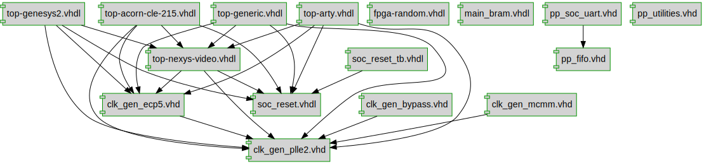

# Project documentation: 
## Project dependency graph

## Designs

- Module: [clock_generator ](./doc_internal/clk_gen_bypass.md)
- Module: [clock_generator ](./doc_internal/clk_gen_ecp5.md)
- Module: [clock_generator ](./doc_internal/clk_gen_mcmm.md)
- Module: [clock_generator ](./doc_internal/clk_gen_plle2.md)
- Module: [random ](./doc_internal/fpga-random.md)
- Module: [main_bram ](./doc_internal/main_bram.md)
- Module: [pp_fifo ](./doc_internal/pp_fifo.md)
- Module: [pp_soc_uart ](./doc_internal/pp_soc_uart.md)
- Package: [pp_utilities ](./doc_internal/pp_utilities.md)
- Module: [soc_reset ](./doc_internal/soc_reset.md)
- Module: [soc_reset_tb ](./doc_internal/soc_reset_tb.md)
- Module: [toplevel ](./doc_internal/top-acorn-cle-215.md)
- Module: [toplevel ](./doc_internal/top-arty.md)
- Module: [toplevel ](./doc_internal/top-generic.md)
- Module: [toplevel ](./doc_internal/top-genesys2.md)
- Module: [toplevel ](./doc_internal/top-nexys-video.md)

