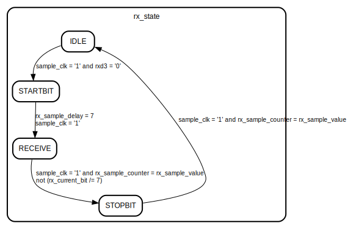
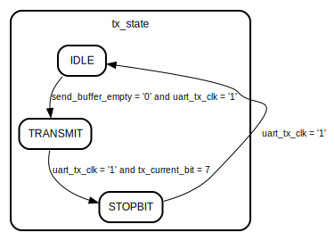
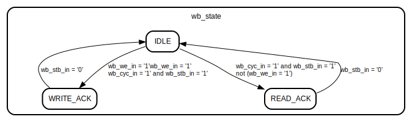

# Entity: pp_soc_uart

## Diagram

## Description

The Potato Processor - A simple processor for FPGAs
(c) Kristian Klomsten Skordal 2014 - 2016 <kristian.skordal@wafflemail.net>
## Generics

| Generic name | Type    | Value | Description |
| ------------ | ------- | ----- | ----------- |
| FIFO_DEPTH   | natural | 64    |             |
## Ports

| Port name  | Direction | Type                          | Description       |
| ---------- | --------- | ----------------------------- | ----------------- |
| clk        | in        | std_logic                     |                   |
| reset      | in        | std_logic                     |                   |
| txd        | out       | std_logic                     | UART ports:       |
| rxd        | in        | std_logic                     |                   |
| irq        | out       | std_logic                     | Interrupt signal: |
| wb_adr_in  | in        | std_logic_vector(11 downto 0) | Wishbone ports:   |
| wb_dat_in  | in        | std_logic_vector( 7 downto 0) |                   |
| wb_dat_out | out       | std_logic_vector( 7 downto 0) |                   |
| wb_we_in   | in        | std_logic                     |                   |
| wb_cyc_in  | in        | std_logic                     |                   |
| wb_stb_in  | in        | std_logic                     |                   |
| wb_ack_out | out       | std_logic                     |                   |
## Signals

| Name                 | Type                                       | Description                |
| -------------------- | ------------------------------------------ | -------------------------- |
| sample_clk           | std_logic                                  | UART sample clock signals: |
| sample_clk_divisor   | std_logic_vector(7 downto 0)               |                            |
| sample_clk_counter   | std_logic_vector(sample_clk_divisor'range) |                            |
| rx_state             | rx_state_type                              |                            |
| rx_byte              | std_logic_vector(7 downto 0)               |                            |
| rx_current_bit       | bitnumber                                  |                            |
| rx_sample_counter    | rx_sample_counter_type                     |                            |
| rx_sample_value      | rx_sample_counter_type                     |                            |
| rx_sample_delay      | rx_sample_delay_type                       |                            |
| tx_state             | tx_state_type                              |                            |
| tx_byte              | std_logic_vector(7 downto 0)               |                            |
| tx_current_bit       | bitnumber                                  |                            |
| uart_tx_counter      | uart_tx_counter_type                       |                            |
| uart_tx_clk          | std_logic                                  |                            |
| send_buffer_full     | std_logic                                  | Buffer signals:            |
|  send_buffer_empty   | std_logic                                  | Buffer signals:            |
| recv_buffer_full     | std_logic                                  |                            |
|  recv_buffer_empty   | std_logic                                  |                            |
| send_buffer_input    | std_logic_vector(7 downto 0)               |                            |
|  send_buffer_output  | std_logic_vector(7 downto 0)               |                            |
| recv_buffer_input    | std_logic_vector(7 downto 0)               |                            |
|  recv_buffer_output  | std_logic_vector(7 downto 0)               |                            |
| send_buffer_push     | std_logic                                  |                            |
|  send_buffer_pop     | std_logic                                  |                            |
| recv_buffer_push     | std_logic                                  |                            |
|  recv_buffer_pop     | std_logic                                  |                            |
| irq_recv_enable      | std_logic                                  | IRQ enable signals:        |
|  irq_tx_ready_enable | std_logic                                  | IRQ enable signals:        |
| wb_state             | wb_state_type                              |                            |
| rxd2                 | std_logic                                  |                            |
| rxd3                 | std_logic                                  |                            |
| txd2                 | std_ulogic                                 |                            |
## Types

| Name          | Type                                                                                                                                            | Description                    |
| ------------- | ----------------------------------------------------------------------------------------------------------------------------------------------- | ------------------------------ |
| rx_state_type | (IDLE,  RECEIVE,  STARTBIT,  STOPBIT)  | UART receive process signals:  |
| tx_state_type | (IDLE,  TRANSMIT,  STOPBIT)                                               | UART transmit process signals: |
| wb_state_type | (IDLE,  WRITE_ACK,  READ_ACK)                                             | Wishbone signals:              |
## Processes
- unnamed: ( clk )
**Description**
Add a few FFs on the RX input to avoid metastability issues

- uart_receive: ( clk )
- sample_counter: ( clk )
- uart_transmit: ( clk )
- uart_tx_clock_generator: ( clk )
- sample_clock_generator: ( clk )
- wishbone: ( clk )
## Instantiations

- send_buffer: work.pp_fifo
- recv_buffer: work.pp_fifo
## State machines

- -------- Wishbone Interface ----------
