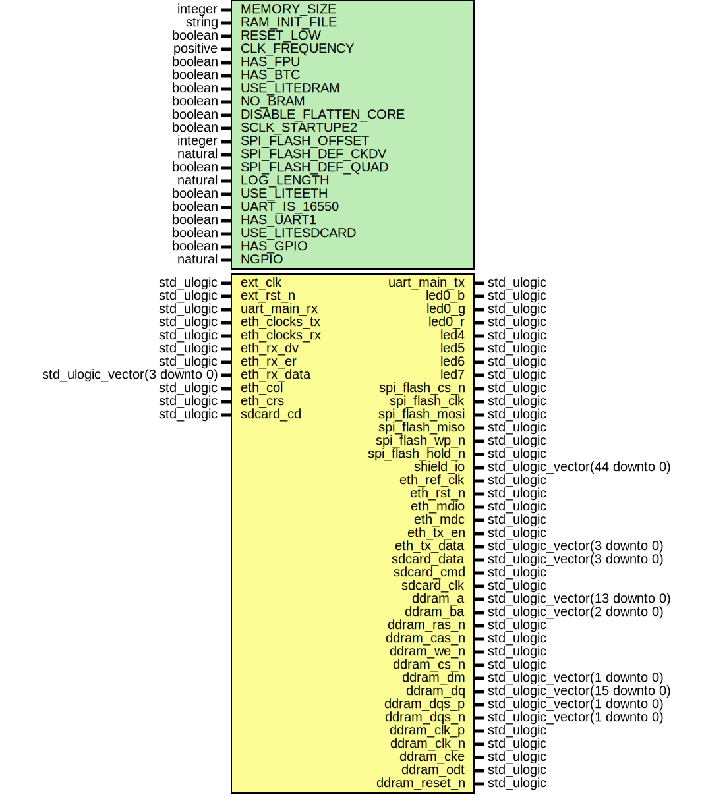

# Entity: toplevel
## Diagram

## Generics
| Generic name         | Type     | Value          | Description |
| -------------------- | -------- | -------------- | ----------- |
| MEMORY_SIZE          | integer  | 16384          |             |
| RAM_INIT_FILE        | string   | "firmware.hex" |             |
| RESET_LOW            | boolean  | true           |             |
| CLK_FREQUENCY        | positive | 100000000      |             |
| HAS_FPU              | boolean  | true           |             |
| HAS_BTC              | boolean  | true           |             |
| USE_LITEDRAM         | boolean  | false          |             |
| NO_BRAM              | boolean  | false          |             |
| DISABLE_FLATTEN_CORE | boolean  | false          |             |
| SCLK_STARTUPE2       | boolean  | false          |             |
| SPI_FLASH_OFFSET     | integer  | 4194304        |             |
| SPI_FLASH_DEF_CKDV   | natural  | 1              |             |
| SPI_FLASH_DEF_QUAD   | boolean  | true           |             |
| LOG_LENGTH           | natural  | 512            |             |
| USE_LITEETH          | boolean  | false          |             |
| UART_IS_16550        | boolean  | false          |             |
| HAS_UART1            | boolean  | true           |             |
| USE_LITESDCARD       | boolean  | false          |             |
| NGPIO                | natural  | 32             |             |
## Ports
| Port name        | Direction | Type                           | Description |
| ---------------- | --------- | ------------------------------ | ----------- |
| ext_clk          | in        | std_ulogic                     |             |
| ext_rst_n        | in        | std_ulogic                     |             |
| uart_main_tx     | out       | std_ulogic                     |             |
| uart_main_rx     | in        | std_ulogic                     |             |
| led0_b           | out       | std_ulogic                     |             |
| led0_g           | out       | std_ulogic                     |             |
| led0_r           | out       | std_ulogic                     |             |
| led4             | out       | std_ulogic                     |             |
| led5             | out       | std_ulogic                     |             |
| led6             | out       | std_ulogic                     |             |
| led7             | out       | std_ulogic                     |             |
| spi_flash_cs_n   | out       | std_ulogic                     |             |
| spi_flash_clk    | out       | std_ulogic                     |             |
| spi_flash_mosi   | inout     | std_ulogic                     |             |
| spi_flash_miso   | inout     | std_ulogic                     |             |
| spi_flash_wp_n   | inout     | std_ulogic                     |             |
| spi_flash_hold_n | inout     | std_ulogic                     |             |
| shield_io        | inout     | std_ulogic_vector(44 downto 0) |             |
| eth_ref_clk      | out       | std_ulogic                     |             |
| eth_clocks_tx    | in        | std_ulogic                     |             |
| eth_clocks_rx    | in        | std_ulogic                     |             |
| eth_rst_n        | out       | std_ulogic                     |             |
| eth_mdio         | inout     | std_ulogic                     |             |
| eth_mdc          | out       | std_ulogic                     |             |
| eth_rx_dv        | in        | std_ulogic                     |             |
| eth_rx_er        | in        | std_ulogic                     |             |
| eth_rx_data      | in        | std_ulogic_vector(3 downto 0)  |             |
| eth_tx_en        | out       | std_ulogic                     |             |
| eth_tx_data      | out       | std_ulogic_vector(3 downto 0)  |             |
| eth_col          | in        | std_ulogic                     |             |
| eth_crs          | in        | std_ulogic                     |             |
| sdcard_data      | inout     | std_ulogic_vector(3 downto 0)  |             |
| sdcard_cmd       | inout     | std_ulogic                     |             |
| sdcard_clk       | out       | std_ulogic                     |             |
| sdcard_cd        | in        | std_ulogic                     |             |
| ddram_a          | out       | std_ulogic_vector(13 downto 0) |             |
| ddram_ba         | out       | std_ulogic_vector(2 downto 0)  |             |
| ddram_ras_n      | out       | std_ulogic                     |             |
| ddram_cas_n      | out       | std_ulogic                     |             |
| ddram_we_n       | out       | std_ulogic                     |             |
| ddram_cs_n       | out       | std_ulogic                     |             |
| ddram_dm         | out       | std_ulogic_vector(1 downto 0)  |             |
| ddram_dq         | inout     | std_ulogic_vector(15 downto 0) |             |
| ddram_dqs_p      | inout     | std_ulogic_vector(1 downto 0)  |             |
| ddram_dqs_n      | inout     | std_ulogic_vector(1 downto 0)  |             |
| ddram_clk_p      | out       | std_ulogic                     |             |
| ddram_clk_n      | out       | std_ulogic                     |             |
| ddram_cke        | out       | std_ulogic                     |             |
| ddram_odt        | out       | std_ulogic                     |             |
| ddram_reset_n    | out       | std_ulogic                     |             |
## Signals
| Name                | Type                                  | Description |
| ------------------- | ------------------------------------- | ----------- |
| soc_rst             | std_ulogic                            |             |
| pll_rst             | std_ulogic                            |             |
| system_clk          | std_ulogic                            |             |
| system_clk_locked   | std_ulogic                            |             |
| eth_clk_locked      | std_ulogic                            |             |
| wb_ext_io_in        | wb_io_master_out                      |             |
| wb_ext_io_out       | wb_io_slave_out                       |             |
| wb_ext_is_dram_csr  | std_ulogic                            |             |
| wb_ext_is_dram_init | std_ulogic                            |             |
| wb_ext_is_eth       | std_ulogic                            |             |
| wb_ext_is_sdcard    | std_ulogic                            |             |
| wb_dram_in          | wishbone_master_out                   |             |
| wb_dram_out         | wishbone_slave_out                    |             |
| wb_dram_ctrl_out    | wb_io_slave_out                       |             |
| ext_irq_eth         | std_ulogic                            |             |
| wb_eth_out          | wb_io_slave_out                       |             |
| ext_irq_sdcard      | std_ulogic                            |             |
| wb_sdcard_out       | wb_io_slave_out                       |             |
| wb_sddma_out        | wb_io_master_out                      |             |
| wb_sddma_in         | wb_io_slave_out                       |             |
| wb_sddma_nr         | wb_io_master_out                      |             |
| wb_sddma_ir         | wb_io_slave_out                       |             |
| wb_sddma_stb_sent   | std_ulogic                            |             |
| core_alt_reset      | std_ulogic                            |             |
| led0_b_pwm          | std_ulogic                            |             |
| led0_r_pwm          | std_ulogic                            |             |
| led0_g_pwm          | std_ulogic                            |             |
| pwm_counter         | std_ulogic_vector(8 downto 0)         |             |
| spi_sck             | std_ulogic                            |             |
| spi_cs_n            | std_ulogic                            |             |
| spi_sdat_o          | std_ulogic_vector(3 downto 0)         |             |
| spi_sdat_oe         | std_ulogic_vector(3 downto 0)         |             |
| spi_sdat_i          | std_ulogic_vector(3 downto 0)         |             |
| gpio_in             | std_ulogic_vector(NGPIO - 1 downto 0) |             |
| gpio_out            | std_ulogic_vector(NGPIO - 1 downto 0) |             |
| gpio_dir            | std_ulogic_vector(NGPIO - 1 downto 0) |             |
## Constants
| Name         | Type    | Value             | Description |
| ------------ | ------- | ----------------- | ----------- |
| BRAM_SIZE    | natural |  get_bram_size    |             |
| PAYLOAD_SIZE | natural |  get_payload_size |             |
## Functions
- get_bram_size () return natural
- get_payload_size () return natural
## Processes
- leds_pwm: _( system_clk )_

## Instantiations
- soc0: work.soc
