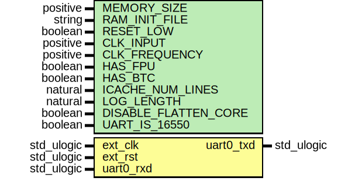

# Entity: toplevel
## Diagram

## Generics
| Generic name         | Type     | Value          | Description |
| -------------------- | -------- | -------------- | ----------- |
| MEMORY_SIZE          | positive | (384*1024)     |             |
| RAM_INIT_FILE        | string   | "firmware.hex" |             |
| RESET_LOW            | boolean  | true           |             |
| CLK_INPUT            | positive | 100000000      |             |
| CLK_FREQUENCY        | positive | 100000000      |             |
| HAS_FPU              | boolean  | true           |             |
| HAS_BTC              | boolean  | false          |             |
| LOG_LENGTH           | natural  | 512            |             |
| DISABLE_FLATTEN_CORE | boolean  | false          |             |
| UART_IS_16550        | boolean  | true           |             |
## Ports
| Port name | Direction | Type       | Description    |
| --------- | --------- | ---------- | -------------- |
| ext_clk   | in        | std_ulogic |                |
| ext_rst   | in        | std_ulogic |                |
| uart0_txd | out       | std_ulogic | UART0 signals: |
| uart0_rxd | in        | std_ulogic |                |
## Signals
| Name              | Type       | Description             |
| ----------------- | ---------- | ----------------------- |
| soc_rst           | std_ulogic |                         |
| pll_rst           | std_ulogic |                         |
| system_clk        | std_ulogic | Internal clock signals: |
| system_clk_locked | std_ulogic |                         |
## Instantiations
- reset_controller: work.soc_reset
- clkgen: work.clock_generator
- soc0: work.soc
**Description**
Main SoC

