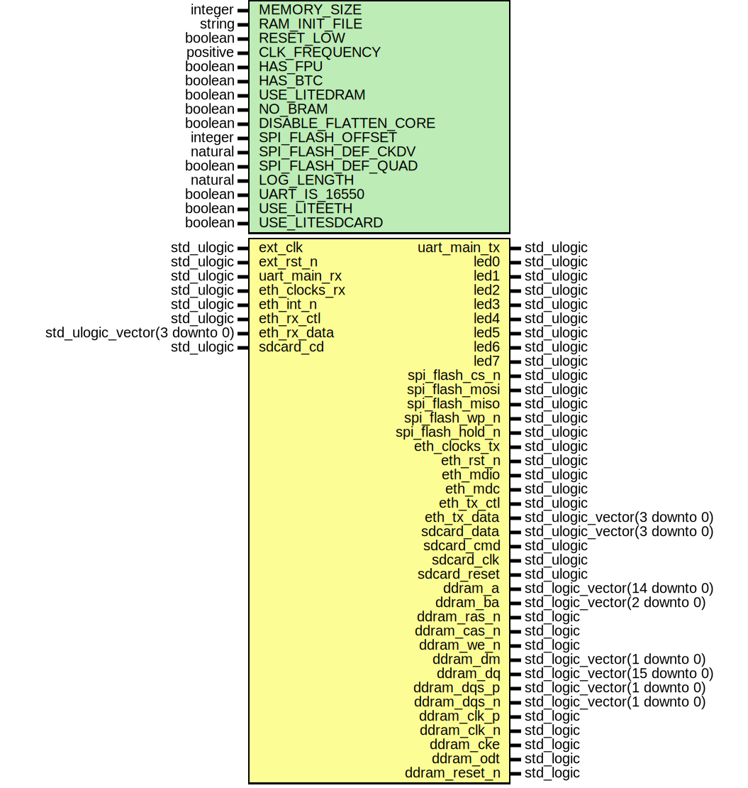

# Entity: toplevel

## Diagram

## Generics

| Generic name         | Type     | Value          | Description |
| -------------------- | -------- | -------------- | ----------- |
| MEMORY_SIZE          | integer  | 16384          |             |
| RAM_INIT_FILE        | string   | "firmware.hex" |             |
| RESET_LOW            | boolean  | true           |             |
| CLK_FREQUENCY        | positive | 100000000      |             |
| HAS_FPU              | boolean  | true           |             |
| HAS_BTC              | boolean  | true           |             |
| USE_LITEDRAM         | boolean  | false          |             |
| NO_BRAM              | boolean  | false          |             |
| DISABLE_FLATTEN_CORE | boolean  | false          |             |
| SPI_FLASH_OFFSET     | integer  | 10485760       |             |
| SPI_FLASH_DEF_CKDV   | natural  | 1              |             |
| SPI_FLASH_DEF_QUAD   | boolean  | true           |             |
| LOG_LENGTH           | natural  | 2048           |             |
| UART_IS_16550        | boolean  | true           |             |
## Ports

| Port name        | Direction | Type                          | Description    |
| ---------------- | --------- | ----------------------------- | -------------- |
| ext_clk          | in        | std_ulogic                    |                |
| ext_rst          | in        | std_ulogic                    |                |
| uart_main_tx     | out       | std_ulogic                    | UART0 signals: |
| uart_main_rx     | in        | std_ulogic                    |                |
| led0             | out       | std_logic                     | LEDs           |
| led1             | out       | std_logic                     |                |
| spi_flash_cs_n   | out       | std_ulogic                    | SPI            |
| spi_flash_mosi   | inout     | std_ulogic                    |                |
| spi_flash_miso   | inout     | std_ulogic                    |                |
| spi_flash_wp_n   | inout     | std_ulogic                    |                |
| spi_flash_hold_n | inout     | std_ulogic                    |                |
| ddram_a          | out       | std_logic_vector(14 downto 0) | DRAM wires     |
| ddram_ba         | out       | std_logic_vector(2 downto 0)  |                |
| ddram_ras_n      | out       | std_logic                     |                |
| ddram_cas_n      | out       | std_logic                     |                |
| ddram_we_n       | out       | std_logic                     |                |
| ddram_dm         | out       | std_logic_vector(1 downto 0)  |                |
| ddram_dq         | inout     | std_logic_vector(15 downto 0) |                |
| ddram_dqs_p      | inout     | std_logic_vector(1 downto 0)  |                |
| ddram_dqs_n      | inout     | std_logic_vector(1 downto 0)  |                |
| ddram_clk_p      | out       | std_logic                     |                |
| ddram_clk_n      | out       | std_logic                     |                |
| ddram_cke        | out       | std_logic                     |                |
| ddram_odt        | out       | std_logic                     |                |
| ddram_reset_n    | out       | std_logic                     |                |
## Signals

| Name                | Type                          | Description                        |
| ------------------- | ----------------------------- | ---------------------------------- |
| soc_rst             | std_ulogic                    |                                    |
| pll_rst             | std_ulogic                    |                                    |
| system_clk          | std_ulogic                    | Internal clock signals:            |
| system_clk_locked   | std_ulogic                    |                                    |
| wb_dram_in          | wishbone_master_out           | DRAM main data wishbone connection |
| wb_dram_out         | wishbone_slave_out            |                                    |
| wb_ext_io_in        | wb_io_master_out              | DRAM control wishbone connection   |
| wb_ext_io_out       | wb_io_slave_out               |                                    |
| wb_ext_is_dram_csr  | std_ulogic                    |                                    |
| wb_ext_is_dram_init | std_ulogic                    |                                    |
| core_alt_reset      | std_ulogic                    | Control/status                     |
| spi_sck             | std_ulogic                    | SPI flash                          |
| spi_cs_n            | std_ulogic                    |                                    |
| spi_sdat_o          | std_ulogic_vector(3 downto 0) |                                    |
| spi_sdat_oe         | std_ulogic_vector(3 downto 0) |                                    |
| spi_sdat_i          | std_ulogic_vector(3 downto 0) |                                    |
## Constants

| Name         | Type    | Value             | Description |
| ------------ | ------- | ----------------- | ----------- |
| BRAM_SIZE    | natural |  get_bram_size    |             |
| PAYLOAD_SIZE | natural |  get_payload_size |             |
## Functions
- get_bram_size () return natural 
**Description**
Fixup various memory sizes based on generics
- get_payload_size () return natural 
## Instantiations

- soc0: work.soc
- STARTUPE2_INST: STARTUPE2
