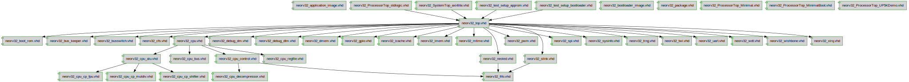

# Documentation for: 

Generated by **TerosHDL** © 2020-2021 License GPLv3 Carlos Alberto Ruiz Naranjo (carlosruiznaranjo@gmail.com) Ismael Perez Rojo (ismaelprojo@gmail.com)  Project revision 2021-09-06 11:48:12  

## Designs

- Package: [neorv32_application_image ](./doc_internal/neorv32_application_image.md)
- Module: [neorv32_boot_rom ](./doc_internal/neorv32_boot_rom.md)
- Package: [neorv32_bootloader_image ](./doc_internal/neorv32_bootloader_image.md)
- Module: [neorv32_bus_keeper ](./doc_internal/neorv32_bus_keeper.md)
- Module: [neorv32_busswitch ](./doc_internal/neorv32_busswitch.md)
- Module: [neorv32_cfs ](./doc_internal/neorv32_cfs.md)
- Module: [neorv32_cpu ](./doc_internal/neorv32_cpu.md)
- Module: [neorv32_cpu_alu ](./doc_internal/neorv32_cpu_alu.md)
- Module: [neorv32_cpu_bus ](./doc_internal/neorv32_cpu_bus.md)
- Module: [neorv32_cpu_control ](./doc_internal/neorv32_cpu_control.md)
- Module: [neorv32_cpu_cp_fpu ](./doc_internal/neorv32_cpu_cp_fpu.md)
- Module: [neorv32_cpu_cp_muldiv ](./doc_internal/neorv32_cpu_cp_muldiv.md)
- Module: [neorv32_cpu_cp_shifter ](./doc_internal/neorv32_cpu_cp_shifter.md)
- Module: [neorv32_cpu_decompressor ](./doc_internal/neorv32_cpu_decompressor.md)
- Module: [neorv32_cpu_regfile ](./doc_internal/neorv32_cpu_regfile.md)
- Module: [neorv32_debug_dm ](./doc_internal/neorv32_debug_dm.md)
- Module: [neorv32_debug_dtm ](./doc_internal/neorv32_debug_dtm.md)
- Module: [neorv32_dmem ](./doc_internal/neorv32_dmem.md)
- Module: [neorv32_fifo ](./doc_internal/neorv32_fifo.md)
- Module: [neorv32_gpio ](./doc_internal/neorv32_gpio.md)
- Module: [neorv32_icache ](./doc_internal/neorv32_icache.md)
- Module: [neorv32_imem ](./doc_internal/neorv32_imem.md)
- Module: [neorv32_mtime ](./doc_internal/neorv32_mtime.md)
- Module: [neorv32_neoled ](./doc_internal/neorv32_neoled.md)
- Package: [neorv32_package ](./doc_internal/neorv32_package.md)
- Module: [neorv32_pwm ](./doc_internal/neorv32_pwm.md)
- Module: [neorv32_slink ](./doc_internal/neorv32_slink.md)
- Module: [neorv32_spi ](./doc_internal/neorv32_spi.md)
- Module: [neorv32_sysinfo ](./doc_internal/neorv32_sysinfo.md)
- Module: [neorv32_top ](./doc_internal/neorv32_top.md)
- Module: [neorv32_trng ](./doc_internal/neorv32_trng.md)
- Module: [neorv32_twi ](./doc_internal/neorv32_twi.md)
- Module: [neorv32_uart ](./doc_internal/neorv32_uart.md)
- Module: [neorv32_wdt ](./doc_internal/neorv32_wdt.md)
- Module: [neorv32_wishbone ](./doc_internal/neorv32_wishbone.md)
- Module: [neorv32_xirq ](./doc_internal/neorv32_xirq.md)
- Module: [neorv32_ProcessorTop_Minimal ](./doc_internal/neorv32_ProcessorTop_Minimal.md)
- Module: [neorv32_ProcessorTop_MinimalBoot ](./doc_internal/neorv32_ProcessorTop_MinimalBoot.md)
- Module: [neorv32_ProcessorTop_UP5KDemo ](./doc_internal/neorv32_ProcessorTop_UP5KDemo.md)
- Module: [neorv32_ProcessorTop_stdlogic ](./doc_internal/neorv32_ProcessorTop_stdlogic.md)
- Module: [neorv32_SystemTop_axi4lite ](./doc_internal/neorv32_SystemTop_axi4lite.md)
- Module: [neorv32_test_setup_approm ](./doc_internal/neorv32_test_setup_approm.md)
- Module: [neorv32_test_setup_bootloader ](./doc_internal/neorv32_test_setup_bootloader.md)

