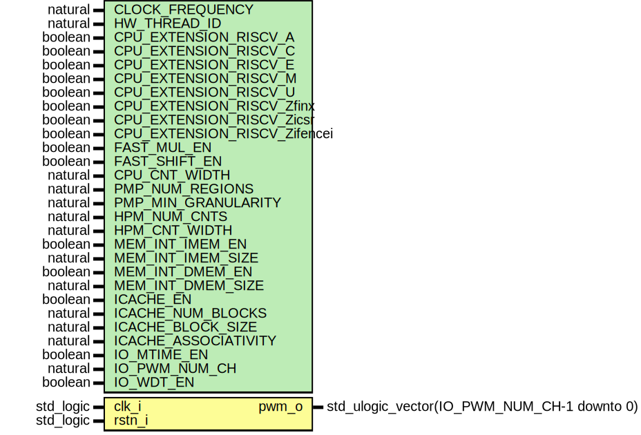

# Entity: neorv32_ProcessorTop_Minimal
## Diagram

## Generics
| Generic name                 | Type                           | Value       | Description |
| ---------------------------- | ------------------------------ | ----------- | ----------- |
| CLOCK_FREQUENCY              | natural                        | 0           |             |
| USER_CODE                    | std_ulogic_vector(31 downto 0) | x"00000000" |             |
| HW_THREAD_ID                 | natural                        | 0           |             |
| CPU_EXTENSION_RISCV_A        | boolean                        | false       |             |
| CPU_EXTENSION_RISCV_C        | boolean                        | false       |             |
| CPU_EXTENSION_RISCV_E        | boolean                        | false       |             |
| CPU_EXTENSION_RISCV_M        | boolean                        | false       |             |
| CPU_EXTENSION_RISCV_U        | boolean                        | false       |             |
| CPU_EXTENSION_RISCV_Zfinx    | boolean                        | false       |             |
| CPU_EXTENSION_RISCV_Zicsr    | boolean                        | true        |             |
| CPU_EXTENSION_RISCV_Zifencei | boolean                        | false       |             |
| FAST_MUL_EN                  | boolean                        | false       |             |
| FAST_SHIFT_EN                | boolean                        | false       |             |
| CPU_CNT_WIDTH                | natural                        | 34          |             |
| PMP_NUM_REGIONS              | natural                        | 0           |             |
| PMP_MIN_GRANULARITY          | natural                        | 8*1024      |             |
| HPM_NUM_CNTS                 | natural                        | 0           |             |
| HPM_CNT_WIDTH                | natural                        | 40          |             |
| MEM_INT_IMEM_EN              | boolean                        | true        |             |
| MEM_INT_IMEM_SIZE            | natural                        | 8*1024      |             |
| MEM_INT_DMEM_EN              | boolean                        | true        |             |
| MEM_INT_DMEM_SIZE            | natural                        | 64*1024     |             |
| ICACHE_EN                    | boolean                        | false       |             |
| ICACHE_NUM_BLOCKS            | natural                        | 4           |             |
| ICACHE_BLOCK_SIZE            | natural                        | 64          |             |
| ICACHE_ASSOCIATIVITY         | natural                        | 1           |             |
| IO_MTIME_EN                  | boolean                        | false       |             |
| IO_PWM_NUM_CH                | natural                        | 3           |             |
| IO_WDT_EN                    | boolean                        | false       |             |
## Ports
| Port name | Direction | Type                                        | Description |
| --------- | --------- | ------------------------------------------- | ----------- |
| clk_i     | in        | std_logic                                   |             |
| rstn_i    | in        | std_logic                                   |             |
| pwm_o     | out       | std_ulogic_vector(IO_PWM_NUM_CH-1 downto 0) |             |
## Instantiations
- neorv32_inst: neorv32.neorv32_top
