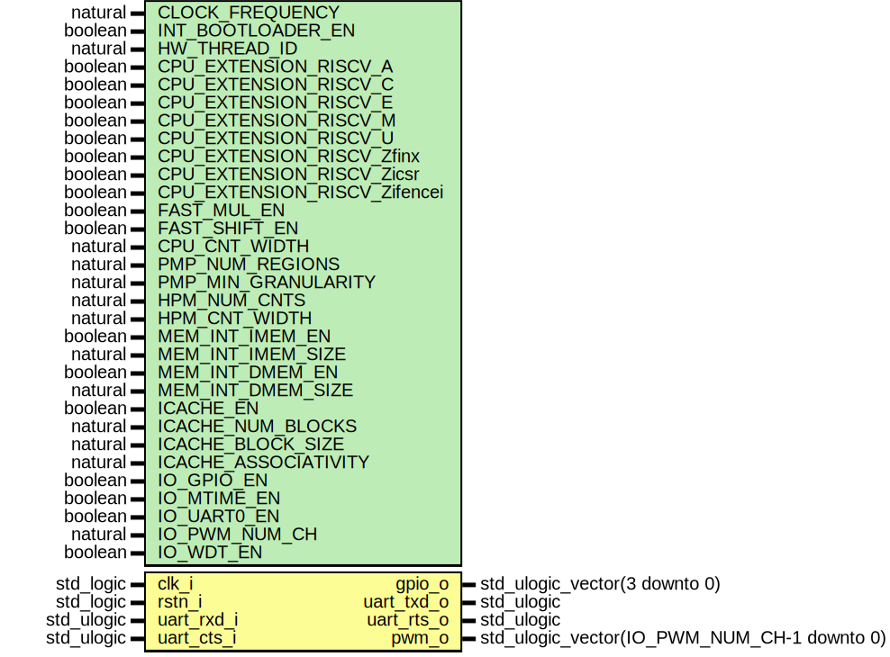

# Entity: neorv32_ProcessorTop_MinimalBoot
## Diagram

## Description
#################################################################################################
# << NEORV32 - Minimal setup with the bootloader enabled >>                                     #
# ********************************************************************************************* #
# BSD 3-Clause License                                                                          #
#                                                                                               #
# Copyright (c) 2021, Stephan Nolting. All rights reserved.                                     #
#                                                                                               #
# Redistribution and use in source and binary forms, with or without modification, are          #
# permitted provided that the following conditions are met:                                     #
#                                                                                               #
# 1. Redistributions of source code must retain the above copyright notice, this list of        #
#    conditions and the following disclaimer.                                                   #
#                                                                                               #
# 2. Redistributions in binary form must reproduce the above copyright notice, this list of     #
#    conditions and the following disclaimer in the documentation and/or other materials        #
#    provided with the distribution.                                                            #
#                                                                                               #
# 3. Neither the name of the copyright holder nor the names of its contributors may be used to  #
#    endorse or promote products derived from this software without specific prior written      #
#    permission.                                                                                #
#                                                                                               #
# THIS SOFTWARE IS PROVIDED BY THE COPYRIGHT HOLDERS AND CONTRIBUTORS "AS IS" AND ANY EXPRESS   #
# OR IMPLIED WARRANTIES, INCLUDING, BUT NOT LIMITED TO, THE IMPLIED WARRANTIES OF               #
# MERCHANTABILITY AND FITNESS FOR A PARTICULAR PURPOSE ARE DISCLAIMED. IN NO EVENT SHALL THE    #
# COPYRIGHT HOLDER OR CONTRIBUTORS BE LIABLE FOR ANY DIRECT, INDIRECT, INCIDENTAL, SPECIAL,     #
# EXEMPLARY, OR CONSEQUENTIAL DAMAGES (INCLUDING, BUT NOT LIMITED TO, PROCUREMENT OF SUBSTITUTE #
# GOODS OR SERVICES; LOSS OF USE, DATA, OR PROFITS; OR BUSINESS INTERRUPTION) HOWEVER CAUSED    #
# AND ON ANY THEORY OF LIABILITY, WHETHER IN CONTRACT, STRICT LIABILITY, OR TORT (INCLUDING     #
# NEGLIGENCE OR OTHERWISE) ARISING IN ANY WAY OUT OF THE USE OF THIS SOFTWARE, EVEN IF ADVISED  #
# OF THE POSSIBILITY OF SUCH DAMAGE.                                                            #
# ********************************************************************************************* #
# The NEORV32 Processor - https://github.com/stnolting/neorv32              (c) Stephan Nolting #
#################################################################################################
## Generics
| Generic name                 | Type                           | Value       | Description                                                                           |
| ---------------------------- | ------------------------------ | ----------- | ------------------------------------------------------------------------------------- |
| CLOCK_FREQUENCY              | natural                        | 0           | clock frequency of clk_i in Hz                                                        |
| INT_BOOTLOADER_EN            | boolean                        | true        | boot configuration: true = boot explicit bootloader; false = boot from int/ext (I)MEM |
| USER_CODE                    | std_ulogic_vector(31 downto 0) | x"00000000" | custom user code                                                                      |
| HW_THREAD_ID                 | natural                        | 0           | hardware thread id (32-bit)                                                           |
| CPU_EXTENSION_RISCV_A        | boolean                        | true        | implement atomic extension?                                                           |
| CPU_EXTENSION_RISCV_C        | boolean                        | true        | implement compressed extension?                                                       |
| CPU_EXTENSION_RISCV_E        | boolean                        | false       | implement embedded RF extension?                                                      |
| CPU_EXTENSION_RISCV_M        | boolean                        | true        | implement mul/div extension?                                                          |
| CPU_EXTENSION_RISCV_U        | boolean                        | false       | implement user mode extension?                                                        |
| CPU_EXTENSION_RISCV_Zfinx    | boolean                        | false       | implement 32-bit floating-point extension (using INT regs!)                           |
| CPU_EXTENSION_RISCV_Zicsr    | boolean                        | true        | implement CSR system?                                                                 |
| CPU_EXTENSION_RISCV_Zifencei | boolean                        | false       | implement instruction stream sync.?                                                   |
| FAST_MUL_EN                  | boolean                        | false       | use DSPs for M extension's multiplier                                                 |
| FAST_SHIFT_EN                | boolean                        | false       | use barrel shifter for shift operations                                               |
| CPU_CNT_WIDTH                | natural                        | 34          | total width of CPU cycle and instret counters (0..64)                                 |
| PMP_NUM_REGIONS              | natural                        | 0           | number of regions (0..64)                                                             |
| PMP_MIN_GRANULARITY          | natural                        | 64*1024     | minimal region granularity in bytes, has to be a power of 2, min 8 bytes              |
| HPM_NUM_CNTS                 | natural                        | 0           | number of implemented HPM counters (0..29)                                            |
| HPM_CNT_WIDTH                | natural                        | 40          | total size of HPM counters (0..64)                                                    |
| MEM_INT_IMEM_EN              | boolean                        | true        | implement processor-internal instruction memory                                       |
| MEM_INT_IMEM_SIZE            | natural                        | 64*1024     | size of processor-internal instruction memory in bytes                                |
| MEM_INT_DMEM_EN              | boolean                        | true        | implement processor-internal data memory                                              |
| MEM_INT_DMEM_SIZE            | natural                        | 64*1024     | size of processor-internal data memory in bytes                                       |
| ICACHE_EN                    | boolean                        | false       | implement instruction cache                                                           |
| ICACHE_NUM_BLOCKS            | natural                        | 4           | i-cache: number of blocks (min 1), has to be a power of 2                             |
| ICACHE_BLOCK_SIZE            | natural                        | 64          | i-cache: block size in bytes (min 4), has to be a power of 2                          |
| ICACHE_ASSOCIATIVITY         | natural                        | 1           | i-cache: associativity / number of sets (1=direct_mapped), has to be a power of 2     |
| IO_GPIO_EN                   | boolean                        | true        | implement general purpose input/output port unit (GPIO)?                              |
| IO_MTIME_EN                  | boolean                        | true        | implement machine system timer (MTIME)?                                               |
| IO_UART0_EN                  | boolean                        | true        | implement primary universal asynchronous receiver/transmitter (UART0)?                |
| IO_PWM_NUM_CH                | natural                        | 3           | number of PWM channels to implement (0..60); 0 = disabled                             |
| IO_WDT_EN                    | boolean                        | true        | implement watch dog timer (WDT)?                                                      |
## Ports
| Port name  | Direction | Type                                        | Description                                                              |
| ---------- | --------- | ------------------------------------------- | ------------------------------------------------------------------------ |
| clk_i      | in        | std_logic                                   |                                                                          |
| rstn_i     | in        | std_logic                                   |                                                                          |
| gpio_o     | out       | std_ulogic_vector(3 downto 0)               | GPIO (available if IO_GPIO_EN = true) --                                 |
| uart_txd_o | out       | std_ulogic                                  | UART0 send data                                                          |
| uart_rxd_i | in        | std_ulogic                                  | UART0 receive data                                                       |
| uart_rts_o | out       | std_ulogic                                  | hw flow control: UART0.RX ready to receive ("RTR"), low-active, optional |
| uart_cts_i | in        | std_ulogic                                  | hw flow control: UART0.TX allowed to transmit, low-active, optional      |
| pwm_o      | out       | std_ulogic_vector(IO_PWM_NUM_CH-1 downto 0) | PWM (available if IO_PWM_NUM_CH > 0) --                                  |
## Signals
| Name       | Type                           | Description |
| ---------- | ------------------------------ | ----------- |
| con_gpio_o | std_ulogic_vector(31 downto 0) |             |
## Instantiations
- neorv32_inst: neorv32.neorv32_top
**Description**
The core of the problem ----------------------------------------------------------------
-------------------------------------------------------------------------------------------

