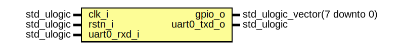

# Entity: neorv32_ProcessorTop_Test
## Diagram

## Ports
| Port name   | Direction | Type                          | Description |
| ----------- | --------- | ----------------------------- | ----------- |
| clk_i       | in        | std_ulogic                    |             |
| rstn_i      | in        | std_ulogic                    |             |
| gpio_o      | out       | std_ulogic_vector(7 downto 0) |             |
| uart0_txd_o | out       | std_ulogic                    |             |
| uart0_rxd_i | in        | std_ulogic                    |             |
## Signals
| Name     | Type                           | Description |
| -------- | ------------------------------ | ----------- |
| gpio_out | std_ulogic_vector(31 downto 0) |             |
## Instantiations
- neorv32_top_inst: neorv32_top
