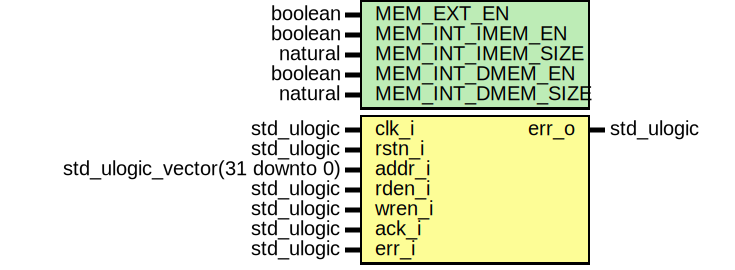

# Entity: neorv32_bus_keeper

- **File**: neorv32_bus_keeper.vhd
## Diagram

## Description

 #################################################################################################
 # << NEORV32 - Bus Keeper (BUSKEEPER) >>                                                        #
 # ********************************************************************************************* #
 # This unit monitors the processor-internal bus. If the accessed INTERNAL (IMEM if enabled,     #
 # DMEM if enabled, BOOTROM + IO region) module does not respond within the defined number of    #
 # cycles (VHDL package: max_proc_int_response_time_c) the BUS KEEPER asserts the error signal   #
 # to inform the CPU / bus driver.                                                               #
 #                                                                                               #
 # WARNING: The bus keeper timeout does not track accesses via the processor-external bus        #
 #          interface! If the timeout-function of the Wishbone interface is not used, the CPU    #
 #          might be permanently stalled by an an unacknowledged transfer! If the external bus   #
 #          interface is disabled, ALL accesses by the CPU are internal.                         #
 # ********************************************************************************************* #
 # BSD 3-Clause License                                                                          #
 #                                                                                               #
 # Copyright (c) 2021, Stephan Nolting. All rights reserved.                                     #
 #                                                                                               #
 # Redistribution and use in source and binary forms, with or without modification, are          #
 # permitted provided that the following conditions are met:                                     #
 #                                                                                               #
 # 1. Redistributions of source code must retain the above copyright notice, this list of        #
 #    conditions and the following disclaimer.                                                   #
 #                                                                                               #
 # 2. Redistributions in binary form must reproduce the above copyright notice, this list of     #
 #    conditions and the following disclaimer in the documentation and/or other materials        #
 #    provided with the distribution.                                                            #
 #                                                                                               #
 # 3. Neither the name of the copyright holder nor the names of its contributors may be used to  #
 #    endorse or promote products derived from this software without specific prior written      #
 #    permission.                                                                                #
 #                                                                                               #
 # THIS SOFTWARE IS PROVIDED BY THE COPYRIGHT HOLDERS AND CONTRIBUTORS "AS IS" AND ANY EXPRESS   #
 # OR IMPLIED WARRANTIES, INCLUDING, BUT NOT LIMITED TO, THE IMPLIED WARRANTIES OF               #
 # MERCHANTABILITY AND FITNESS FOR A PARTICULAR PURPOSE ARE DISCLAIMED. IN NO EVENT SHALL THE    #
 # COPYRIGHT HOLDER OR CONTRIBUTORS BE LIABLE FOR ANY DIRECT, INDIRECT, INCIDENTAL, SPECIAL,     #
 # EXEMPLARY, OR CONSEQUENTIAL DAMAGES (INCLUDING, BUT NOT LIMITED TO, PROCUREMENT OF SUBSTITUTE #
 # GOODS OR SERVICES; LOSS OF USE, DATA, OR PROFITS; OR BUSINESS INTERRUPTION) HOWEVER CAUSED    #
 # AND ON ANY THEORY OF LIABILITY, WHETHER IN CONTRACT, STRICT LIABILITY, OR TORT (INCLUDING     #
 # NEGLIGENCE OR OTHERWISE) ARISING IN ANY WAY OUT OF THE USE OF THIS SOFTWARE, EVEN IF ADVISED  #
 # OF THE POSSIBILITY OF SUCH DAMAGE.                                                            #
 # ********************************************************************************************* #
 # The NEORV32 Processor - https://github.com/stnolting/neorv32              (c) Stephan Nolting #
 #################################################################################################
## Generics

| Generic name      | Type    | Value | Description                                             |
| ----------------- | ------- | ----- | ------------------------------------------------------- |
| MEM_EXT_EN        | boolean |       |  implement external memory bus interface?               |
| MEM_INT_IMEM_EN   | boolean |       |  implement processor-internal instruction memory        |
| MEM_INT_IMEM_SIZE | natural |       |  size of processor-internal instruction memory in bytes |
| MEM_INT_DMEM_EN   | boolean |       |  implement processor-internal data memory               |
| MEM_INT_DMEM_SIZE | natural |       |  size of processor-internal data memory in bytes        |
## Ports

| Port name | Direction | Type                           | Description                           |
| --------- | --------- | ------------------------------ | ------------------------------------- |
| clk_i     | in        | std_ulogic                     |  global clock line                    |
| rstn_i    | in        | std_ulogic                     |  global reset line, low-active        |
| addr_i    | in        | std_ulogic_vector(31 downto 0) |  address                              |
| rden_i    | in        | std_ulogic                     |  read enable                          |
| wren_i    | in        | std_ulogic                     |  write enable                         |
| ack_i     | in        | std_ulogic                     |  transfer acknowledge from bus system |
| err_i     | in        | std_ulogic                     |  transfer error from bus system       |
| err_o     | out       | std_ulogic                     |  bus error                            |
## Signals

| Name         | Type           | Description |
| ------------ | -------------- | ----------- |
| access_check | access_check_t |             |
| control      | control_t      |             |
## Types

| Name           | Type | Description     |
| -------------- | ---- | --------------- |
| access_check_t |      |                 |
| control_t      |      |  controller --  |
## Processes
- keeper_control: ( rstn_i, clk_i )
 **Description**
 Keeper ---------------------------------------------------------------------------------  ------------------------------------------------------------------------------------------- 
