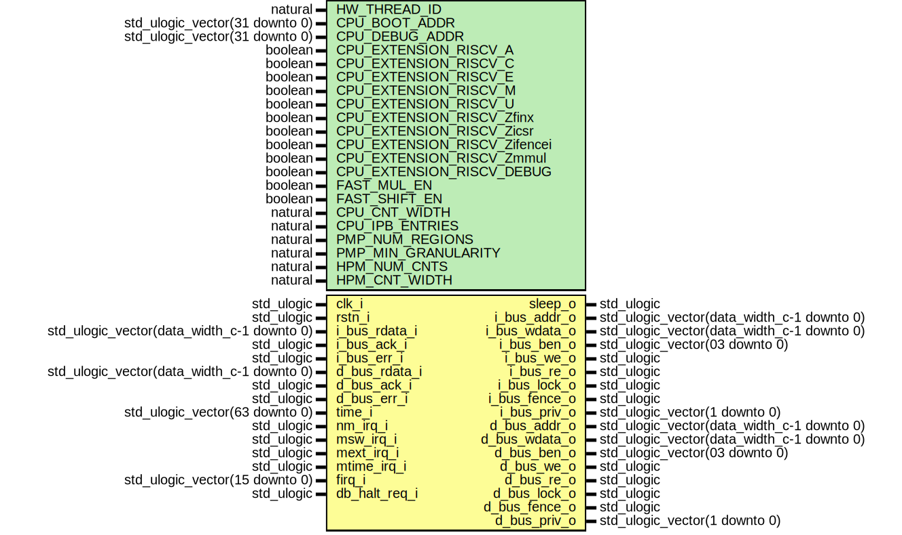

# Entity: neorv32_cpu
## Diagram

## Generics
| Generic name                 | Type                           | Value       | Description |
| ---------------------------- | ------------------------------ | ----------- | ----------- |
| HW_THREAD_ID                 | natural                        | 0           |             |
| CPU_BOOT_ADDR                | std_ulogic_vector(31 downto 0) | x"00000000" |             |
| CPU_DEBUG_ADDR               | std_ulogic_vector(31 downto 0) | x"00000000" |             |
| CPU_EXTENSION_RISCV_A        | boolean                        | false       |             |
| CPU_EXTENSION_RISCV_C        | boolean                        | false       |             |
| CPU_EXTENSION_RISCV_E        | boolean                        | false       |             |
| CPU_EXTENSION_RISCV_M        | boolean                        | false       |             |
| CPU_EXTENSION_RISCV_U        | boolean                        | false       |             |
| CPU_EXTENSION_RISCV_Zfinx    | boolean                        | false       |             |
| CPU_EXTENSION_RISCV_Zicsr    | boolean                        | true        |             |
| CPU_EXTENSION_RISCV_Zifencei | boolean                        | false       |             |
| CPU_EXTENSION_RISCV_Zmmul    | boolean                        | false       |             |
| CPU_EXTENSION_RISCV_DEBUG    | boolean                        | false       |             |
| FAST_MUL_EN                  | boolean                        | false       |             |
| FAST_SHIFT_EN                | boolean                        | false       |             |
| CPU_CNT_WIDTH                | natural                        | 64          |             |
| PMP_NUM_REGIONS              | natural                        | 0           |             |
| PMP_MIN_GRANULARITY          | natural                        | 64*1024     |             |
| HPM_NUM_CNTS                 | natural                        | 0           |             |
| HPM_CNT_WIDTH                | natural                        | 40          |             |
## Ports
| Port name     | Direction | Type                                       | Description |
| ------------- | --------- | ------------------------------------------ | ----------- |
| clk_i         | in        | std_ulogic                                 |             |
| rstn_i        | in        | std_ulogic                                 |             |
| sleep_o       | out       | std_ulogic                                 |             |
| i_bus_addr_o  | out       | std_ulogic_vector(data_width_c-1 downto 0) |             |
| i_bus_rdata_i | in        | std_ulogic_vector(data_width_c-1 downto 0) |             |
| i_bus_wdata_o | out       | std_ulogic_vector(data_width_c-1 downto 0) |             |
| i_bus_ben_o   | out       | std_ulogic_vector(03 downto 0)             |             |
| i_bus_we_o    | out       | std_ulogic                                 |             |
| i_bus_re_o    | out       | std_ulogic                                 |             |
| i_bus_lock_o  | out       | std_ulogic                                 |             |
| i_bus_ack_i   | in        | std_ulogic                                 |             |
| i_bus_err_i   | in        | std_ulogic                                 |             |
| i_bus_fence_o | out       | std_ulogic                                 |             |
| i_bus_priv_o  | out       | std_ulogic_vector(1 downto 0)              |             |
| d_bus_addr_o  | out       | std_ulogic_vector(data_width_c-1 downto 0) |             |
| d_bus_rdata_i | in        | std_ulogic_vector(data_width_c-1 downto 0) |             |
| d_bus_wdata_o | out       | std_ulogic_vector(data_width_c-1 downto 0) |             |
| d_bus_ben_o   | out       | std_ulogic_vector(03 downto 0)             |             |
| d_bus_we_o    | out       | std_ulogic                                 |             |
| d_bus_re_o    | out       | std_ulogic                                 |             |
| d_bus_lock_o  | out       | std_ulogic                                 |             |
| d_bus_ack_i   | in        | std_ulogic                                 |             |
| d_bus_err_i   | in        | std_ulogic                                 |             |
| d_bus_fence_o | out       | std_ulogic                                 |             |
| d_bus_priv_o  | out       | std_ulogic_vector(1 downto 0)              |             |
| time_i        | in        | std_ulogic_vector(63 downto 0)             |             |
| nm_irq_i      | in        | std_ulogic                                 |             |
| msw_irq_i     | in        | std_ulogic                                 |             |
| mext_irq_i    | in        | std_ulogic                                 |             |
| mtime_irq_i   | in        | std_ulogic                                 |             |
| firq_i        | in        | std_ulogic_vector(15 downto 0)             |             |
| firq_ack_o    | out       | std_ulogic_vector(15 downto 0)             |             |
| db_halt_req_i | in        | std_ulogic                                 |             |
## Signals
| Name       | Type                                       | Description |
| ---------- | ------------------------------------------ | ----------- |
| ctrl       | std_ulogic_vector(ctrl_width_c-1 downto 0) |             |
| comparator | std_ulogic_vector(1 downto 0)              |             |
| imm        | std_ulogic_vector(data_width_c-1 downto 0) |             |
| instr      | std_ulogic_vector(data_width_c-1 downto 0) |             |
| rs1        | std_ulogic_vector(data_width_c-1 downto 0) |             |
|  rs2       | std_ulogic_vector(data_width_c-1 downto 0) |             |
| alu_res    | std_ulogic_vector(data_width_c-1 downto 0) |             |
| alu_add    | std_ulogic_vector(data_width_c-1 downto 0) |             |
| mem_rdata  | std_ulogic_vector(data_width_c-1 downto 0) |             |
| alu_idone  | std_ulogic                                 |             |
| bus_i_wait | std_ulogic                                 |             |
| bus_d_wait | std_ulogic                                 |             |
| csr_rdata  | std_ulogic_vector(data_width_c-1 downto 0) |             |
| mar        | std_ulogic_vector(data_width_c-1 downto 0) |             |
| ma_instr   | std_ulogic                                 |             |
| ma_load    | std_ulogic                                 |             |
| ma_store   | std_ulogic                                 |             |
| excl_state | std_ulogic                                 |             |
| be_instr   | std_ulogic                                 |             |
| be_load    | std_ulogic                                 |             |
| be_store   | std_ulogic                                 |             |
| fetch_pc   | std_ulogic_vector(data_width_c-1 downto 0) |             |
| curr_pc    | std_ulogic_vector(data_width_c-1 downto 0) |             |
| fpu_flags  | std_ulogic_vector(4 downto 0)              |             |
| pmp_addr   | pmp_addr_if_t                              |             |
| pmp_ctrl   | pmp_ctrl_if_t                              |             |
## Instantiations
- neorv32_cpu_control_inst: neorv32_cpu_control
- neorv32_cpu_regfile_inst: neorv32_cpu_regfile
- neorv32_cpu_alu_inst: neorv32_cpu_alu
- neorv32_cpu_bus_inst: neorv32_cpu_bus
