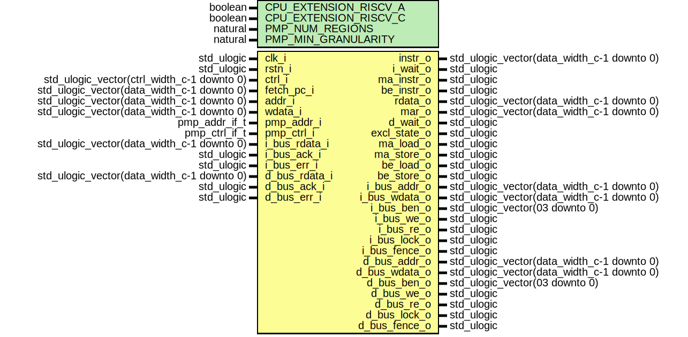

# Entity: neorv32_cpu_bus

- **File**: neorv32_cpu_bus.vhd
## Diagram

## Description

 #################################################################################################
 # << NEORV32 - Bus Interface Unit >>                                                            #
 # ********************************************************************************************* #
 # Instruction and data bus interfaces and physical memory protection (PMP).                     #
 # ********************************************************************************************* #
 # BSD 3-Clause License                                                                          #
 #                                                                                               #
 # Copyright (c) 2021, Stephan Nolting. All rights reserved.                                     #
 #                                                                                               #
 # Redistribution and use in source and binary forms, with or without modification, are          #
 # permitted provided that the following conditions are met:                                     #
 #                                                                                               #
 # 1. Redistributions of source code must retain the above copyright notice, this list of        #
 #    conditions and the following disclaimer.                                                   #
 #                                                                                               #
 # 2. Redistributions in binary form must reproduce the above copyright notice, this list of     #
 #    conditions and the following disclaimer in the documentation and/or other materials        #
 #    provided with the distribution.                                                            #
 #                                                                                               #
 # 3. Neither the name of the copyright holder nor the names of its contributors may be used to  #
 #    endorse or promote products derived from this software without specific prior written      #
 #    permission.                                                                                #
 #                                                                                               #
 # THIS SOFTWARE IS PROVIDED BY THE COPYRIGHT HOLDERS AND CONTRIBUTORS "AS IS" AND ANY EXPRESS   #
 # OR IMPLIED WARRANTIES, INCLUDING, BUT NOT LIMITED TO, THE IMPLIED WARRANTIES OF               #
 # MERCHANTABILITY AND FITNESS FOR A PARTICULAR PURPOSE ARE DISCLAIMED. IN NO EVENT SHALL THE    #
 # COPYRIGHT HOLDER OR CONTRIBUTORS BE LIABLE FOR ANY DIRECT, INDIRECT, INCIDENTAL, SPECIAL,     #
 # EXEMPLARY, OR CONSEQUENTIAL DAMAGES (INCLUDING, BUT NOT LIMITED TO, PROCUREMENT OF SUBSTITUTE #
 # GOODS OR SERVICES; LOSS OF USE, DATA, OR PROFITS; OR BUSINESS INTERRUPTION) HOWEVER CAUSED    #
 # AND ON ANY THEORY OF LIABILITY, WHETHER IN CONTRACT, STRICT LIABILITY, OR TORT (INCLUDING     #
 # NEGLIGENCE OR OTHERWISE) ARISING IN ANY WAY OUT OF THE USE OF THIS SOFTWARE, EVEN IF ADVISED  #
 # OF THE POSSIBILITY OF SUCH DAMAGE.                                                            #
 # ********************************************************************************************* #
 # The NEORV32 Processor - https://github.com/stnolting/neorv32              (c) Stephan Nolting #
 #################################################################################################
## Generics

| Generic name          | Type    | Value | Description                                                               |
| --------------------- | ------- | ----- | ------------------------------------------------------------------------- |
| CPU_EXTENSION_RISCV_A | boolean |       |  implement atomic extension?                                              |
| CPU_EXTENSION_RISCV_C | boolean |       |  implement compressed extension?                                          |
| PMP_NUM_REGIONS       | natural |       |  number of regions (0..64)                                                |
| PMP_MIN_GRANULARITY   | natural |       |  minimal region granularity in bytes, has to be a power of 2, min 8 bytes |
## Ports

| Port name     | Direction | Type                                       | Description                      |
| ------------- | --------- | ------------------------------------------ | -------------------------------- |
| clk_i         | in        | std_ulogic                                 |  global clock, rising edge       |
| rstn_i        | in        | std_ulogic                                 |  global reset, low-active, async |
| ctrl_i        | in        | std_ulogic_vector(ctrl_width_c-1 downto 0) |  main control bus                |
| fetch_pc_i    | in        | std_ulogic_vector(data_width_c-1 downto 0) |  PC for instruction fetch        |
| instr_o       | out       | std_ulogic_vector(data_width_c-1 downto 0) |  instruction                     |
| i_wait_o      | out       | std_ulogic                                 |  wait for fetch to complete      |
| ma_instr_o    | out       | std_ulogic                                 |  misaligned instruction address  |
| be_instr_o    | out       | std_ulogic                                 |  bus error on instruction access |
| addr_i        | in        | std_ulogic_vector(data_width_c-1 downto 0) |  ALU result -> access address    |
| wdata_i       | in        | std_ulogic_vector(data_width_c-1 downto 0) |  write data                      |
| rdata_o       | out       | std_ulogic_vector(data_width_c-1 downto 0) |  read data                       |
| mar_o         | out       | std_ulogic_vector(data_width_c-1 downto 0) |  current memory address register |
| d_wait_o      | out       | std_ulogic                                 |  wait for access to complete     |
| excl_state_o  | out       | std_ulogic                                 |  atomic/exclusive access status  |
| ma_load_o     | out       | std_ulogic                                 |  misaligned load data address    |
| ma_store_o    | out       | std_ulogic                                 |  misaligned store data address   |
| be_load_o     | out       | std_ulogic                                 |  bus error on load data access   |
| be_store_o    | out       | std_ulogic                                 |  bus error on store data access  |
| pmp_addr_i    | in        | pmp_addr_if_t                              |  addresses                       |
| pmp_ctrl_i    | in        | pmp_ctrl_if_t                              |  configs                         |
| i_bus_addr_o  | out       | std_ulogic_vector(data_width_c-1 downto 0) |  bus access address              |
| i_bus_rdata_i | in        | std_ulogic_vector(data_width_c-1 downto 0) |  bus read data                   |
| i_bus_wdata_o | out       | std_ulogic_vector(data_width_c-1 downto 0) |  bus write data                  |
| i_bus_ben_o   | out       | std_ulogic_vector(03 downto 0)             |  byte enable                     |
| i_bus_we_o    | out       | std_ulogic                                 |  write enable                    |
| i_bus_re_o    | out       | std_ulogic                                 |  read enable                     |
| i_bus_lock_o  | out       | std_ulogic                                 |  exclusive access request        |
| i_bus_ack_i   | in        | std_ulogic                                 |  bus transfer acknowledge        |
| i_bus_err_i   | in        | std_ulogic                                 |  bus transfer error              |
| i_bus_fence_o | out       | std_ulogic                                 |  fence operation                 |
| d_bus_addr_o  | out       | std_ulogic_vector(data_width_c-1 downto 0) |  bus access address              |
| d_bus_rdata_i | in        | std_ulogic_vector(data_width_c-1 downto 0) |  bus read data                   |
| d_bus_wdata_o | out       | std_ulogic_vector(data_width_c-1 downto 0) |  bus write data                  |
| d_bus_ben_o   | out       | std_ulogic_vector(03 downto 0)             |  byte enable                     |
| d_bus_we_o    | out       | std_ulogic                                 |  write enable                    |
| d_bus_re_o    | out       | std_ulogic                                 |  read enable                     |
| d_bus_lock_o  | out       | std_ulogic                                 |  exclusive access request        |
| d_bus_ack_i   | in        | std_ulogic                                 |  bus transfer acknowledge        |
| d_bus_err_i   | in        | std_ulogic                                 |  bus transfer error              |
| d_bus_fence_o | out       | std_ulogic                                 |  fence operation                 |
## Signals

| Name                  | Type                                       | Description                                           |
| --------------------- | ------------------------------------------ | ----------------------------------------------------- |
| mar                   | std_ulogic_vector(data_width_c-1 downto 0) |  data interface registers --                          |
|  mdo                  | std_ulogic_vector(data_width_c-1 downto 0) |  data interface registers --                          |
|  mdi                  | std_ulogic_vector(data_width_c-1 downto 0) |  data interface registers --                          |
| d_bus_wdata           | std_ulogic_vector(data_width_c-1 downto 0) |  write data                                           |
| d_bus_rdata           | std_ulogic_vector(data_width_c-1 downto 0) |  read data                                            |
| rdata_align           | std_ulogic_vector(data_width_c-1 downto 0) |  read-data alignment                                  |
| d_bus_ben             | std_ulogic_vector(3 downto 0)              |  write data byte enable                               |
| d_misaligned          | std_ulogic                                 |  misaligned access? --                                |
|  i_misaligned         | std_ulogic                                 |  misaligned access? --                                |
| i_arbiter             | bus_arbiter_t                              |                                                       |
|  d_arbiter            | bus_arbiter_t                              |                                                       |
| exclusive_lock        | std_ulogic                                 |  atomic/exclusive access - reservation controller --  |
| exclusive_lock_status | std_ulogic_vector(data_width_c-1 downto 0) |  read data                                            |
| pmp                   | pmp_t                                      |                                                       |
| d_bus_we              | std_ulogic                                 |  memory control signal buffer (when using PMP) --     |
|  d_bus_we_buf         | std_ulogic                                 |  memory control signal buffer (when using PMP) --     |
| d_bus_re              | std_ulogic                                 |                                                       |
|  d_bus_re_buf         | std_ulogic                                 |                                                       |
| i_bus_re              | std_ulogic                                 |                                                       |
|  i_bus_re_buf         | std_ulogic                                 |                                                       |
| if_pmp_fault          | std_ulogic                                 |  pmp instruction access fault                         |
| ld_pmp_fault          | std_ulogic                                 |  pmp load access fault                                |
| st_pmp_fault          | std_ulogic                                 |                                                       |
## Constants

| Name             | Type                          | Value                              | Description                                         |
| ---------------- | ----------------------------- | ---------------------------------- | --------------------------------------------------- |
| pmp_off_mode_c   | std_ulogic_vector(1 downto 0) |  "00"                              |  null region (disabled)                             |
| pmp_napot_mode_c | std_ulogic_vector(1 downto 0) |  "11"                              |  naturally aligned power-of-two region (>= 8 bytes) |
| pmp_g_c          | natural                       |  index_size_f(PMP_MIN_GRANULARITY) |  PMP granularity --                                 |
| pmp_cfg_r_c      | natural                       |  0                                 |  read permit                                        |
| pmp_cfg_w_c      | natural                       |  1                                 |  write permit                                       |
| pmp_cfg_x_c      | natural                       |  2                                 |  execute permit                                     |
| pmp_cfg_al_c     | natural                       |  3                                 |  mode bit low                                       |
| pmp_cfg_ah_c     | natural                       |  4                                 |  mode bit high                                      |
| pmp_cfg_l_c      | natural                       |  7                                 |  locked entry                                       |
## Types

| Name          | Type | Description                     |
| ------------- | ---- | ------------------------------- |
| bus_arbiter_t |      |  bus arbiter --                 |
| pmp_addr_t    |      |  physical memory protection --  |
| pmp_t         |      |                                 |
## Processes
- mem_adr_reg: ( rstn_i, clk_i )
**Description**
 Data Interface: Access Address ---------------------------------------------------------  ------------------------------------------------------------------------------------------- 
- misaligned_d_check: ( mar, ctrl_i )
**Description**
 alignment check -- 
- mem_do_reg: ( rstn_i, clk_i )
**Description**
 Data Interface: Write Data -------------------------------------------------------------  ------------------------------------------------------------------------------------------- 
- byte_enable: ( mar, mdo, ctrl_i )
**Description**
 byte enable and output data alignment -- 
- mem_di_reg: ( rstn_i, clk_i )
**Description**
 Data Interface: Read Data --------------------------------------------------------------  ------------------------------------------------------------------------------------------- 
- read_align: ( mdi, mar, ctrl_i )
**Description**
 input data alignment and sign extension -- 
- data_access_arbiter: ( rstn_i, clk_i )
**Description**
 Data Access Arbiter --------------------------------------------------------------------  ------------------------------------------------------------------------------------------- 
- pmp_dbus_buffer: ( rstn_i, clk_i )
**Description**
 additional register stage for control signals if using PMP_NUM_REGIONS > pmp_num_regions_critical_c -- 
- exclusive_access_controller: ( rstn_i, clk_i )
**Description**
 Reservation Controller (LR/SC [A extension]) -------------------------------------------  ------------------------------------------------------------------------------------------- 
- ifetch_arbiter: ( rstn_i, clk_i )
**Description**
 Instruction Fetch Arbiter --------------------------------------------------------------  ------------------------------------------------------------------------------------------- 
- pmp_ibus_buffer: ( rstn_i, clk_i )
**Description**
 32-bit accesses only  additional register stage for control signals if using PMP_NUM_REGIONS > pmp_num_regions_critical_c -- 
- pmp_masks: ( rstn_i, clk_i )
**Description**
 Physical Memory Protection (PMP) -------------------------------------------------------  -------------------------------------------------------------------------------------------  compute address masks (ITERATIVE!!!) -- 
- pmp_check_permission: ( pmp, pmp_ctrl_i, ctrl_i )
**Description**
 r  check access type and region's permissions -- 
