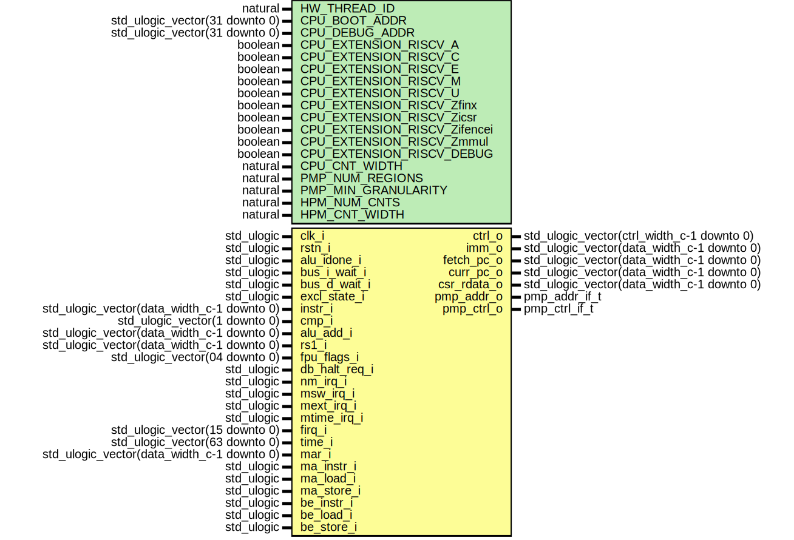

# Entity: neorv32_cpu_control

- **File**: neorv32_cpu_control.vhd
## Diagram

## Description

 #################################################################################################
 # << NEORV32 - CPU Control >>                                                                   #
 # ********************************************************************************************* #
 # CPU operation is split into a fetch engine (responsible for fetching instruction data), an    #
 # issue engine (for recoding compressed instructions and for constructing 32-bit instruction    #
 # words) and an execute engine (responsible for actually executing the instructions), a trap    #
 # handling controller and the RISC-V status and control register set (CSRs) including the       #
 # hardware performance monitor counters.                                                        #
 # ********************************************************************************************* #
 # BSD 3-Clause License                                                                          #
 #                                                                                               #
 # Copyright (c) 2021, Stephan Nolting. All rights reserved.                                     #
 #                                                                                               #
 # Redistribution and use in source and binary forms, with or without modification, are          #
 # permitted provided that the following conditions are met:                                     #
 #                                                                                               #
 # 1. Redistributions of source code must retain the above copyright notice, this list of        #
 #    conditions and the following disclaimer.                                                   #
 #                                                                                               #
 # 2. Redistributions in binary form must reproduce the above copyright notice, this list of     #
 #    conditions and the following disclaimer in the documentation and/or other materials        #
 #    provided with the distribution.                                                            #
 #                                                                                               #
 # 3. Neither the name of the copyright holder nor the names of its contributors may be used to  #
 #    endorse or promote products derived from this software without specific prior written      #
 #    permission.                                                                                #
 #                                                                                               #
 # THIS SOFTWARE IS PROVIDED BY THE COPYRIGHT HOLDERS AND CONTRIBUTORS "AS IS" AND ANY EXPRESS   #
 # OR IMPLIED WARRANTIES, INCLUDING, BUT NOT LIMITED TO, THE IMPLIED WARRANTIES OF               #
 # MERCHANTABILITY AND FITNESS FOR A PARTICULAR PURPOSE ARE DISCLAIMED. IN NO EVENT SHALL THE    #
 # COPYRIGHT HOLDER OR CONTRIBUTORS BE LIABLE FOR ANY DIRECT, INDIRECT, INCIDENTAL, SPECIAL,     #
 # EXEMPLARY, OR CONSEQUENTIAL DAMAGES (INCLUDING, BUT NOT LIMITED TO, PROCUREMENT OF SUBSTITUTE #
 # GOODS OR SERVICES; LOSS OF USE, DATA, OR PROFITS; OR BUSINESS INTERRUPTION) HOWEVER CAUSED    #
 # AND ON ANY THEORY OF LIABILITY, WHETHER IN CONTRACT, STRICT LIABILITY, OR TORT (INCLUDING     #
 # NEGLIGENCE OR OTHERWISE) ARISING IN ANY WAY OUT OF THE USE OF THIS SOFTWARE, EVEN IF ADVISED  #
 # OF THE POSSIBILITY OF SUCH DAMAGE.                                                            #
 # ********************************************************************************************* #
 # The NEORV32 Processor - https://github.com/stnolting/neorv32              (c) Stephan Nolting #
 #################################################################################################
## Generics

| Generic name                 | Type                           | Value | Description                                                               |
| ---------------------------- | ------------------------------ | ----- | ------------------------------------------------------------------------- |
| HW_THREAD_ID                 | natural                        |       |  hardware thread id (32-bit)                                              |
| CPU_BOOT_ADDR                | std_ulogic_vector(31 downto 0) |       |  cpu boot address                                                         |
| CPU_DEBUG_ADDR               | std_ulogic_vector(31 downto 0) |       |  cpu debug mode start address                                             |
| CPU_EXTENSION_RISCV_A        | boolean                        |       |  implement atomic extension?                                              |
| CPU_EXTENSION_RISCV_C        | boolean                        |       |  implement compressed extension?                                          |
| CPU_EXTENSION_RISCV_E        | boolean                        |       |  implement embedded RF extension?                                         |
| CPU_EXTENSION_RISCV_M        | boolean                        |       |  implement muld/div extension?                                            |
| CPU_EXTENSION_RISCV_U        | boolean                        |       |  implement user mode extension?                                           |
| CPU_EXTENSION_RISCV_Zfinx    | boolean                        |       |  implement 32-bit floating-point extension (using INT reg!)               |
| CPU_EXTENSION_RISCV_Zicsr    | boolean                        |       |  implement CSR system?                                                    |
| CPU_EXTENSION_RISCV_Zifencei | boolean                        |       |  implement instruction stream sync.?                                      |
| CPU_EXTENSION_RISCV_Zmmul    | boolean                        |       |  implement multiply-only M sub-extension?                                 |
| CPU_EXTENSION_RISCV_DEBUG    | boolean                        |       |  implement CPU debug mode?                                                |
| CPU_CNT_WIDTH                | natural                        |       |  total width of CPU cycle and instret counters (0..64)                    |
| CPU_IPB_ENTRIES              | natural                        |       |  entries is instruction prefetch buffer, has to be a power of 2           |
| PMP_NUM_REGIONS              | natural                        |       |  number of regions (0..64)                                                |
| PMP_MIN_GRANULARITY          | natural                        |       |  minimal region granularity in bytes, has to be a power of 2, min 8 bytes |
| HPM_NUM_CNTS                 | natural                        |       |  number of implemented HPM counters (0..29)                               |
| HPM_CNT_WIDTH                | natural                        |       |  total size of HPM counters (0..64)                                       |
## Ports

| Port name     | Direction | Type                                       | Description                                        |
| ------------- | --------- | ------------------------------------------ | -------------------------------------------------- |
| clk_i         | in        | std_ulogic                                 |  global clock, rising edge                         |
| rstn_i        | in        | std_ulogic                                 |  global reset, low-active, async                   |
| ctrl_o        | out       | std_ulogic_vector(ctrl_width_c-1 downto 0) |  main control bus                                  |
| alu_idone_i   | in        | std_ulogic                                 |  ALU iterative operation done                      |
| bus_i_wait_i  | in        | std_ulogic                                 |  wait for bus                                      |
| bus_d_wait_i  | in        | std_ulogic                                 |  wait for bus                                      |
| excl_state_i  | in        | std_ulogic                                 |  atomic/exclusive access lock status               |
| instr_i       | in        | std_ulogic_vector(data_width_c-1 downto 0) |  instruction                                       |
| cmp_i         | in        | std_ulogic_vector(1 downto 0)              |  comparator status                                 |
| alu_add_i     | in        | std_ulogic_vector(data_width_c-1 downto 0) |  ALU address result                                |
| rs1_i         | in        | std_ulogic_vector(data_width_c-1 downto 0) |  rf source 1                                       |
| imm_o         | out       | std_ulogic_vector(data_width_c-1 downto 0) |  immediate                                         |
| fetch_pc_o    | out       | std_ulogic_vector(data_width_c-1 downto 0) |  PC for instruction fetch                          |
| curr_pc_o     | out       | std_ulogic_vector(data_width_c-1 downto 0) |  current PC (corresponding to current instruction) |
| csr_rdata_o   | out       | std_ulogic_vector(data_width_c-1 downto 0) |  CSR read data                                     |
| fpu_flags_i   | in        | std_ulogic_vector(04 downto 0)             |  exception flags                                   |
| db_halt_req_i | in        | std_ulogic                                 | debug mode (halt) request --                       |
| nm_irq_i      | in        | std_ulogic                                 | non-maskable interrupt --                          |
| msw_irq_i     | in        | std_ulogic                                 |  machine software interrupt                        |
| mext_irq_i    | in        | std_ulogic                                 |  machine external interrupt                        |
| mtime_irq_i   | in        | std_ulogic                                 |  machine timer interrupt                           |
| firq_i        | in        | std_ulogic_vector(15 downto 0)             | fast interrupts (custom) --                        |
| time_i        | in        | std_ulogic_vector(63 downto 0)             |  current system time                               |
| pmp_addr_o    | out       | pmp_addr_if_t                              |  addresses                                         |
| pmp_ctrl_o    | out       | pmp_ctrl_if_t                              |  configs                                           |
| mar_i         | in        | std_ulogic_vector(data_width_c-1 downto 0) |  memory address register                           |
| ma_instr_i    | in        | std_ulogic                                 |  misaligned instruction address                    |
| ma_load_i     | in        | std_ulogic                                 |  misaligned load data address                      |
| ma_store_i    | in        | std_ulogic                                 |  misaligned store data address                     |
| be_instr_i    | in        | std_ulogic                                 |  bus error on instruction access                   |
| be_load_i     | in        | std_ulogic                                 |  bus error on load data access                     |
| be_store_i    | in        | std_ulogic                                 |  bus error on store data access                    |
## Signals

| Name                | Type                                              | Description                        |
| ------------------- | ------------------------------------------------- | ---------------------------------- |
| fetch_engine        | fetch_engine_t                                    |                                    |
| ipb                 | ipb_t                                             |                                    |
| ci_instr16          | std_ulogic_vector(15 downto 0)                    |  pre-decoder --                    |
| ci_instr32          | std_ulogic_vector(31 downto 0)                    |                                    |
| ci_illegal          | std_ulogic                                        |                                    |
| issue_engine        | issue_engine_t                                    |                                    |
| cmd_issue           | cmd_issue_t                                       |                                    |
| decode_aux          | decode_aux_t                                      |                                    |
| execute_engine      | execute_engine_t                                  |                                    |
| trap_ctrl           | trap_ctrl_t                                       |                                    |
| ctrl_nxt            | std_ulogic_vector(ctrl_width_c-1 downto 0)        |  CPU main control bus --           |
|  ctrl               | std_ulogic_vector(ctrl_width_c-1 downto 0)        |  CPU main control bus --           |
| bus_fast_ir         | std_ulogic                                        |  fast instruction fetch access --  |
| csr                 | csr_t                                             |                                    |
| debug_ctrl          | debug_ctrl_t                                      |                                    |
| cnt_event           | std_ulogic_vector(hpmcnt_event_size_c-1 downto 0) |  (hpm) counter events --           |
|  cnt_event_nxt      | std_ulogic_vector(hpmcnt_event_size_c-1 downto 0) |  (hpm) counter events --           |
| hpmcnt_trigger      | std_ulogic_vector(HPM_NUM_CNTS-1 downto 0)        |                                    |
| illegal_opcode_lsbs | std_ulogic                                        |  if opcode != rv32                 |
| illegal_instruction | std_ulogic                                        |                                    |
| illegal_register    | std_ulogic                                        |  only for E-extension              |
| illegal_compressed  | std_ulogic                                        |  only fir C-extension              |
| csr_acc_valid       | std_ulogic                                        |  access (privilege) check --       |
## Constants

| Name               | Type    | Value                                                                                                                                              | Description                             |
| ------------------ | ------- | -------------------------------------------------------------------------------------------------------------------------------------------------- | --------------------------------------- |
| cpu_cnt_lo_width_c | natural |  natural(cond_sel_int_f(boolean(CPU_CNT_WIDTH < 32),  CPU_CNT_WIDTH,  32))   |                                         |
| cpu_cnt_hi_width_c | natural |  natural(cond_sel_int_f(boolean(CPU_CNT_WIDTH > 32),  CPU_CNT_WIDTH-32,  0)) |                                         |
| hpm_cnt_lo_width_c | natural |  natural(cond_sel_int_f(boolean(HPM_CNT_WIDTH < 32),  HPM_CNT_WIDTH,  32))   |  HPM counter width - high/low parts --  |
| hpm_cnt_hi_width_c | natural |  natural(cond_sel_int_f(boolean(HPM_CNT_WIDTH > 32),  HPM_CNT_WIDTH-32,  0)) |                                         |
## Types

| Name                   | Type                                                                                                                                                                                                                                                                                                                                                                                                                                                                                                                                                                                                                                            | Description                                       |
| ---------------------- | ----------------------------------------------------------------------------------------------------------------------------------------------------------------------------------------------------------------------------------------------------------------------------------------------------------------------------------------------------------------------------------------------------------------------------------------------------------------------------------------------------------------------------------------------------------------------------------------------------------------------------------------------- | ------------------------------------------------- |
| fetch_engine_state_t   | (IFETCH_REQUEST,  IFETCH_ISSUE)                                                                                                                                                                                                                                                                                                                                                                                                                                                                                                                                                                              |  instruction fetch engine --                      |
| fetch_engine_t         |                                                                                                                                                                                                                                                                                                                                                                                                                                                                                                                                                                                                                                                 |                                                   |
| ipb_t                  |                                                                                                                                                                                                                                                                                                                                                                                                                                                                                                                                                                                                                                                 |  instruction prefetch buffer (FIFO) interface --  |
| issue_engine_state_t   | (ISSUE_ACTIVE,  ISSUE_REALIGN)                                                                                                                                                                                                                                                                                                                                                                                                                                                                                                                                                                               |  instruction issue engine --                      |
| issue_engine_t         |                                                                                                                                                                                                                                                                                                                                                                                                                                                                                                                                                                                                                                                 |                                                   |
| cmd_issue_t            |                                                                                                                                                                                                                                                                                                                                                                                                                                                                                                                                                                                                                                                 |  instruction issue interface --                   |
| decode_aux_t           |                                                                                                                                                                                                                                                                                                                                                                                                                                                                                                                                                                                                                                                 |  instruction decoding helper logic --             |
| execute_engine_state_t | (SYS_WAIT,  DISPATCH,  TRAP_ENTER,  TRAP_EXIT,  TRAP_EXECUTE,  EXECUTE,  ALU_WAIT,  BRANCH,  FENCE_OP,  LOADSTORE_0,  LOADSTORE_1,  LOADSTORE_2,  SYS_ENV,  CSR_ACCESS)  |  instruction execution engine --                  |
| execute_engine_t       |                                                                                                                                                                                                                                                                                                                                                                                                                                                                                                                                                                                                                                                 |                                                   |
| trap_ctrl_t            |                                                                                                                                                                                                                                                                                                                                                                                                                                                                                                                                                                                                                                                 |  trap controller --                               |
| pmp_ctrl_t             |                                                                                                                                                                                                                                                                                                                                                                                                                                                                                                                                                                                                                                                 |  RISC-V control and status registers (CSRs) --    |
| pmp_addr_t             |                                                                                                                                                                                                                                                                                                                                                                                                                                                                                                                                                                                                                                                 |                                                   |
| pmp_ctrl_rd_t          |                                                                                                                                                                                                                                                                                                                                                                                                                                                                                                                                                                                                                                                 |                                                   |
| mhpmevent_t            |                                                                                                                                                                                                                                                                                                                                                                                                                                                                                                                                                                                                                                                 |                                                   |
| mhpmcnt_t              |                                                                                                                                                                                                                                                                                                                                                                                                                                                                                                                                                                                                                                                 |                                                   |
| mhpmcnt_nxt_t          |                                                                                                                                                                                                                                                                                                                                                                                                                                                                                                                                                                                                                                                 |                                                   |
| mhpmcnt_ovfl_t         |                                                                                                                                                                                                                                                                                                                                                                                                                                                                                                                                                                                                                                                 |                                                   |
| mhpmcnt_rd_t           |                                                                                                                                                                                                                                                                                                                                                                                                                                                                                                                                                                                                                                                 |                                                   |
| csr_t                  |                                                                                                                                                                                                                                                                                                                                                                                                                                                                                                                                                                                                                                                 |                                                   |
| debug_ctrl_state_t     | (DEBUG_OFFLINE,  DEBUG_PENDING,  DEBUG_ONLINE,  DEBUG_EXIT)                                                                                                                                                                                                                                                                                                                                                                                                                                                                            |  debug mode controller --                         |
| debug_ctrl_t           |                                                                                                                                                                                                                                                                                                                                                                                                                                                                                                                                                                                                                                                 |                                                   |
## Processes
- fetch_engine_fsm_sync: ( rstn_i, clk_i )
- fetch_engine_fsm_comb: ( fetch_engine, execute_engine, ipb, instr_i, bus_i_wait_i, be_instr_i, ma_instr_i )
**Description**
 half-word aligned  Fetch Engine FSM Comb ------------------------------------------------------------------  ------------------------------------------------------------------------------------------- 
- issue_engine_fsm_sync: ( rstn_i, clk_i )
**Description**
 ****************************************************************************************************************************  Instruction Issue (recoding of compressed instructions and 32-bit instruction word construction)  ****************************************************************************************************************************  Issue Engine FSM Sync ------------------------------------------------------------------  ------------------------------------------------------------------------------------------- 
- issue_engine_fsm_comb: ( issue_engine, ipb, execute_engine, ci_illegal, ci_instr32 )
**Description**
 Issue Engine FSM Comb ------------------------------------------------------------------  ------------------------------------------------------------------------------------------- 
- imm_gen: ( rstn_i, clk_i )
**Description**
 ****************************************************************************************************************************  Instruction Execution  ****************************************************************************************************************************  Immediate Generator --------------------------------------------------------------------  ------------------------------------------------------------------------------------------- 
- branch_check: ( execute_engine.i_reg, cmp_i )
**Description**
 Branch Condition Check -----------------------------------------------------------------  ------------------------------------------------------------------------------------------- 
- execute_engine_fsm_sync: ( rstn_i, clk_i )
**Description**
 Execute Engine FSM Sync ----------------------------------------------------------------  ------------------------------------------------------------------------------------------- 
- ctrl_output: ( ctrl, fetch_engine, trap_ctrl, bus_fast_ir, execute_engine, csr, debug_ctrl )
**Description**
 CPU Control Bus Output -----------------------------------------------------------------  ------------------------------------------------------------------------------------------- 
- decode_helper: ( execute_engine )
**Description**
 Decoding Helper Logic ------------------------------------------------------------------  ------------------------------------------------------------------------------------------- 
- execute_engine_fsm_comb: ( execute_engine, debug_ctrl, trap_ctrl, decode_aux, fetch_engine, cmd_issue,
                                   csr, ctrl, csr_acc_valid, alu_idone_i, bus_d_wait_i, excl_state_i )
**Description**
 Execute Engine FSM Comb ----------------------------------------------------------------  ------------------------------------------------------------------------------------------- 
- csr_access_check: ( execute_engine.i_reg, csr, debug_ctrl )
**Description**
 ****************************************************************************************************************************  Invalid Instruction / CSR access check  ****************************************************************************************************************************  CSR Access Check -----------------------------------------------------------------------  ------------------------------------------------------------------------------------------- 
- illegal_instruction_check: ( execute_engine, decode_aux, csr, csr_acc_valid, debug_ctrl )
**Description**
 Illegal Instruction Check --------------------------------------------------------------  ------------------------------------------------------------------------------------------- 
- trap_controller: ( rstn_i, clk_i )
**Description**
 ****************************************************************************************************************************  Exception and Interrupt (= Trap) Control  ****************************************************************************************************************************  Trap Controller ------------------------------------------------------------------------  ------------------------------------------------------------------------------------------- 
- trap_priority: ( trap_ctrl )
**Description**
 "NMI" for debug mode entry  Trap Priority Encoder ------------------------------------------------------------------  ------------------------------------------------------------------------------------------- 
- csr_write_data: ( execute_engine.i_reg, csr.rdata, rs1_i )
**Description**
 ****************************************************************************************************************************  Control and Status Registers (CSRs)  ****************************************************************************************************************************  Control and Status Registers Write Data ------------------------------------------------  ------------------------------------------------------------------------------------------- 
- csr_write_access: ( rstn_i, clk_i )
**Description**
 Control and Status Registers - Write Access --------------------------------------------  ------------------------------------------------------------------------------------------- 
- pmp_output: ( csr )
**Description**
 PMP configuration output to bus unit -- 
- pmp_rd_dummy: ( csr )
**Description**
 PMP config read dummy -- 
- csr_counters: ( rstn_i, clk_i )
**Description**
 Control and Status Registers - Counters ------------------------------------------------  ------------------------------------------------------------------------------------------- 
- hpm_rd_dummy: ( csr )
**Description**
 hpm counter read -- 
- hpmcnt_ctrl: ( rstn_i, clk_i )
**Description**
 Hardware Performance Monitor - Counter Event Control -----------------------------------  ------------------------------------------------------------------------------------------- 
- csr_read_access: ( rstn_i, clk_i )
**Description**
 illegal operation  Control and Status Registers - Read Access ---------------------------------------------  ------------------------------------------------------------------------------------------- 
- debug_control: ( rstn_i, clk_i )
**Description**
 Debug Control --------------------------------------------------------------------------  ------------------------------------------------------------------------------------------- 
## Instantiations

- instr_prefetch_buffer: neorv32_fifo
**Description**
 ****************************************************************************************************************************
 Instruction Prefetch Buffer
 ****************************************************************************************************************************
 Instruction Prefetch Buffer (FIFO) -----------------------------------------------------
 -------------------------------------------------------------------------------------------

