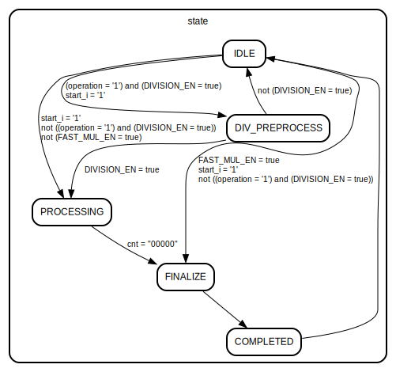

# Entity: neorv32_cpu_cp_muldiv

## Diagram

## Description

#################################################################################################
# << NEORV32 - CPU Co-Processor: Integer Multiplier/Divider Unit (RISC-V "M" Extension) >>      #
# ********************************************************************************************* #
# Multiplier and Divider unit. Implements the RISC-V M CPU extension.                           #
#                                                                                               #
# Multiplier core (signed/unsigned) uses classical serial algorithm. Unit latency: 31+3 cycles  #
# Divider core (unsigned) uses classical serial algorithm. Unit latency: 32+4 cycles            #
#                                                                                               #
# Multiplications can be mapped to DSP blocks (faster!) when FAST_MUL_EN = true.                #
# ********************************************************************************************* #
# BSD 3-Clause License                                                                          #
#                                                                                               #
# Copyright (c) 2021, Stephan Nolting. All rights reserved.                                     #
#                                                                                               #
# Redistribution and use in source and binary forms, with or without modification, are          #
# permitted provided that the following conditions are met:                                     #
#                                                                                               #
# 1. Redistributions of source code must retain the above copyright notice, this list of        #
#    conditions and the following disclaimer.                                                   #
#                                                                                               #
# 2. Redistributions in binary form must reproduce the above copyright notice, this list of     #
#    conditions and the following disclaimer in the documentation and/or other materials        #
#    provided with the distribution.                                                            #
#                                                                                               #
# 3. Neither the name of the copyright holder nor the names of its contributors may be used to  #
#    endorse or promote products derived from this software without specific prior written      #
#    permission.                                                                                #
#                                                                                               #
# THIS SOFTWARE IS PROVIDED BY THE COPYRIGHT HOLDERS AND CONTRIBUTORS "AS IS" AND ANY EXPRESS   #
# OR IMPLIED WARRANTIES, INCLUDING, BUT NOT LIMITED TO, THE IMPLIED WARRANTIES OF               #
# MERCHANTABILITY AND FITNESS FOR A PARTICULAR PURPOSE ARE DISCLAIMED. IN NO EVENT SHALL THE    #
# COPYRIGHT HOLDER OR CONTRIBUTORS BE LIABLE FOR ANY DIRECT, INDIRECT, INCIDENTAL, SPECIAL,     #
# EXEMPLARY, OR CONSEQUENTIAL DAMAGES (INCLUDING, BUT NOT LIMITED TO, PROCUREMENT OF SUBSTITUTE #
# GOODS OR SERVICES; LOSS OF USE, DATA, OR PROFITS; OR BUSINESS INTERRUPTION) HOWEVER CAUSED    #
# AND ON ANY THEORY OF LIABILITY, WHETHER IN CONTRACT, STRICT LIABILITY, OR TORT (INCLUDING     #
# NEGLIGENCE OR OTHERWISE) ARISING IN ANY WAY OUT OF THE USE OF THIS SOFTWARE, EVEN IF ADVISED  #
# OF THE POSSIBILITY OF SUCH DAMAGE.                                                            #
# ********************************************************************************************* #
# The NEORV32 Processor - https://github.com/stnolting/neorv32              (c) Stephan Nolting #
#################################################################################################
## Generics

| Generic name | Type    | Value | Description                        |
| ------------ | ------- | ----- | ---------------------------------- |
| FAST_MUL_EN  | boolean | false | use DSPs for faster multiplication |
| DIVISION_EN  | boolean | true  | implement divider hardware         |
## Ports

| Port name | Direction | Type                                       | Description                     |
| --------- | --------- | ------------------------------------------ | ------------------------------- |
| clk_i     | in        | std_ulogic                                 | global clock, rising edge       |
| rstn_i    | in        | std_ulogic                                 | global reset, low-active, async |
| ctrl_i    | in        | std_ulogic_vector(ctrl_width_c-1 downto 0) | main control bus                |
| start_i   | in        | std_ulogic                                 | trigger operation               |
| rs1_i     | in        | std_ulogic_vector(data_width_c-1 downto 0) | rf source 1                     |
| rs2_i     | in        | std_ulogic_vector(data_width_c-1 downto 0) | rf source 2                     |
| res_o     | out       | std_ulogic_vector(data_width_c-1 downto 0) | operation result                |
| valid_o   | out       | std_ulogic                                 | data output valid               |
## Signals

| Name             | Type                                       | Description                 |
| ---------------- | ------------------------------------------ | --------------------------- |
| state            | state_t                                    |                             |
| cnt              | std_ulogic_vector(4 downto 0)              |                             |
| cp_op            | std_ulogic_vector(2 downto 0)              | operation to execute        |
| cp_op_ff         | std_ulogic_vector(2 downto 0)              | operation that was executed |
| start_div        | std_ulogic                                 |                             |
| start_mul        | std_ulogic                                 |                             |
| operation        | std_ulogic                                 |                             |
| div_opx          | std_ulogic_vector(data_width_c-1 downto 0) |                             |
| div_opy          | std_ulogic_vector(data_width_c-1 downto 0) |                             |
| rs1_is_signed    | std_ulogic                                 |                             |
| rs2_is_signed    | std_ulogic                                 |                             |
| opy_is_zero      | std_ulogic                                 |                             |
| div_res_corr     | std_ulogic                                 |                             |
| valid            | std_ulogic                                 |                             |
| remainder        | std_ulogic_vector(data_width_c-1 downto 0) | divider core --             |
| quotient         | std_ulogic_vector(data_width_c-1 downto 0) |                             |
| div_sub          | std_ulogic_vector(data_width_c   downto 0) |                             |
| div_sign_comp_in | std_ulogic_vector(data_width_c-1 downto 0) |                             |
| div_sign_comp    | std_ulogic_vector(data_width_c-1 downto 0) |                             |
| div_res          | std_ulogic_vector(data_width_c-1 downto 0) |                             |
| mul_product      | std_ulogic_vector(63 downto 0)             | multiplier core --          |
| mul_do_add       | std_ulogic_vector(data_width_c downto 0)   |                             |
| mul_sign_cycle   | std_ulogic                                 |                             |
| mul_p_sext       | std_ulogic                                 |                             |
| mul_op_x         | signed(32 downto 0)                        | for using DSPs              |
| mul_op_y         | signed(32 downto 0)                        | for using DSPs              |
| mul_buf_ff       | signed(65 downto 0)                        |                             |
## Constants

| Name           | Type                          | Value  | Description |
| -------------- | ----------------------------- | ------ | ----------- |
| cp_op_mul_c    | std_ulogic_vector(2 downto 0) |  "000" | mul         |
| cp_op_mulh_c   | std_ulogic_vector(2 downto 0) |  "001" | mulh        |
| cp_op_mulhsu_c | std_ulogic_vector(2 downto 0) |  "010" | mulhsu      |
| cp_op_mulhu_c  | std_ulogic_vector(2 downto 0) |  "011" | mulhu       |
| cp_op_div_c    | std_ulogic_vector(2 downto 0) |  "100" | div         |
| cp_op_divu_c   | std_ulogic_vector(2 downto 0) |  "101" | divu        |
| cp_op_rem_c    | std_ulogic_vector(2 downto 0) |  "110" | rem         |
| cp_op_remu_c   | std_ulogic_vector(2 downto 0) |  "111" | remu        |
## Types

| Name    | Type                                                     | Description   |
| ------- | -------------------------------------------------------- | ------------- |
| state_t | (IDLE, DIV_PREPROCESS, PROCESSING, FINALIZE, COMPLETED)  | controller -- |
## Processes
- coprocessor_ctrl: ( rstn_i, clk_i )
- mul_update: ( mul_product, mul_sign_cycle, mul_p_sext, rs1_is_signed, rs1_i )
**Description**
do another addition (bit-serial) --

- operation_result: ( rstn_i, clk_i )
**Description**
Data Output ----------------------------------------------------------------------------
-------------------------------------------------------------------------------------------

## State machines

