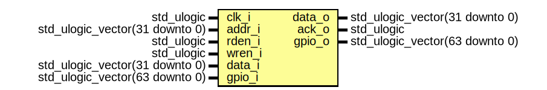

# Entity: neorv32_gpio
## Diagram

## Ports
| Port name | Direction | Type                           | Description |
| --------- | --------- | ------------------------------ | ----------- |
| clk_i     | in        | std_ulogic                     |             |
| addr_i    | in        | std_ulogic_vector(31 downto 0) |             |
| rden_i    | in        | std_ulogic                     |             |
| wren_i    | in        | std_ulogic                     |             |
| data_i    | in        | std_ulogic_vector(31 downto 0) |             |
| data_o    | out       | std_ulogic_vector(31 downto 0) |             |
| ack_o     | out       | std_ulogic                     |             |
| gpio_o    | out       | std_ulogic_vector(31 downto 0) |             |
| gpio_i    | in        | std_ulogic_vector(31 downto 0) |             |
| irq_o     | out       | std_ulogic                     |             |
## Signals
| Name   | Type                           | Description |
| ------ | ------------------------------ | ----------- |
| acc_en | std_ulogic                     |             |
| addr   | std_ulogic_vector(31 downto 0) |             |
| din    | std_ulogic_vector(31 downto 0) |             |
| dout   | std_ulogic_vector(31 downto 0) |             |
| irq_en | std_ulogic_vector(31 downto 0) |             |
| in_buf | std_ulogic_vector(31 downto 0) |             |
## Constants
| Name     | Type    | Value                      | Description |
| -------- | ------- | -------------------------- | ----------- |
| hi_abb_c | natural |  index_size_f(io_size_c)-1 |             |
| lo_abb_c | natural |  index_size_f(gpio_size_c) |             |
## Processes
- rw_access: _( clk_i )_

- irq_detector: _( clk_i )_

