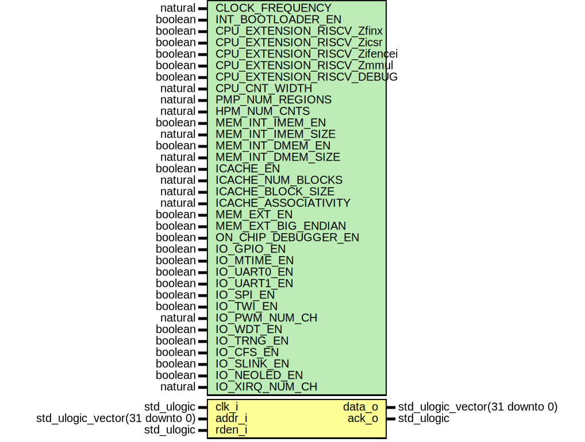

# Entity: neorv32_sysinfo

## Diagram

## Description

#################################################################################################
# << NEORV32 - System/Processor Configuration Information Memory (SYSINFO) >>                   #
# ********************************************************************************************* #
# This unit provides information regarding the NEORV32 processor system configuration -         #
# mostly derived from the top's configuration generics.                                         #
# ********************************************************************************************* #
# BSD 3-Clause License                                                                          #
#                                                                                               #
# Copyright (c) 2021, Stephan Nolting. All rights reserved.                                     #
#                                                                                               #
# Redistribution and use in source and binary forms, with or without modification, are          #
# permitted provided that the following conditions are met:                                     #
#                                                                                               #
# 1. Redistributions of source code must retain the above copyright notice, this list of        #
#    conditions and the following disclaimer.                                                   #
#                                                                                               #
# 2. Redistributions in binary form must reproduce the above copyright notice, this list of     #
#    conditions and the following disclaimer in the documentation and/or other materials        #
#    provided with the distribution.                                                            #
#                                                                                               #
# 3. Neither the name of the copyright holder nor the names of its contributors may be used to  #
#    endorse or promote products derived from this software without specific prior written      #
#    permission.                                                                                #
#                                                                                               #
# THIS SOFTWARE IS PROVIDED BY THE COPYRIGHT HOLDERS AND CONTRIBUTORS "AS IS" AND ANY EXPRESS   #
# OR IMPLIED WARRANTIES, INCLUDING, BUT NOT LIMITED TO, THE IMPLIED WARRANTIES OF               #
# MERCHANTABILITY AND FITNESS FOR A PARTICULAR PURPOSE ARE DISCLAIMED. IN NO EVENT SHALL THE    #
# COPYRIGHT HOLDER OR CONTRIBUTORS BE LIABLE FOR ANY DIRECT, INDIRECT, INCIDENTAL, SPECIAL,     #
# EXEMPLARY, OR CONSEQUENTIAL DAMAGES (INCLUDING, BUT NOT LIMITED TO, PROCUREMENT OF SUBSTITUTE #
# GOODS OR SERVICES; LOSS OF USE, DATA, OR PROFITS; OR BUSINESS INTERRUPTION) HOWEVER CAUSED    #
# AND ON ANY THEORY OF LIABILITY, WHETHER IN CONTRACT, STRICT LIABILITY, OR TORT (INCLUDING     #
# NEGLIGENCE OR OTHERWISE) ARISING IN ANY WAY OUT OF THE USE OF THIS SOFTWARE, EVEN IF ADVISED  #
# OF THE POSSIBILITY OF SUCH DAMAGE.                                                            #
# ********************************************************************************************* #
# The NEORV32 Processor - https://github.com/stnolting/neorv32              (c) Stephan Nolting #
#################################################################################################
## Generics

| Generic name         | Type                           | Value       | Description                                                                           |
| -------------------- | ------------------------------ | ----------- | ------------------------------------------------------------------------------------- |
| CLOCK_FREQUENCY      | natural                        | 0           | clock frequency of clk_i in Hz                                                        |
| INT_BOOTLOADER_EN    | boolean                        | true        | boot configuration: true = boot explicit bootloader; false = boot from int/ext (I)MEM |
| USER_CODE            | std_ulogic_vector(31 downto 0) | x"00000000" | custom user code                                                                      |
| MEM_INT_IMEM_EN      | boolean                        | true        | implement processor-internal instruction memory                                       |
| MEM_INT_IMEM_SIZE    | natural                        | 8*1024      | size of processor-internal instruction memory in bytes                                |
| MEM_INT_DMEM_EN      | boolean                        | true        | implement processor-internal data memory                                              |
| MEM_INT_DMEM_SIZE    | natural                        | 4*1024      | size of processor-internal data memory in bytes                                       |
| ICACHE_EN            | boolean                        | true        | implement instruction cache                                                           |
| ICACHE_NUM_BLOCKS    | natural                        | 4           | i-cache: number of blocks (min 2), has to be a power of 2                             |
| ICACHE_BLOCK_SIZE    | natural                        | 64          | i-cache: block size in bytes (min 4), has to be a power of 2                          |
| ICACHE_ASSOCIATIVITY | natural                        | 1           | i-cache: associativity (min 1), has to be a power 2                                   |
| MEM_EXT_EN           | boolean                        | false       | implement external memory bus interface?                                              |
| ON_CHIP_DEBUGGER_EN  | boolean                        | false       | implement OCD?                                                                        |
| IO_GPIO_EN           | boolean                        | true        | implement general purpose input/output port unit (GPIO)?                              |
| IO_MTIME_EN          | boolean                        | true        | implement machine system timer (MTIME)?                                               |
| IO_UART0_EN          | boolean                        | true        | implement primary universal asynchronous receiver/transmitter (UART0)?                |
| IO_UART1_EN          | boolean                        | true        | implement secondary universal asynchronous receiver/transmitter (UART1)?              |
| IO_SPI_EN            | boolean                        | true        | implement serial peripheral interface (SPI)?                                          |
| IO_TWI_EN            | boolean                        | true        | implement two-wire interface (TWI)?                                                   |
| IO_PWM_NUM_CH        | natural                        | 4           | number of PWM channels to implement                                                   |
| IO_WDT_EN            | boolean                        | true        | implement watch dog timer (WDT)?                                                      |
| IO_TRNG_EN           | boolean                        | true        | implement true random number generator (TRNG)?                                        |
| IO_CFS_EN            | boolean                        | true        | implement custom functions subsystem (CFS)?                                           |
| IO_SLINK_EN          | boolean                        | true        | implement stream link interface?                                                      |
| IO_NEOLED_EN         | boolean                        | true        | implement NeoPixel-compatible smart LED interface (NEOLED)?                           |
## Ports

| Port name | Direction | Type                           | Description          |
| --------- | --------- | ------------------------------ | -------------------- |
| clk_i     | in        | std_ulogic                     | global clock line    |
| addr_i    | in        | std_ulogic_vector(31 downto 0) | address              |
| rden_i    | in        | std_ulogic                     | read enable          |
| data_o    | out       | std_ulogic_vector(31 downto 0) | data out             |
| ack_o     | out       | std_ulogic                     | transfer acknowledge |
## Signals

| Name        | Type                           | Description          |
| ----------- | ------------------------------ | -------------------- |
| acc_en      | std_ulogic                     | module access enable |
| addr        | std_ulogic_vector(31 downto 0) |                      |
| rden        | std_ulogic                     |                      |
| info_addr   | std_ulogic_vector(02 downto 0) |                      |
| sysinfo_mem | info_mem_t                     |                      |
## Constants

| Name     | Type    | Value                         | Description               |
| -------- | ------- | ----------------------------- | ------------------------- |
| hi_abb_c | natural |  index_size_f(io_size_c)-1    | high address boundary bit |
| lo_abb_c | natural |  index_size_f(sysinfo_size_c) | low address boundary bit  |
## Types

| Name       | Type | Description               |
| ---------- | ---- | ------------------------- |
| info_mem_t |      | system information ROM -- |
## Processes
- read_access: ( clk_i )
**Description**
Read Access ----------------------------------------------------------------------------
-------------------------------------------------------------------------------------------

