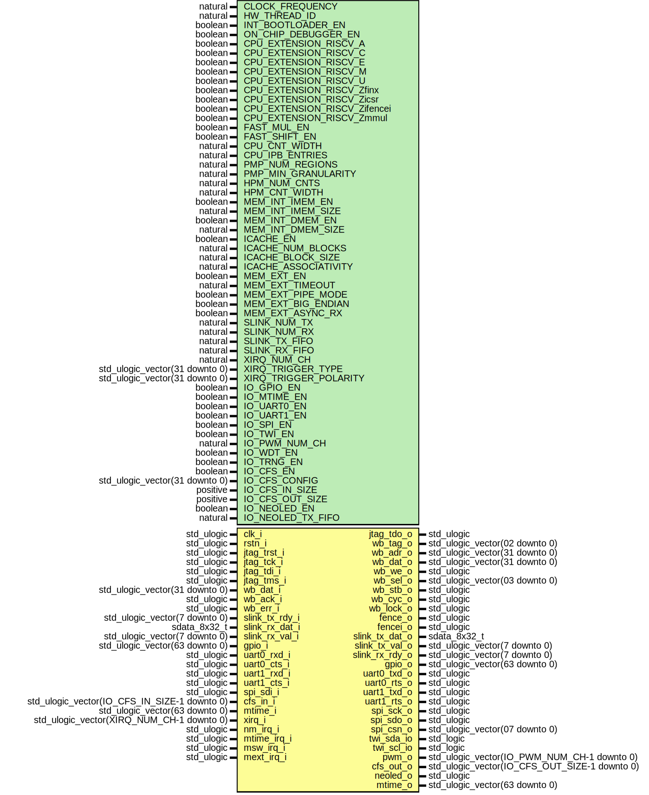

# Entity: neorv32_top

## Diagram

## Description

#################################################################################################
# << NEORV32 - Processor Top Entity >>                                                          #
# ********************************************************************************************* #
# This is the top entity of the NEORV32 PROCESSOR. Instantiate this unit in your own project    #
# and define all the configuration generics according to your needs. Alternatively, you can use #
# one of the alternative top entities provided in the "rtl/templates" folder.                   #
#                                                                                               #
# Check out the processor's documentation for more information.                                 #
# ********************************************************************************************* #
# BSD 3-Clause License                                                                          #
#                                                                                               #
# Copyright (c) 2021, Stephan Nolting. All rights reserved.                                     #
#                                                                                               #
# Redistribution and use in source and binary forms, with or without modification, are          #
# permitted provided that the following conditions are met:                                     #
#                                                                                               #
# 1. Redistributions of source code must retain the above copyright notice, this list of        #
#    conditions and the following disclaimer.                                                   #
#                                                                                               #
# 2. Redistributions in binary form must reproduce the above copyright notice, this list of     #
#    conditions and the following disclaimer in the documentation and/or other materials        #
#    provided with the distribution.                                                            #
#                                                                                               #
# 3. Neither the name of the copyright holder nor the names of its contributors may be used to  #
#    endorse or promote products derived from this software without specific prior written      #
#    permission.                                                                                #
#                                                                                               #
# THIS SOFTWARE IS PROVIDED BY THE COPYRIGHT HOLDERS AND CONTRIBUTORS "AS IS" AND ANY EXPRESS   #
# OR IMPLIED WARRANTIES, INCLUDING, BUT NOT LIMITED TO, THE IMPLIED WARRANTIES OF               #
# MERCHANTABILITY AND FITNESS FOR A PARTICULAR PURPOSE ARE DISCLAIMED. IN NO EVENT SHALL THE    #
# COPYRIGHT HOLDER OR CONTRIBUTORS BE LIABLE FOR ANY DIRECT, INDIRECT, INCIDENTAL, SPECIAL,     #
# EXEMPLARY, OR CONSEQUENTIAL DAMAGES (INCLUDING, BUT NOT LIMITED TO, PROCUREMENT OF SUBSTITUTE #
# GOODS OR SERVICES; LOSS OF USE, DATA, OR PROFITS; OR BUSINESS INTERRUPTION) HOWEVER CAUSED    #
# AND ON ANY THEORY OF LIABILITY, WHETHER IN CONTRACT, STRICT LIABILITY, OR TORT (INCLUDING     #
# NEGLIGENCE OR OTHERWISE) ARISING IN ANY WAY OUT OF THE USE OF THIS SOFTWARE, EVEN IF ADVISED  #
# OF THE POSSIBILITY OF SUCH DAMAGE.                                                            #
# ********************************************************************************************* #
# The NEORV32 Processor - https://github.com/stnolting/neorv32              (c) Stephan Nolting #
#################################################################################################
## Generics

| Generic name                 | Type                           | Value       | Description                                                                           |
| ---------------------------- | ------------------------------ | ----------- | ------------------------------------------------------------------------------------- |
| CLOCK_FREQUENCY              | natural                        | 0           | clock frequency of clk_i in Hz                                                        |
| USER_CODE                    | std_ulogic_vector(31 downto 0) | x"00000000" | custom user code                                                                      |
| HW_THREAD_ID                 | natural                        | 0           | hardware thread id (32-bit)                                                           |
| INT_BOOTLOADER_EN            | boolean                        | true        | boot configuration: true = boot explicit bootloader; false = boot from int/ext (I)MEM |
| ON_CHIP_DEBUGGER_EN          | boolean                        | false       | implement on-chip debugger                                                            |
| CPU_EXTENSION_RISCV_A        | boolean                        | false       | implement atomic extension?                                                           |
| CPU_EXTENSION_RISCV_C        | boolean                        | false       | implement compressed extension?                                                       |
| CPU_EXTENSION_RISCV_E        | boolean                        | false       | implement embedded RF extension?                                                      |
| CPU_EXTENSION_RISCV_M        | boolean                        | false       | implement mul/div extension?                                                          |
| CPU_EXTENSION_RISCV_U        | boolean                        | false       | implement user mode extension?                                                        |
| CPU_EXTENSION_RISCV_Zfinx    | boolean                        | false       | implement 32-bit floating-point extension (using INT regs!)                           |
| CPU_EXTENSION_RISCV_Zicsr    | boolean                        | true        | implement CSR system?                                                                 |
| CPU_EXTENSION_RISCV_Zifencei | boolean                        | false       | implement instruction stream sync.?                                                   |
| CPU_EXTENSION_RISCV_Zmmul    | boolean                        | false       | implement multiply-only M sub-extension?                                              |
| FAST_MUL_EN                  | boolean                        | false       | use DSPs for M extension's multiplier                                                 |
| FAST_SHIFT_EN                | boolean                        | false       | use barrel shifter for shift operations                                               |
| CPU_CNT_WIDTH                | natural                        | 64          | total width of CPU cycle and instret counters (0..64)                                 |
| PMP_NUM_REGIONS              | natural                        | 0           | number of regions (0..64)                                                             |
| PMP_MIN_GRANULARITY          | natural                        | 64*1024     | minimal region granularity in bytes, has to be a power of 2, min 8 bytes              |
| HPM_NUM_CNTS                 | natural                        | 0           | number of implemented HPM counters (0..29)                                            |
| HPM_CNT_WIDTH                | natural                        | 40          | total size of HPM counters (0..64)                                                    |
| MEM_INT_IMEM_EN              | boolean                        | true        | implement processor-internal instruction memory                                       |
| MEM_INT_IMEM_SIZE            | natural                        | 16*1024     | size of processor-internal instruction memory in bytes                                |
| MEM_INT_DMEM_EN              | boolean                        | true        | implement processor-internal data memory                                              |
| MEM_INT_DMEM_SIZE            | natural                        | 8*1024      | size of processor-internal data memory in bytes                                       |
| ICACHE_EN                    | boolean                        | false       | implement instruction cache                                                           |
| ICACHE_NUM_BLOCKS            | natural                        | 4           | i-cache: number of blocks (min 1), has to be a power of 2                             |
| ICACHE_BLOCK_SIZE            | natural                        | 64          | i-cache: block size in bytes (min 4), has to be a power of 2                          |
| ICACHE_ASSOCIATIVITY         | natural                        | 1           | i-cache: associativity / number of sets (1=direct_mapped), has to be a power of 2     |
| MEM_EXT_EN                   | boolean                        | false       | implement external memory bus interface?                                              |
| MEM_EXT_TIMEOUT              | natural                        | 255         | cycles after a pending bus access auto-terminates (0 = disabled)                      |
| SLINK_NUM_TX                 | natural                        | 0           | number of TX links (0..8)                                                             |
| SLINK_NUM_RX                 | natural                        | 0           | number of TX links (0..8)                                                             |
| SLINK_TX_FIFO                | natural                        | 1           | TX fifo depth, has to be a power of two                                               |
| SLINK_RX_FIFO                | natural                        | 1           | RX fifo depth, has to be a power of two                                               |
| IO_GPIO_EN                   | boolean                        | true        | implement general purpose input/output port unit (GPIO)?                              |
| IO_MTIME_EN                  | boolean                        | true        | implement machine system timer (MTIME)?                                               |
| IO_UART0_EN                  | boolean                        | true        | implement primary universal asynchronous receiver/transmitter (UART0)?                |
| IO_UART1_EN                  | boolean                        | true        | implement secondary universal asynchronous receiver/transmitter (UART1)?              |
| IO_SPI_EN                    | boolean                        | true        | implement serial peripheral interface (SPI)?                                          |
| IO_TWI_EN                    | boolean                        | true        | implement two-wire interface (TWI)?                                                   |
| IO_PWM_NUM_CH                | natural                        | 4           | number of PWM channels to implement (0..60); 0 = disabled                             |
| IO_WDT_EN                    | boolean                        | true        | implement watch dog timer (WDT)?                                                      |
| IO_TRNG_EN                   | boolean                        | false       | implement true random number generator (TRNG)?                                        |
| IO_CFS_EN                    | boolean                        | false       | implement custom functions subsystem (CFS)?                                           |
| IO_CFS_CONFIG                | std_ulogic_vector(31 downto 0) | x"00000000" | custom CFS configuration generic                                                      |
| IO_CFS_IN_SIZE               | positive                       | 32          | size of CFS input conduit in bits                                                     |
| IO_CFS_OUT_SIZE              | positive                       | 32          | size of CFS output conduit in bits                                                    |
| IO_NEOLED_EN                 | boolean                        | true        | implement NeoPixel-compatible smart LED interface (NEOLED)?                           |
## Ports

| Port name      | Direction | Type                                          | Description                                                              |
| -------------- | --------- | --------------------------------------------- | ------------------------------------------------------------------------ |
| clk_i          | in        | std_ulogic                                    | global clock, rising edge                                                |
| rstn_i         | in        | std_ulogic                                    | global reset, low-active, async                                          |
| jtag_trst_i    | in        | std_ulogic                                    | low-active TAP reset (optional)                                          |
| jtag_tck_i     | in        | std_ulogic                                    | serial clock                                                             |
| jtag_tdi_i     | in        | std_ulogic                                    | serial data input                                                        |
| jtag_tdo_o     | out       | std_ulogic                                    | serial data output                                                       |
| jtag_tms_i     | in        | std_ulogic                                    | mode select                                                              |
| wb_tag_o       | out       | std_ulogic_vector(02 downto 0)                | request tag                                                              |
| wb_adr_o       | out       | std_ulogic_vector(31 downto 0)                | address                                                                  |
| wb_dat_i       | in        | std_ulogic_vector(31 downto 0)                | read data                                                                |
| wb_dat_o       | out       | std_ulogic_vector(31 downto 0)                | write data                                                               |
| wb_we_o        | out       | std_ulogic                                    | read/write                                                               |
| wb_sel_o       | out       | std_ulogic_vector(03 downto 0)                | byte enable                                                              |
| wb_stb_o       | out       | std_ulogic                                    | strobe                                                                   |
| wb_cyc_o       | out       | std_ulogic                                    | valid cycle                                                              |
| wb_lock_o      | out       | std_ulogic                                    | exclusive access request                                                 |
| wb_ack_i       | in        | std_ulogic                                    | transfer acknowledge                                                     |
| wb_err_i       | in        | std_ulogic                                    | transfer error                                                           |
| fence_o        | out       | std_ulogic                                    | indicates an executed FENCE operation                                    |
| fencei_o       | out       | std_ulogic                                    | indicates an executed FENCEI operation                                   |
| slink_tx_dat_o | out       | sdata_8x32_t                                  | output data                                                              |
| slink_tx_val_o | out       | std_ulogic_vector(7 downto 0)                 | valid output                                                             |
| slink_tx_rdy_i | in        | std_ulogic_vector(7 downto 0)                 | ready to send                                                            |
| slink_rx_dat_i | in        | sdata_8x32_t                                  | input data                                                               |
| slink_rx_val_i | in        | std_ulogic_vector(7 downto 0)                 | valid input                                                              |
| slink_rx_rdy_o | out       | std_ulogic_vector(7 downto 0)                 | ready to receive                                                         |
| gpio_o         | out       | std_ulogic_vector(63 downto 0)                | parallel output                                                          |
| gpio_i         | in        | std_ulogic_vector(63 downto 0)                | parallel input                                                           |
| uart0_txd_o    | out       | std_ulogic                                    | UART0 send data                                                          |
| uart0_rxd_i    | in        | std_ulogic                                    | UART0 receive data                                                       |
| uart0_rts_o    | out       | std_ulogic                                    | hw flow control: UART0.RX ready to receive ("RTR"), low-active, optional |
| uart0_cts_i    | in        | std_ulogic                                    | hw flow control: UART0.TX allowed to transmit, low-active, optional      |
| uart1_txd_o    | out       | std_ulogic                                    | UART1 send data                                                          |
| uart1_rxd_i    | in        | std_ulogic                                    | UART1 receive data                                                       |
| uart1_rts_o    | out       | std_ulogic                                    | hw flow control: UART1.RX ready to receive ("RTR"), low-active, optional |
| uart1_cts_i    | in        | std_ulogic                                    | hw flow control: UART1.TX allowed to transmit, low-active, optional      |
| spi_sck_o      | out       | std_ulogic                                    | SPI serial clock                                                         |
| spi_sdo_o      | out       | std_ulogic                                    | controller data out, peripheral data in                                  |
| spi_sdi_i      | in        | std_ulogic                                    | controller data in, peripheral data out                                  |
| spi_csn_o      | out       | std_ulogic_vector(07 downto 0)                | chip-select                                                              |
| twi_sda_io     | inout     | std_logic                                     | twi serial data line                                                     |
| twi_scl_io     | inout     | std_logic                                     | twi serial clock line                                                    |
| pwm_o          | out       | std_ulogic_vector(IO_PWM_NUM_CH-1 downto 0)   | pwm channels                                                             |
| cfs_in_i       | in        | std_ulogic_vector(IO_CFS_IN_SIZE-1  downto 0) | custom CFS inputs conduit                                                |
| cfs_out_o      | out       | std_ulogic_vector(IO_CFS_OUT_SIZE-1 downto 0) | custom CFS outputs conduit                                               |
| neoled_o       | out       | std_ulogic                                    | async serial data line                                                   |
| mtime_i        | in        | std_ulogic_vector(63 downto 0)                | current system time from ext. MTIME (if IO_MTIME_EN = false)             |
| mtime_o        | out       | std_ulogic_vector(63 downto 0)                | current system time from int. MTIME (if IO_MTIME_EN = true)              |
| nm_irq_i       | in        | std_ulogic                                    | non-maskable interrupt                                                   |
| mtime_irq_i    | in        | std_ulogic                                    | machine timer interrupt, available if IO_MTIME_EN = false                |
| msw_irq_i      | in        | std_ulogic                                    | machine software interrupt                                               |
| mext_irq_i     | in        | std_ulogic                                    | machine external interrupt                                               |
## Signals

| Name           | Type                           | Description                    |
| -------------- | ------------------------------ | ------------------------------ |
| rstn_gen       | std_ulogic_vector(7 downto 0)  | reset generator --             |
| ext_rstn       | std_ulogic                     |                                |
| sys_rstn       | std_ulogic                     |                                |
| wdt_rstn       | std_ulogic                     |                                |
| clk_div        | std_ulogic_vector(11 downto 0) | clock generator --             |
| clk_div_ff     | std_ulogic_vector(11 downto 0) |                                |
| clk_gen        | std_ulogic_vector(07 downto 0) |                                |
| clk_gen_en     | std_ulogic_vector(07 downto 0) |                                |
| wdt_cg_en      | std_ulogic                     |                                |
| uart0_cg_en    | std_ulogic                     |                                |
| uart1_cg_en    | std_ulogic                     |                                |
| spi_cg_en      | std_ulogic                     |                                |
| twi_cg_en      | std_ulogic                     |                                |
| pwm_cg_en      | std_ulogic                     |                                |
| cfs_cg_en      | std_ulogic                     |                                |
| neoled_cg_en   | std_ulogic                     |                                |
| cpu_i          | bus_interface_t                |                                |
|  i_cache       | bus_interface_t                |                                |
|  cpu_d         | bus_interface_t                |                                |
|  p_bus         | bus_interface_t                |                                |
| dci_ndmrstn    | std_ulogic                     | debug core interface (DCI) --  |
| dci_halt_req   | std_ulogic                     |                                |
| dmi            | dmi_t                          |                                |
| io_acc         | std_ulogic                     | io space access --             |
| io_rden        | std_ulogic                     |                                |
| io_wren        | std_ulogic                     |                                |
| resp_bus       | resp_bus_t                     |                                |
| fast_irq       | std_ulogic_vector(15 downto 0) | IRQs --                        |
| fast_irq_ack   | std_ulogic_vector(15 downto 0) |                                |
| mtime_irq      | std_ulogic                     |                                |
| wdt_irq        | std_ulogic                     |                                |
| uart0_rxd_irq  | std_ulogic                     |                                |
| uart0_txd_irq  | std_ulogic                     |                                |
| uart1_rxd_irq  | std_ulogic                     |                                |
| uart1_txd_irq  | std_ulogic                     |                                |
| spi_irq        | std_ulogic                     |                                |
| twi_irq        | std_ulogic                     |                                |
| cfs_irq        | std_ulogic                     |                                |
| cfs_irq_ack    | std_ulogic                     |                                |
| neoled_irq     | std_ulogic                     |                                |
| slink_tx_irq   | std_ulogic                     |                                |
| slink_rx_irq   | std_ulogic                     |                                |
| mtime_time     | std_ulogic_vector(63 downto 0) | current system time from MTIME |
| cpu_sleep      | std_ulogic                     | CPU is in sleep mode when set  |
| bus_keeper_err | std_ulogic                     |                                |
## Constants

| Name                       | Type                                                          | Value                                                                          | Description                              |
| -------------------------- | ------------------------------------------------------------- | ------------------------------------------------------------------------------ | ---------------------------------------- |
| cpu_boot_addr_c            | std_ulogic_vector(31 downto 0)                                |  cond_sel_stdulogicvector_f(INT_BOOTLOADER_EN, boot_rom_base_c, ispace_base_c) |                                          |
| imem_align_check_c         | std_ulogic_vector(index_size_f(MEM_INT_IMEM_SIZE)-1 downto 0) |  (others => '0')                                                               | alignment check for internal memories -- |
| dmem_align_check_c         | std_ulogic_vector(index_size_f(MEM_INT_DMEM_SIZE)-1 downto 0) |  (others => '0')                                                               |                                          |
| io_slink_en_c              | boolean                                                       |  boolean(SLINK_NUM_RX > 0) or boolean(SLINK_NUM_TX > 0)                        | implement slink at all?                  |
| resp_bus_entry_terminate_c | resp_bus_entry_t                                              |  (rdata => (others => '0'), ack => '0', err => '0')                            |                                          |
## Types

| Name             | Type                                                                                                                                                                                                              | Description                         |
| ---------------- | ----------------------------------------------------------------------------------------------------------------------------------------------------------------------------------------------------------------- | ----------------------------------- |
| bus_interface_t  |                                                                                                                                                                                                                   | bus interface --                    |
| dmi_t            |                                                                                                                                                                                                                   | debug module interface (DMI) --     |
| resp_bus_entry_t |                                                                                                                                                                                                                   | module response bus - entry type -- |
| resp_bus_id_t    | (RESP_IMEM, RESP_DMEM, RESP_BOOTROM, RESP_WISHBONE, RESP_GPIO, RESP_MTIME, RESP_UART0, RESP_UART1, RESP_SPI, RESP_TWI, RESP_PWM, RESP_WDT, RESP_TRNG, RESP_CFS, RESP_NEOLED, RESP_SYSINFO, RESP_OCD, RESP_SLINK)  | module response bus - device ID --  |
| resp_bus_t       |                                                                                                                                                                                                                   | module response bus --              |
## Processes
- reset_generator: ( rstn_i, clk_i )
**Description**
Reset Generator ------------------------------------------------------------------------
-------------------------------------------------------------------------------------------

- clock_generator: ( sys_rstn, clk_i )
**Description**
Clock Generator ------------------------------------------------------------------------
-------------------------------------------------------------------------------------------

- bus_response: ( resp_bus, bus_keeper_err )
**Description**
bus response --

- mtime_sync: ( clk_i )
**Description**
system time output LO --

## Instantiations

- neorv32_cpu_inst: neorv32_cpu
**Description**
CPU Core -------------------------------------------------------------------------------
-------------------------------------------------------------------------------------------

- neorv32_busswitch_inst: neorv32_busswitch
**Description**
CPU Bus Switch -------------------------------------------------------------------------
-------------------------------------------------------------------------------------------

- neorv32_bus_keeper_inst: neorv32_bus_keeper
**Description**
Processor-Internal Bus Keeper (BUS_KEEPER) ---------------------------------------------
-------------------------------------------------------------------------------------------

- neorv32_sysinfo_inst: neorv32_sysinfo
**Description**
System Configuration Information Memory (SYSINFO) --------------------------------------
-------------------------------------------------------------------------------------------

