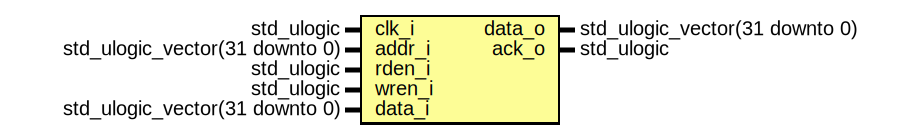

# Entity: neorv32_trng
## Diagram

## Description
#################################################################################################
# << NEORV32 - True Random Number Generator (TRNG) >>                                           #
# ********************************************************************************************* #
# This unit implements a *true* random number generator which uses several ring oscillators as  #
# entropy source. The outputs of all chains are XORed and de-biased using a John von Neumann    #
# randomness extractor. The de-biased signal is further processed by a simple LFSR for improved #
# whitening.                                                                                    #
# ********************************************************************************************* #
# BSD 3-Clause License                                                                          #
#                                                                                               #
# Copyright (c) 2021, Stephan Nolting. All rights reserved.                                     #
#                                                                                               #
# Redistribution and use in source and binary forms, with or without modification, are          #
# permitted provided that the following conditions are met:                                     #
#                                                                                               #
# 1. Redistributions of source code must retain the above copyright notice, this list of        #
#    conditions and the following disclaimer.                                                   #
#                                                                                               #
# 2. Redistributions in binary form must reproduce the above copyright notice, this list of     #
#    conditions and the following disclaimer in the documentation and/or other materials        #
#    provided with the distribution.                                                            #
#                                                                                               #
# 3. Neither the name of the copyright holder nor the names of its contributors may be used to  #
#    endorse or promote products derived from this software without specific prior written      #
#    permission.                                                                                #
#                                                                                               #
# THIS SOFTWARE IS PROVIDED BY THE COPYRIGHT HOLDERS AND CONTRIBUTORS "AS IS" AND ANY EXPRESS   #
# OR IMPLIED WARRANTIES, INCLUDING, BUT NOT LIMITED TO, THE IMPLIED WARRANTIES OF               #
# MERCHANTABILITY AND FITNESS FOR A PARTICULAR PURPOSE ARE DISCLAIMED. IN NO EVENT SHALL THE    #
# COPYRIGHT HOLDER OR CONTRIBUTORS BE LIABLE FOR ANY DIRECT, INDIRECT, INCIDENTAL, SPECIAL,     #
# EXEMPLARY, OR CONSEQUENTIAL DAMAGES (INCLUDING, BUT NOT LIMITED TO, PROCUREMENT OF SUBSTITUTE #
# GOODS OR SERVICES; LOSS OF USE, DATA, OR PROFITS; OR BUSINESS INTERRUPTION) HOWEVER CAUSED    #
# AND ON ANY THEORY OF LIABILITY, WHETHER IN CONTRACT, STRICT LIABILITY, OR TORT (INCLUDING     #
# NEGLIGENCE OR OTHERWISE) ARISING IN ANY WAY OUT OF THE USE OF THIS SOFTWARE, EVEN IF ADVISED  #
# OF THE POSSIBILITY OF SUCH DAMAGE.                                                            #
# ********************************************************************************************* #
# The NEORV32 Processor - https://github.com/stnolting/neorv32              (c) Stephan Nolting #
#################################################################################################
## Ports
| Port name | Direction | Type                           | Description          |
| --------- | --------- | ------------------------------ | -------------------- |
| clk_i     | in        | std_ulogic                     | global clock line    |
| addr_i    | in        | std_ulogic_vector(31 downto 0) | address              |
| rden_i    | in        | std_ulogic                     | read enable          |
| wren_i    | in        | std_ulogic                     | write enable         |
| data_i    | in        | std_ulogic_vector(31 downto 0) | data in              |
| data_o    | out       | std_ulogic_vector(31 downto 0) | data out             |
| ack_o     | out       | std_ulogic                     | transfer acknowledge |
## Signals
| Name             | Type                                      | Description              |
| ---------------- | ----------------------------------------- | ------------------------ |
| acc_en           | std_ulogic                                | module access enable     |
| wren             | std_ulogic                                | full word write enable   |
| rden             | std_ulogic                                | read enable              |
| osc_array_en_in  | std_ulogic_vector(num_roscs_c-1 downto 0) | ring-oscillator array -- |
| osc_array_en_out | std_ulogic_vector(num_roscs_c-1 downto 0) |                          |
| osc_array_data   | std_ulogic_vector(num_roscs_c-1 downto 0) |                          |
| debiasing        | debiasing_t                               |                          |
| processing       | processing_t                              |                          |
## Constants
| Name            | Type                          | Value                      | Description                                                                  |
| --------------- | ----------------------------- | -------------------------- | ---------------------------------------------------------------------------- |
| num_roscs_c     | natural                       |  4                         | total number of ring oscillators                                             |
| num_inv_start_c | natural                       |  5                         | number of inverters in FIRST ring oscillator (has to be odd)                 |
| num_inv_inc_c   | natural                       |  2                         | number of inverters increment for each next ring oscillator (has to be even) |
| lfsr_en_c       | boolean                       |  true                      | use LFSR-based post-processing                                               |
| lfsr_taps_c     | std_ulogic_vector(7 downto 0) |  "10111000"                | Fibonacci post-processing LFSR feedback taps                                 |
| ctrl_data_lsb_c | natural                       |   0                        | r/-: Random data byte LSB                                                    |
| ctrl_data_msb_c | natural                       |   7                        | r/-: Random data byte MSB                                                    |
| ctrl_en_c       | natural                       |  30                        | r/w: TRNG enable                                                             |
| ctrl_valid_c    | natural                       |  31                        | r/-: Output data valid                                                       |
| hi_abb_c        | natural                       |  index_size_f(io_size_c)-1 | high address boundary bit                                                    |
| lo_abb_c        | natural                       |  index_size_f(trng_size_c) | low address boundary bit                                                     |
## Types
| Name         | Type | Description               |
| ------------ | ---- | ------------------------- |
| debiasing_t  |      | von-Neumann de-biasing -- |
| processing_t |      | (post-)processing core -- |
## Processes
- rw_access: _( clk_i )_
Read/Write Access ----------------------------------------------------------------------
-------------------------------------------------------------------------------------------

**Description**
Read/Write Access ----------------------------------------------------------------------
-------------------------------------------------------------------------------------------

- array_intercon: _( processing.enable, osc_array_en_out )_
RO enable chain --

**Description**
RO enable chain --

- neumann_debiasing_sync: _( clk_i )_
John von Neumann De-Biasing ------------------------------------------------------------
-------------------------------------------------------------------------------------------

**Description**
John von Neumann De-Biasing ------------------------------------------------------------
-------------------------------------------------------------------------------------------

- neumann_debiasing_comb: _( debiasing )_
Edge detector --

**Description**
Edge detector --

- processing_core: _( clk_i )_
Processing Core ------------------------------------------------------------------------
-------------------------------------------------------------------------------------------

**Description**
Processing Core ------------------------------------------------------------------------
-------------------------------------------------------------------------------------------

