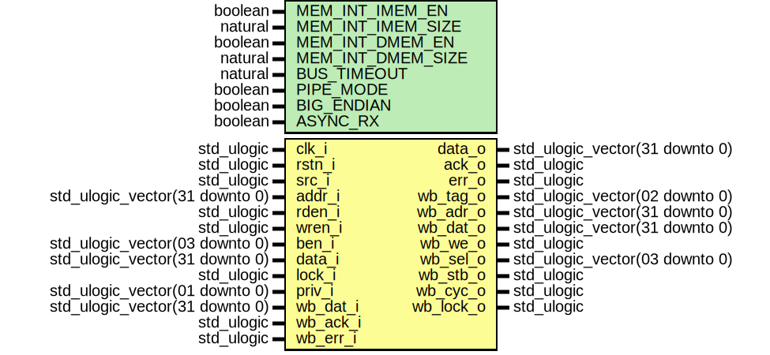

# Entity: neorv32_wishbone
## Diagram

## Description
#################################################################################################
# << NEORV32 - External Bus Interface (WISHBONE) >>                                             #
# ********************************************************************************************* #
# All bus accesses from the CPU, which do not target the internal IO region / the internal      #
# bootloader / the internal instruction or data memories (if implemented), are delegated via    #
# this Wishbone gateway to the external bus interface. Accessed peripherals can have a response #
# latency of up to BUS_TIMEOUT - 1 cycles.                                                      #
#                                                                                               #
# Even when all processor-internal memories and IO devices are disabled, the EXTERNAL address   #
# space ENDS at address 0xffff0000 (begin of internal BOOTROM address space).                   #
#                                                                                               #
# The interface uses registers for ALL OUTGOING AND FOR ALL INCOMING signals. Hence, an access  #
# latency of (at least) 2 cycles is added.                                                      #
#                                                                                               #
# This interface supports classic/standard Wishbone transactions (pkg.wb_pipe_mode_c = false)   #
# and also pipelined transactions (pkg.wb_pipe_mode_c = true).                                  #
# ********************************************************************************************* #
# BSD 3-Clause License                                                                          #
#                                                                                               #
# Copyright (c) 2021, Stephan Nolting. All rights reserved.                                     #
#                                                                                               #
# Redistribution and use in source and binary forms, with or without modification, are          #
# permitted provided that the following conditions are met:                                     #
#                                                                                               #
# 1. Redistributions of source code must retain the above copyright notice, this list of        #
#    conditions and the following disclaimer.                                                   #
#                                                                                               #
# 2. Redistributions in binary form must reproduce the above copyright notice, this list of     #
#    conditions and the following disclaimer in the documentation and/or other materials        #
#    provided with the distribution.                                                            #
#                                                                                               #
# 3. Neither the name of the copyright holder nor the names of its contributors may be used to  #
#    endorse or promote products derived from this software without specific prior written      #
#    permission.                                                                                #
#                                                                                               #
# THIS SOFTWARE IS PROVIDED BY THE COPYRIGHT HOLDERS AND CONTRIBUTORS "AS IS" AND ANY EXPRESS   #
# OR IMPLIED WARRANTIES, INCLUDING, BUT NOT LIMITED TO, THE IMPLIED WARRANTIES OF               #
# MERCHANTABILITY AND FITNESS FOR A PARTICULAR PURPOSE ARE DISCLAIMED. IN NO EVENT SHALL THE    #
# COPYRIGHT HOLDER OR CONTRIBUTORS BE LIABLE FOR ANY DIRECT, INDIRECT, INCIDENTAL, SPECIAL,     #
# EXEMPLARY, OR CONSEQUENTIAL DAMAGES (INCLUDING, BUT NOT LIMITED TO, PROCUREMENT OF SUBSTITUTE #
# GOODS OR SERVICES; LOSS OF USE, DATA, OR PROFITS; OR BUSINESS INTERRUPTION) HOWEVER CAUSED    #
# AND ON ANY THEORY OF LIABILITY, WHETHER IN CONTRACT, STRICT LIABILITY, OR TORT (INCLUDING     #
# NEGLIGENCE OR OTHERWISE) ARISING IN ANY WAY OUT OF THE USE OF THIS SOFTWARE, EVEN IF ADVISED  #
# OF THE POSSIBILITY OF SUCH DAMAGE.                                                            #
# ********************************************************************************************* #
# The NEORV32 Processor - https://github.com/stnolting/neorv32              (c) Stephan Nolting #
#################################################################################################
## Generics
| Generic name      | Type    | Value  | Description                                                              |
| ----------------- | ------- | ------ | ------------------------------------------------------------------------ |
| MEM_INT_IMEM_EN   | boolean | true   | implement processor-internal instruction memory                          |
| MEM_INT_IMEM_SIZE | natural | 8*1024 | size of processor-internal instruction memory in bytes                   |
| MEM_INT_DMEM_EN   | boolean | true   | implement processor-internal data memory                                 |
| MEM_INT_DMEM_SIZE | natural | 4*1024 | size of processor-internal data memory in bytes                          |
| BUS_TIMEOUT       | natural | 63     | cycles after an UNACKNOWLEDGED bus access triggers a bus fault exception |
## Ports
| Port name | Direction | Type                           | Description                          |
| --------- | --------- | ------------------------------ | ------------------------------------ |
| clk_i     | in        | std_ulogic                     | global clock line                    |
| rstn_i    | in        | std_ulogic                     | global reset line, low-active        |
| src_i     | in        | std_ulogic                     | access type (0: data, 1:instruction) |
| addr_i    | in        | std_ulogic_vector(31 downto 0) | address                              |
| rden_i    | in        | std_ulogic                     | read enable                          |
| wren_i    | in        | std_ulogic                     | write enable                         |
| ben_i     | in        | std_ulogic_vector(03 downto 0) | byte write enable                    |
| data_i    | in        | std_ulogic_vector(31 downto 0) | data in                              |
| data_o    | out       | std_ulogic_vector(31 downto 0) | data out                             |
| lock_i    | in        | std_ulogic                     | exclusive access request             |
| ack_o     | out       | std_ulogic                     | transfer acknowledge                 |
| err_o     | out       | std_ulogic                     | transfer error                       |
| priv_i    | in        | std_ulogic_vector(01 downto 0) | current CPU privilege level          |
| wb_tag_o  | out       | std_ulogic_vector(02 downto 0) | request tag                          |
| wb_adr_o  | out       | std_ulogic_vector(31 downto 0) | address                              |
| wb_dat_i  | in        | std_ulogic_vector(31 downto 0) | read data                            |
| wb_dat_o  | out       | std_ulogic_vector(31 downto 0) | write data                           |
| wb_we_o   | out       | std_ulogic                     | read/write                           |
| wb_sel_o  | out       | std_ulogic_vector(03 downto 0) | byte enable                          |
| wb_stb_o  | out       | std_ulogic                     | strobe                               |
| wb_cyc_o  | out       | std_ulogic                     | valid cycle                          |
| wb_lock_o | out       | std_ulogic                     | exclusive access request             |
| wb_ack_i  | in        | std_ulogic                     | transfer acknowledge                 |
| wb_err_i  | in        | std_ulogic                     | transfer error                       |
## Signals
| Name         | Type                           | Description       |
| ------------ | ------------------------------ | ----------------- |
| int_imem_acc | std_ulogic                     | access control -- |
| int_dmem_acc | std_ulogic                     |                   |
| int_boot_acc | std_ulogic                     |                   |
| xbus_access  | std_ulogic                     |                   |
| ctrl         | ctrl_t                         |                   |
| stb_int      | std_ulogic                     |                   |
| cyc_int      | std_ulogic                     |                   |
| rdata        | std_ulogic_vector(31 downto 0) |                   |
| ack_gated    | std_ulogic                     | async RX mode --  |
| rdata_gated  | std_ulogic_vector(31 downto 0) |                   |
## Constants
| Name         | Type    | Value                      | Description                        |
| ------------ | ------- | -------------------------- | ---------------------------------- |
| timeout_en_c | boolean |  boolean(BUS_TIMEOUT /= 0) | timeout enabled if BUS_TIMEOUT > 0 |
## Types
| Name         | Type         | Description |
| ------------ | ------------ | ----------- |
| ctrl_state_t | (IDLE, BUSY) | bus arbiter |
| ctrl_t       |              |             |
## Processes
- bus_arbiter: _( rstn_i, clk_i )_
Bus Arbiter -----------------------------------------------------------------------------
-------------------------------------------------------------------------------------------

**Description**
Bus Arbiter -----------------------------------------------------------------------------
-------------------------------------------------------------------------------------------

