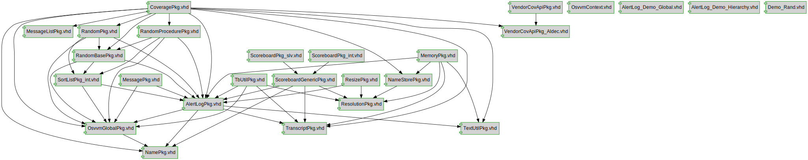

# Documentation for: 

Generated by **TerosHDL** © 2020-2021 License GPLv3 Carlos Alberto Ruiz Naranjo (carlosruiznaranjo@gmail.com) Ismael Perez Rojo (ismaelprojo@gmail.com)  Project revision 2021-07-19 15:19:16  

## Designs

- Package: [AlertLogPkg ](./doc_internal/AlertLogPkg.md)
- Package: [CoveragePkg ](./doc_internal/CoveragePkg.md)
- Package: [MemoryPkg ](./doc_internal/MemoryPkg.md)
- Package: [MessagePkg ](./doc_internal/MessagePkg.md)
- Package: [NamePkg ](./doc_internal/NamePkg.md)
- Package: [NameStorePkg ](./doc_internal/NameStorePkg.md)
- Package: [OsvvmGlobalPkg ](./doc_internal/OsvvmGlobalPkg.md)
- Package: [RandomBasePkg ](./doc_internal/RandomBasePkg.md)
- Package: [RandomPkg ](./doc_internal/RandomPkg.md)
- Package: [RandomProcedurePkg ](./doc_internal/RandomProcedurePkg.md)
- Package: [ResizePkg ](./doc_internal/ResizePkg.md)
- Package: [ResolutionPkg ](./doc_internal/ResolutionPkg.md)
- Package: [ScoreboardGenericPkg ](./doc_internal/ScoreboardGenericPkg.md)
- Package: [SortListPkg_int ](./doc_internal/SortListPkg_int.md)
- Package: [TbUtilPkg ](./doc_internal/TbUtilPkg.md)
- Package: [TextUtilPkg ](./doc_internal/TextUtilPkg.md)
- Package: [TranscriptPkg ](./doc_internal/TranscriptPkg.md)
- Package: [VendorCovApiPkg ](./doc_internal/VendorCovApiPkg.md)
- Package: [VendorCovApiPkg ](./doc_internal/VendorCovApiPkg_Aldec.md)
- Package: [TestSupportPkg ](./doc_internal/Demo_Rand.md)

