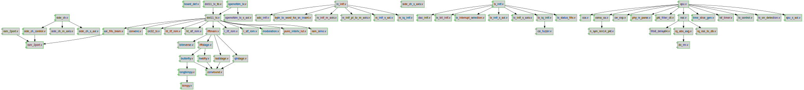

# Documentation for: 

Generated by **TerosHDL** © 2020-2021 License GPLv3 Carlos Alberto Ruiz Naranjo (carlosruiznaranjo@gmail.com) Ismael Perez Rojo (ismaelprojo@gmail.com)  Project revision 2021-07-19 15:10:35  

## Designs

- Module: [axi_fifo_bram ](./doc_internal/axi_fifo_bram.md)
- Module: [bimpy ](./doc_internal/bimpy.md)
- Module: [bitreverse ](./doc_internal/bitreverse.md)
- Module: [butterfly ](./doc_internal/butterfly.md)
- Module: [convenc ](./doc_internal/convenc.md)
- Module: [convround ](./doc_internal/convround.md)
- Module: [crc32_tx ](./doc_internal/crc32_tx.md)
- Module: [dot11_tx ](./doc_internal/dot11_tx.md)
- Module: [ht_ltf_rom ](./doc_internal/ht_ltf_rom.md)
- Module: [ht_stf_rom ](./doc_internal/ht_stf_rom.md)
- Module: [hwbfly ](./doc_internal/hwbfly.md)
- Module: [ifftmain ](./doc_internal/ifftmain.md)
- Module: [fftstage ](./doc_internal/ifftstage.md)
- Module: [l_ltf_rom ](./doc_internal/l_ltf_rom.md)
- Module: [l_stf_rom ](./doc_internal/l_stf_rom.md)
- Module: [laststage ](./doc_internal/laststage.md)
- Module: [longbimpy ](./doc_internal/longbimpy.md)
- Module: [modulation ](./doc_internal/modulation.md)
- Module: [openofdm_tx ](./doc_internal/openofdm_tx.md)
- Module: [openofdm_tx_s_axi ](./doc_internal/openofdm_tx_s_axi.md)
- Module: [punc_interlv_lut ](./doc_internal/punc_interlv_lut.md)
- Module: [qtrstage ](./doc_internal/qtrstage.md)
- Module: [ram_2port ](./doc_internal/ram_2port.md)
- Module: [ram_simo ](./doc_internal/ram_simo.md)
- Module: [adc_intf ](./doc_internal/adc_intf.md)
- Module: [byte_to_word_fcs_sn_insert ](./doc_internal/byte_to_word_fcs_sn_insert.md)
- Module: [rx_intf ](./doc_internal/rx_intf.md)
- Module: [rx_intf_m_axis ](./doc_internal/rx_intf_m_axis.md)
- Module: [rx_intf_pl_to_m_axis ](./doc_internal/rx_intf_pl_to_m_axis.md)
- Module: [rx_intf_s_axi ](./doc_internal/rx_intf_s_axi.md)
- Module: [rx_iq_intf ](./doc_internal/rx_iq_intf.md)
- Module: [ram_2port ](./doc_internal/ram_2port.md)
- Module: [side_ch_m_axis ](./doc_internal/side_ch_m_axis.md)
- Module: [side_ch_s_axi ](./doc_internal/side_ch_s_axi.md)
- Module: [side_ch_s_axis ](./doc_internal/side_ch_s_axis.md)
- Module: [csi_fuzzer ](./doc_internal/csi_fuzzer.md)
- Module: [dac_intf ](./doc_internal/dac_intf.md)
- Module: [tx_interrupt_selection ](./doc_internal/tx_interrupt_selection.md)
- Module: [tx_intf ](./doc_internal/tx_intf.md)
- Module: [tx_intf_s_axi ](./doc_internal/tx_intf_s_axi.md)
- Module: [tx_intf_s_axis ](./doc_internal/tx_intf_s_axis.md)
- Module: [tx_iq_intf ](./doc_internal/tx_iq_intf.md)
- Module: [cw_exp ](./doc_internal/cw_exp.md)
- Module: [dc_rm ](./doc_internal/dc_rm.md)
- Module: [fifo8_delay64 ](./doc_internal/fifo8_delay64.md)
- Module: [iq_abs_avg ](./doc_internal/iq_abs_avg.md)
- Module: [iq_rssi_to_db ](./doc_internal/iq_rssi_to_db.md)
- Module: [n_sym_len14_pkt ](./doc_internal/n_sym_len14_pkt.md)
- Module: [phy_rx_parse ](./doc_internal/phy_rx_parse.md)
- Module: [time_slice_gen ](./doc_internal/time_slice_gen.md)
- Module: [tsf_timer ](./doc_internal/tsf_timer.md)
- Module: [xpu ](./doc_internal/xpu.md)
- Module: [xpu_s_axi ](./doc_internal/xpu_s_axi.md)

