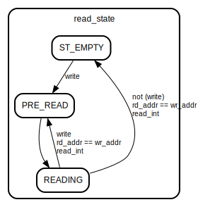

# Entity: axi_fifo_bram

- **File**: axi_fifo_bram.v
## Diagram

## Description

Copyright 2012-2014 Ettus Research LLC
 Copyright 2018 Ettus Research, a National Instruments Company
 SPDX-License-Identifier: LGPL-3.0-or-later
 Block RAM AXI fifo
 
## Generics

| Generic name | Type | Value | Description |
| ------------ | ---- | ----- | ----------- |
| WIDTH        |      | 32    |             |
| SIZE         |      | 9     |             |
## Ports

| Port name | Direction | Type            | Description |
| --------- | --------- | --------------- | ----------- |
| clk       | input     |                 |             |
| reset     | input     |                 |             |
| clear     | input     |                 |             |
| i_tdata   | input     | [WIDTH-1:0]     |             |
| i_tvalid  | input     |                 |             |
| i_tready  | output    |                 |             |
| o_tdata   | output    | reg [WIDTH-1:0] |             |
| o_tvalid  | output    | reg             |             |
| o_tready  | input     |                 |             |
| space     | output    | [15:0]          |             |
| occupied  | output    | [15:0]          |             |
## Signals

| Name               | Type             | Description                                                                                                                    |
| ------------------ | ---------------- | ------------------------------------------------------------------------------------------------------------------------------ |
| int_tdata          | wire [WIDTH-1:0] |                                                                                                                                |
| int_tready         | wire             |                                                                                                                                |
| full               | wire             |                                                                                                                                |
| empty              | wire             |                                                                                                                                |
| write              | wire             |                                                                                                                                |
| read_int           | wire             | read_int will assert when either a read occurs or the output register is empty (and there is data in the shift register fifo)  |
| read               | wire             | read will only assert when an actual 1read request occurs at the interface                                                     |
| wr_addr            | reg [SIZE-1:0]   |                                                                                                                                |
| rd_addr            | reg [SIZE-1:0]   |                                                                                                                                |
| read_state         | reg [1:0]        |                                                                                                                                |
| empty_reg          | reg              |                                                                                                                                |
| full_reg           | reg              |                                                                                                                                |
| dont_write_past_me | wire [SIZE-1:0]  | case(read_state)                                                                                                               |
| becoming_full      | wire             |                                                                                                                                |
## Constants

| Name     | Type | Value     | Description                                                       |
| -------- | ---- | --------- | ----------------------------------------------------------------- |
| ST_EMPTY |      | 0         | Read side states                                                  |
| PRE_READ |      | 1         |                                                                   |
| READING  |      | 2         |                                                                   |
| NUMLINES |      | (1<<SIZE) | space and occupied are for diagnostics only not guaranteed exact  |
## Processes
- unnamed: ( @(posedge clk) )
- unnamed: ( @(posedge clk) )
- unnamed: ( @(posedge clk) )
- unnamed: ( @(posedge clk) )
**Description**
Output registered stage

- unnamed: ( @(posedge clk) )
- unnamed: ( @(posedge clk) )
## Instantiations

- ram: ram_2port
## State machines

