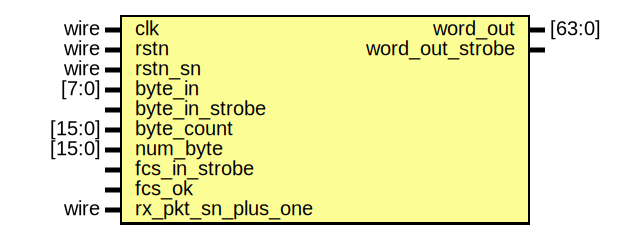

# Entity: byte_to_word_fcs_sn_insert

- **File**: byte_to_word_fcs_sn_insert.v
## Diagram

## Description

 Xianjun jiao. putaoshu@msn.com; xianjun.jiao@imec.be;

## Ports

| Port name          | Direction | Type   | Description |
| ------------------ | --------- | ------ | ----------- |
| clk                | input     | wire   |             |
| rstn               | input     | wire   |             |
| rstn_sn            | input     | wire   |             |
| byte_in            | input     | [7:0]  |             |
| byte_in_strobe     | input     |        |             |
| byte_count         | input     | [15:0] |             |
| num_byte           | input     | [15:0] |             |
| fcs_in_strobe      | input     |        |             |
| fcs_ok             | input     |        |             |
| rx_pkt_sn_plus_one | input     | wire   |             |
| word_out           | output    | [63:0] |             |
| word_out_strobe    | output    |        |             |
## Signals

| Name                 | Type        | Description |
| -------------------- | ----------- | ----------- |
| byte_buf             | reg [63:0]  |             |
| byte_in_dly0         | reg [7:0]   |             |
| byte_in_dly1         | reg [7:0]   |             |
| byte_in_strobe_dly0  | reg         |             |
| byte_in_strobe_dly1  | reg         |             |
| byte_count_dly0      | reg [15:0]  |             |
| byte_count_dly1      | reg [15:0]  |             |
| rx_pkt_sn            | reg [6:0]   |             |
| byte_in_final        | wire [7:0]  |             |
| byte_in_strobe_final | wire        |             |
| byte_count_final     | wire [15:0] |             |
## Processes
- unnamed: ( @(posedge clk) )
  - **Type:** always
- unnamed: ( @(posedge clk) )
  - **Type:** always
**Description**
 delay and select to insert fcs 
- unnamed: ( @(posedge clk) )
  - **Type:** always
**Description**
 byte to word 
