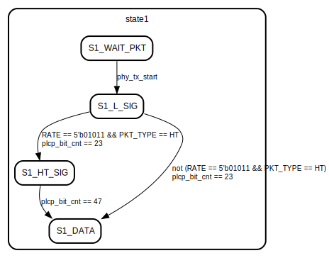
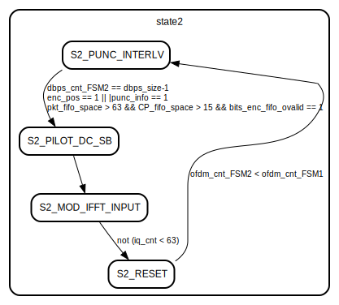
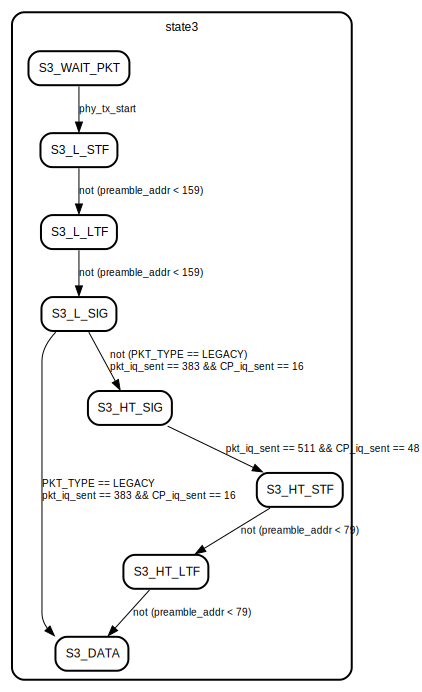

# Entity: dot11_tx

- **File**: dot11_tx.v
## Diagram

## Description

## Ports

| Port name              | Direction | Type        | Description |
| ---------------------- | --------- | ----------- | ----------- |
| clk                    | input     | wire        |             |
| phy_tx_arest           | input     | wire        |             |
| phy_tx_start           | input     | wire        |             |
| phy_tx_done            | output    |             |             |
| phy_tx_started         | output    |             |             |
| init_pilot_scram_state | input     | wire [6:0]  |             |
| init_data_scram_state  | input     | wire [6:0]  |             |
| bram_din               | input     | wire [63:0] |             |
| bram_addr              | output    | [9:0]       |             |
| result_iq_ready        | input     | wire        |             |
| result_iq_valid        | output    | wire        |             |
| result_i               | output    | wire [15:0] |             |
| result_q               | output    | wire [15:0] |             |
## Signals

| Name                 | Type        | Description                                                                                                                                                                                                                              |
| -------------------- | ----------- | ---------------------------------------------------------------------------------------------------------------------------------------------------------------------------------------------------------------------------------------- |
| FSM3_reset           | reg         | Reset after transmiting a whole packet                                                                                                                                                                                                   |
| reset_int            | wire        |                                                                                                                                                                                                                                          |
| state1               | reg [1:0]   |  Data collection states                                                                                                                                                                                                                  |
| state11              | reg [2:0]   |                                                                                                                                                                                                                                          |
| state2               | reg [1:0]   |  IQ sample generation states                                                                                                                                                                                                             |
| state3               | reg [2:0]   |  IQ sample forwarding states                                                                                                                                                                                                             |
| PKT_TYPE             | reg         |                                                                                                                                                                                                                                          |
| plcp_bit_cnt         | reg [5:0]   |                                                                                                                                                                                                                                          |
| service_bit_cnt      | reg [3:0]   |                                                                                                                                                                                                                                          |
| psdu_bit_cnt         | reg [14:0]  | Maximum number of PSDU bits = 4095*8 = 32760                                                                                                                                                                                             |
| ofdm_cnt_FSM1        | reg [10:0]  | Maximum number of OFDM symbols = 1 + ceil((16+4095*8+6)/24) = 1367                                                                                                                                                                       |
| l_stf                | wire [31:0] | ////////////////////////////////////////////////////////////////////////  LEGACY SHORT + LONG PREAMBLE ////////////////////////////////////////////////////////////////////////                                                          |
| l_ltf                | wire [31:0] |                                                                                                                                                                                                                                          |
| preamble_addr        | reg  [7:0]  |                                                                                                                                                                                                                                          |
| ht_stf               | wire [31:0] | ////////////////////////////////////////////////////////////////////////  HT SHORT + LONG PREAMBLE ////////////////////////////////////////////////////////////////////////                                                              |
| ht_ltf               | wire [31:0] |                                                                                                                                                                                                                                          |
| crc_en               | wire        | ////////////////////////////////////////////////////////////////////////  Cyclic redundancy check (CRC32) and frame check sequence (FCS) block ////////////////////////////////////////////////////////////////////////                  |
| crc_data             | wire [3:0]  |                                                                                                                                                                                                                                          |
| pkt_fcs              | wire [31:0] |                                                                                                                                                                                                                                          |
| pkt_fcs_idx          | reg  [4:0]  |                                                                                                                                                                                                                                          |
| bit_scram            | reg         | ////////////////////////////////////////////////////////////////////////  bit source selection and scrambling operation ////////////////////////////////////////////////////////////////////////                                         |
| data_scram_state     | reg [6:0]   |                                                                                                                                                                                                                                          |
| enc_reset            | wire        | ////////////////////////////////////////////////////////////////////////  Convolutional encoding ////////////////////////////////////////////////////////////////////////                                                                |
| enc_en               | wire        |                                                                                                                                                                                                                                          |
| bits_enc             | wire [1:0]  |                                                                                                                                                                                                                                          |
| N_BPSC               | reg [2:0]   | ////////////////////////////////////////////////////////////////////////  DOT11 TX FINITE STATE MACHINE 1 ////////////////////////////////////////////////////////////////////////                                                       |
| N_DBPS               | reg [8:0]   |                                                                                                                                                                                                                                          |
| RATE                 | reg [4:0]   |                                                                                                                                                                                                                                          |
| PSDU_BIT_LEN         | reg [14:0]  |                                                                                                                                                                                                                                          |
| S_GI                 | reg         |                                                                                                                                                                                                                                          |
| dbps_cnt_FSM1        | reg [8:0]   |                                                                                                                                                                                                                                          |
| bits_enc_fifo_idata  | wire [1:0]  | ////////////////////////////////////////////////////////////////////////  Store scrambed bits into axi stream fifo ////////////////////////////////////////////////////////////////////////                                              |
| bits_enc_fifo_odata  | wire [1:0]  | ////////////////////////////////////////////////////////////////////////  Store scrambed bits into axi stream fifo ////////////////////////////////////////////////////////////////////////                                              |
| bits_enc_fifo_ivalid | wire        |                                                                                                                                                                                                                                          |
| bits_enc_fifo_ovalid | wire        |                                                                                                                                                                                                                                          |
| bits_enc_fifo_iready | wire        |                                                                                                                                                                                                                                          |
| bits_enc_fifo_oready | wire        |                                                                                                                                                                                                                                          |
| bits_enc_fifo_space  | wire [15:0] |                                                                                                                                                                                                                                          |
| ofdm_cnt_FSM2        | reg  [10:0] | ////////////////////////////////////////////////////////////////////////  Bit puncturing and bit interleaving ////////////////////////////////////////////////////////////////////////  Puncturing and interleaving index look up table  |
| dbps_cnt_FSM2        | reg  [8:0]  |                                                                                                                                                                                                                                          |
| punc_info            | wire [1:0]  |                                                                                                                                                                                                                                          |
| interlv_addrs        | wire [17:0] |                                                                                                                                                                                                                                          |
| enc_pos              | reg         |  This is a RAM module for holding convolutionally encoded, punctured and interleaved bits.  Bit puncturing is implicitly carried out, such that punc_interlv_lut provides write address along with puncturing ON/OFF signal              |
| bits_ram_en          | wire        |                                                                                                                                                                                                                                          |
| punc_bit             | wire        |                                                                                                                                                                                                                                          |
| bits_ram_waddr       | wire [8:0]  |                                                                                                                                                                                                                                          |
| mod_addr             | reg  [5:0]  |                                                                                                                                                                                                                                          |
| bits_to_mod          | wire [5:0]  |                                                                                                                                                                                                                                          |
| mod_IQ               | wire [31:0] | ////////////////////////////////////////////////////////////////////////  Bits modulation ////////////////////////////////////////////////////////////////////////  BPSK, QPSK, 16-QAM and 64-QAM modulation                             |
| pilot_iq             | reg  [31:0] | ////////////////////////////////////////////////////////////////////////  PILOT, DC (0Hz) and sideband(SB) ////////////////////////////////////////////////////////////////////////                                                      |
| pilot_scram_state    | reg  [6:0]  |                                                                                                                                                                                                                                          |
| ht_polarity          | reg  [3:0]  |                                                                                                                                                                                                                                          |
| pilot_gain           | wire        |                                                                                                                                                                                                                                          |
| DC_SB_IQ             | wire [31:0] |                                                                                                                                                                                                                                          |
| ifft_iq              | reg [31:0]  | ////////////////////////////////////////////////////////////////////////  Inverse Fast Fourier Transform (IFFT) ////////////////////////////////////////////////////////////////////////                                                 |
| iq_cnt               | reg [7:0]   |                                                                                                                                                                                                                                          |
| ifft_ce              | reg         |                                                                                                                                                                                                                                          |
| ifft_o_sync          | wire        |                                                                                                                                                                                                                                          |
| ifft_o_result        | wire [31:0] |                                                                                                                                                                                                                                          |
| dbps_size            | wire [8:0]  | ////////////////////////////////////////////////////////////////////////  DOT11 TX FINITE STATE MACHINE 2 ////////////////////////////////////////////////////////////////////////                                                       |
| ifft_status          | reg         | ////////////////////////////////////////////////////////////////////////  Count number of [pkt/CP] IQ samples to send ////////////////////////////////////////////////////////////////////////                                           |
| ifft_ce_reg          | reg         |                                                                                                                                                                                                                                          |
| ifft_o_result_reg    | reg [31:0]  |                                                                                                                                                                                                                                          |
| ifft_o_iq_cnt        | reg [5:0]   |                                                                                                                                                                                                                                          |
| ifft_o_sync_cnt      | reg [10:0]  |                                                                                                                                                                                                                                          |
| nof_iq2send          | reg [15:0]  |                                                                                                                                                                                                                                          |
| CP_fifo_idata        | wire [31:0] | ////////////////////////////////////////////////////////////////////////  Cyclic Prefix IFFT output -> Axi stream fifo ////////////////////////////////////////////////////////////////////////                                          |
| CP_fifo_odata        | wire [31:0] | ////////////////////////////////////////////////////////////////////////  Cyclic Prefix IFFT output -> Axi stream fifo ////////////////////////////////////////////////////////////////////////                                          |
| CP_fifo_ivalid       | wire        |                                                                                                                                                                                                                                          |
| CP_fifo_ovalid       | wire        |                                                                                                                                                                                                                                          |
| CP_fifo_iready       | wire        |                                                                                                                                                                                                                                          |
| CP_fifo_oready       | wire        |                                                                                                                                                                                                                                          |
| CP_fifo_space        | wire [15:0] |                                                                                                                                                                                                                                          |
| pkt_fifo_idata       | wire [31:0] | ////////////////////////////////////////////////////////////////////////  Packet IFFT output -> Axi stream fifo ////////////////////////////////////////////////////////////////////////                                                 |
| pkt_fifo_odata       | wire [31:0] | ////////////////////////////////////////////////////////////////////////  Packet IFFT output -> Axi stream fifo ////////////////////////////////////////////////////////////////////////                                                 |
| pkt_fifo_ivalid      | wire        |                                                                                                                                                                                                                                          |
| pkt_fifo_ovalid      | wire        |                                                                                                                                                                                                                                          |
| pkt_fifo_iready      | wire        |                                                                                                                                                                                                                                          |
| pkt_fifo_oready      | wire        |                                                                                                                                                                                                                                          |
| pkt_fifo_space       | wire [15:0] |                                                                                                                                                                                                                                          |
| fifo_turn            | reg         | ////////////////////////////////////////////////////////////////////////  Count number of [pkt/CP] IQ samples sent ////////////////////////////////////////////////////////////////////////                                              |
| pkt_iq_sent          | reg [15:0]  |                                                                                                                                                                                                                                          |
| CP_iq_sent           | reg [13:0]  |                                                                                                                                                                                                                                          |
## Constants

| Name              | Type | Value | Description |
| ----------------- | ---- | ----- | ----------- |
| S1_WAIT_PKT       |      | 0     |             |
| S1_L_SIG          |      | 1     |             |
| S1_HT_SIG         |      | 2     |             |
| S1_DATA           |      | 3     |             |
| S11_SERVICE       |      | 0     |             |
| S11_PSDU_DATA     |      | 1     |             |
| S11_PSDU_CRC      |      | 2     |             |
| S11_TAIL          |      | 3     |             |
| S11_PAD           |      | 4     |             |
| S11_RESET         |      | 5     |             |
| S2_PUNC_INTERLV   |      | 0     |             |
| S2_PILOT_DC_SB    |      | 1     |             |
| S2_MOD_IFFT_INPUT |      | 2     |             |
| S2_RESET          |      | 3     |             |
| S3_WAIT_PKT       |      | 0     |             |
| S3_L_STF          |      | 1     |             |
| S3_L_LTF          |      | 2     |             |
| S3_L_SIG          |      | 3     |             |
| S3_HT_SIG         |      | 4     |             |
| S3_HT_STF         |      | 5     |             |
| S3_HT_LTF         |      | 6     |             |
| S3_DATA           |      | 7     |             |
| LEGACY            |      | 0     |             |
| HT                |      | 1     |             |
| NO_OUTPUT_YET     |      | 0     |             |
| OUTPUT_STARTED    |      | 1     |             |
| CP_FIFO           |      | 0     |             |
| PKT_FIFO          |      | 1     |             |
## Processes
- unnamed: ( @* )
  - **Type:** always
- unnamed: ( @(posedge clk) )
  - **Type:** always
- unnamed: ( @* )
  - **Type:** always
- unnamed: ( @(posedge clk) )
  - **Type:** always
- unnamed: ( @(posedge clk) )
  - **Type:** always
- unnamed: ( @(posedge clk) )
  - **Type:** always
- unnamed: ( @(posedge clk) )
  - **Type:** always
**Description**
////////////////////////////////////////////////////////////////////////  DOT11 TX FINITE STATE MACHINE 3 //////////////////////////////////////////////////////////////////////// 
## Instantiations

- l_stf_rom: l_stf_rom
- l_ltf_rom: l_ltf_rom
- ht_stf_rom: ht_stf_rom
- ht_ltf_rom: ht_ltf_rom
- fcs_inst: crc32_tx
- convenc: convenc
- bits_enc_fifo: axi_fifo_bram
- punc_interlv_lut: punc_interlv_lut
- bits_ram: ram_simo
- modulation: modulation
- ifft64: ifftmain
- CP_fifo: axi_fifo_bram
- pkt_fifo: axi_fifo_bram
## State machines

- ////////////////////////////////////////////////////////////////////////
 DOT11 TX FINITE STATE MACHINE 3
////////////////////////////////////////////////////////////////////////