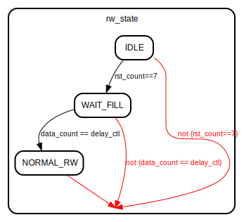

# Entity: fifo8_delay64

- **File**: fifo8_delay64.v
## Diagram

## Description

 Xianjun jiao. putaoshu@msn.com; xianjun.jiao@imec.be;

## Generics

| Generic name    | Type    | Value | Description |
| --------------- | ------- | ----- | ----------- |
| DATA_WIDTH      | integer | 8     |             |
| DELAY_CTL_WIDTH | integer | 7     |             |
## Ports

| Port name      | Direction | Type                         | Description                                                                                                                   |
| -------------- | --------- | ---------------------------- | ----------------------------------------------------------------------------------------------------------------------------- |
| clk            | input     | wire                         |  main function: after receive data, send ack; after send data, disable tx for a while because need to wait for ack from peer. |
| rstn           | input     | wire                         |                                                                                                                               |
| delay_ctl      | input     | wire [(DELAY_CTL_WIDTH-1):0] |                                                                                                                               |
| data_in        | input     | wire [(DATA_WIDTH-1):0]      |                                                                                                                               |
| data_in_valid  | input     | wire                         |                                                                                                                               |
| data_out       | output    | wire [(DATA_WIDTH-1):0]      |                                                                                                                               |
| data_out_valid | output    | wire                         |                                                                                                                               |
## Signals

| Name          | Type                         | Description |
| ------------- | ---------------------------- | ----------- |
| rw_state      | reg [1:0]                    |             |
| rst_count     | reg [2:0]                    |             |
| rden_internal | reg                          |             |
| wren_internal | reg                          |             |
| data_count    | wire [(DELAY_CTL_WIDTH-1):0] |             |
| full          | wire                         |             |
| empty         | wire                         |             |
## Constants

| Name      | Type  | Value | Description |
| --------- | ----- | ----- | ----------- |
| IDLE      | [1:0] | 2'b00 |             |
| WAIT_FILL | [1:0] | 2'b01 |             |
| NORMAL_RW | [1:0] | 2'b10 |             |
## Processes
- unnamed: ( @(posedge clk) )
  - **Type:** always
## Instantiations

- fifo8_1clk_dep64_i: xpm_fifo_sync
**Description**
 fifo8_1clk_dep64 fifo8_1clk_dep64_i (
     .CLK(clk),
     .DATAO(data_out),
     .DI(data_in),
     .EMPTY(empty),
     .FULL(full),
     .RDEN(rden_internal),
     .RST(~rstn),
     .WREN(wren_internal),
     .data_count(data_count)
 );

## State machines

