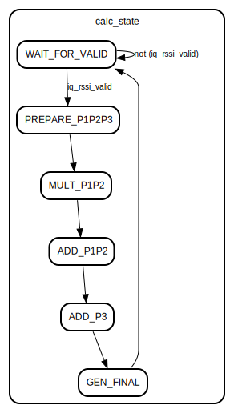

# Entity: iq_rssi_to_db

- **File**: iq_rssi_to_db.v
## Diagram

## Description

 Xianjun jiao. putaoshu@msn.com; xianjun.jiao@imec.be;

## Generics

| Generic name          | Type    | Value | Description |
| --------------------- | ------- | ----- | ----------- |
| IQ_DATA_WIDTH         | integer | 16    |             |
| IQ_RSSI_HALF_DB_WIDTH | integer | 9     |             |
## Ports

| Port name             | Direction | Type                                      | Description                               |
| --------------------- | --------- | ----------------------------------------- | ----------------------------------------- |
| clk                   | input     | wire                                      |                                           |
| rstn                  | input     | wire                                      |                                           |
| iq_rssi               | input     | wire signed [(IQ_DATA_WIDTH-1):0]         |  Ports to receive iq rssi from iq_abs_avg |
| iq_rssi_valid         | input     | wire                                      |                                           |
| iq_rssi_half_db       | output    | wire signed [(IQ_RSSI_HALF_DB_WIDTH-1):0] | step size is 0.5dB not 1dB!               |
| iq_rssi_half_db_valid | output    | wire                                      |                                           |
## Signals

| Name                      | Type                                 | Description |
| ------------------------- | ------------------------------------ | ----------- |
| calc_state                | reg [2:0]                            |             |
| iq_rssi_reg               | reg signed [(IQ_DATA_WIDTH-1):0]     |             |
| iq_rssi2                  | reg signed [(2*IQ_DATA_WIDTH-1):0]   |             |
| num_shfit_bit             | reg [4:0]                            |             |
| p3                        | reg signed [32:0]                    |             |
| p2                        | reg signed [16:0]                    |             |
| p1                        | reg signed [2:0]                     |             |
| mult_p1                   | reg signed [(3+2*IQ_DATA_WIDTH-1):0] |             |
| mult_p2                   | reg signed [(17+IQ_DATA_WIDTH-1):0]  |             |
| sum_p1p2                  | reg signed [(4+2*IQ_DATA_WIDTH-1):0] |             |
| sum_p1p2p3                | reg signed [(4+2*IQ_DATA_WIDTH-1):0] |             |
| iq_rssi_half_db_reg       | reg signed [(IQ_DATA_WIDTH-1):0]     |             |
| iq_rssi_half_db_valid_reg | reg signed                           |             |
## Constants

| Name           | Type  | Value  | Description                                                                                       |
| -------------- | ----- | ------ | ------------------------------------------------------------------------------------------------- |
| WAIT_FOR_VALID | [2:0] | 3'b000 | let's use FSM to do calculation. remember, after a iq_rssi_valid, you have 8 clock to do the job  |
| PREPARE_P1P2P3 | [2:0] | 3'b001 | let's use FSM to do calculation. remember, after a iq_rssi_valid, you have 8 clock to do the job  |
| MULT_P1P2      | [2:0] | 3'b010 | let's use FSM to do calculation. remember, after a iq_rssi_valid, you have 8 clock to do the job  |
| ADD_P1P2       | [2:0] | 3'b011 | let's use FSM to do calculation. remember, after a iq_rssi_valid, you have 8 clock to do the job  |
| ADD_P3         | [2:0] | 3'b100 | let's use FSM to do calculation. remember, after a iq_rssi_valid, you have 8 clock to do the job  |
| GEN_FINAL      | [2:0] | 3'b101 | let's use FSM to do calculation. remember, after a iq_rssi_valid, you have 8 clock to do the job  |
## Processes
- unnamed: ( @(posedge clk) )
  - **Type:** always
## State machines

