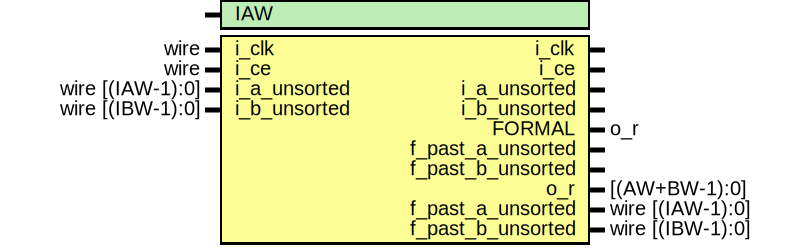

# Entity: longbimpy

- **File**: longbimpy.v
## Diagram

## Description

//////////////////////////////////////////////////////////////////////////////

 Filename: 	../../ifft64/longbimpy.v

 Project:	A General Purpose Pipelined FFT Implementation

 Purpose:	A portable shift and add multiply, built with the knowledge
	of the existence of a six bit LUT and carry chain.  That knowledge
	allows us to multiply two bits from one value at a time against all
	of the bits of the other value.  This sub multiply is called the
	bimpy.

	For minimal processing delay, make the first parameter the one with
	the least bits, so that AWIDTH <= BWIDTH.

 Creator:	Dan Gisselquist, Ph.D.
		Gisselquist Technology, LLC

//////////////////////////////////////////////////////////////////////////////

 Copyright (C) 2015-2019, Gisselquist Technology, LLC

 This file is part of the general purpose pipelined FFT project.

 The pipelined FFT project is free software (firmware): you can redistribute
 it and/or modify it under the terms of the GNU Lesser General Public License
 as published by the Free Software Foundation, either version 3 of the
 License, or (at your option) any later version.

 The pipelined FFT project is distributed in the hope that it will be useful,
 but WITHOUT ANY WARRANTY; without even the implied warranty of
 MERCHANTIBILITY or FITNESS FOR A PARTICULAR PURPOSE.  See the GNU Lesser
 General Public License for more details.

 You should have received a copy of the GNU Lesser General Public License
 along with this program.  (It's in the $(ROOT)/doc directory.  Run make
 with no target there if the PDF file isn't present.)  If not, see
 <http://www.gnu.org/licenses/> for a copy.

 License:	LGPL, v3, as defined and found on www.gnu.org,
		http://www.gnu.org/licenses/lgpl.html

//////////////////////////////////////////////////////////////////////////////

`default_nettype	none

## Generics

| Generic name | Type | Value | Description                        |
| ------------ | ---- | ----- | ---------------------------------- |
| IAW          |      | 8     |  The width of i_a, min width is 5  |
## Ports

| Port name         | Direction | Type             | Description                  |
| ----------------- | --------- | ---------------- | ---------------------------- |
| i_clk             | output    |                  |                              |
| i_ce              | output    |                  |                              |
| i_a_unsorted      | output    |                  |                              |
| i_b_unsorted      | output    |                  |                              |
| FORMAL            | output    | o_r              |                              |
| f_past_a_unsorted | output    |                  |                              |
| f_past_b_unsorted | output    |                  |                              |
| i_clk             | input     | wire             |  Nmbr of rows in our tableau |
|  i_ce             | input     | wire             |  Nmbr of rows in our tableau |
| i_a_unsorted      | input     | wire	[(IAW-1):0] |                              |
| i_b_unsorted      | input     | wire	[(IBW-1):0] |                              |
| o_r               | output    | [(AW+BW-1):0]    |                              |
| f_past_a_unsorted | output    | wire	[(IAW-1):0] |                              |
| f_past_b_unsorted | output    | wire	[(IBW-1):0] |                              |
## Signals

| Name         | Type                    | Description                                                           |
| ------------ | ----------------------- | --------------------------------------------------------------------- |
| i_a          | wire [AW-1:0]           |   Swap parameter order, so that AW <= BW -- for performance  reasons  |
| i_b          | wire [BW-1:0]           |                                                                       |
| u_a          | reg	[(IW-1):0]          |                                                                       |
| u_b          | reg	[(BW-1):0]          |                                                                       |
| sgn          | reg                     |                                                                       |
| r_a          | reg	[(IW-1-2*(LUTB)):0] |                                                                       |
| r_b          | reg	[(BW-1):0]          |                                                                       |
| r_s          | reg	[(TLEN-1):0]        |                                                                       |
| acc          | reg	[(IW+BW-1):0]       |                                                                       |
| pr_a         | wire [(BW+LUTB-1):0]    |                                                                       |
| pr_b         | wire [(BW+LUTB-1):0]    |                                                                       |
| w_r          | wire [(IW+BW-1):0]      |                                                                       |
| f_past_valid | reg                     |                                                                       |
| f_past_a     | reg	[AW-1:0]            |                                                                       |
| f_past_b     | reg	[BW-1:0]            |                                                                       |
| f_sgn_a      | reg	[TLEN+1:0]          |                                                                       |
| f_sgn_b      | reg	[TLEN+1:0]          |                                                                       |
| f_past_a_neg | wire [AW-1:0]           |                                                                       |
| f_past_b_neg | wire [BW-1:0]           |                                                                       |
| f_past_a_pos | wire [AW-1:0]           |                                                                       |
| f_past_b_pos | wire [BW-1:0]           |                                                                       |
## Constants

| Name | Type | Value | Description        |
| ---- | ---- | ----- | ------------------ |
| AW   |      | IAW   |  The output width  |
| BW   |      | IBW   |  The output width  |
| IW   |      | &(-2) |  The output width  |
| LUTB |      | 2     |  The output width  |
| TLEN |      | LUTB  |  The output width  |
## Processes
- unnamed: ( @(posedge i_clk) )
  - **Type:** always
- unnamed: ( @(posedge i_clk) )
  - **Type:** always
- unnamed: ( @(posedge i_clk) )
  - **Type:** always
- unnamed: ( @(posedge i_clk) )
  - **Type:** always
- unnamed: ( @(posedge i_clk) )
  - **Type:** always
**Description**
One clk after p[0],p[1] become valid 
- unnamed: ( @(posedge i_clk) )
  - **Type:** always
- unnamed: ( @(posedge i_clk) )
  - **Type:** always
- unnamed: ( @(posedge i_clk) )
  - **Type:** always
- unnamed: ( @(posedge i_clk) )
  - **Type:** always
- unnamed: ( @(posedge i_clk) )
  - **Type:** always
- unnamed: ( @(posedge i_clk) )
  - **Type:** always
- unnamed: ( @(posedge i_clk) )
  - **Type:** always
- unnamed: ( @(posedge i_clk) )
  - **Type:** always
- unnamed: ( @(*) )
  - **Type:** always
**Description**
 The following properties artificially restrict the inputs  to this long binary multiplier to only those values whose  absolute value is 0..7.  It is used by the formal proof of  the BUTTERFLY to artificially limit the scope of the proof.  By the time the butterfly sees this code, it will be known  that the long binary multiply works.  At issue will no longer  be whether or not this works, but rather whether it works in  context.  For that purpose, we'll need to check timing, not  results.  Checking against inputs of +/- 1 and 0 are perfect  for that task.  The below assumptions (yes they are assumptions  just go a little bit further.   THEREFORE, THESE PROPERTIES ARE NOT NECESSARY TO PROVING THAT  THIS MODULE WORKS, AND THEY WILL INTERFERE WITH THAT PROOF.   This just limits the proof for the butterfly, the parent.  module that calls this one   Start by assuming that all inputs have an absolute value less  than eight. 
- unnamed: ( @(*) )
  - **Type:** always
## Instantiations

- lmpy_1: bimpy
