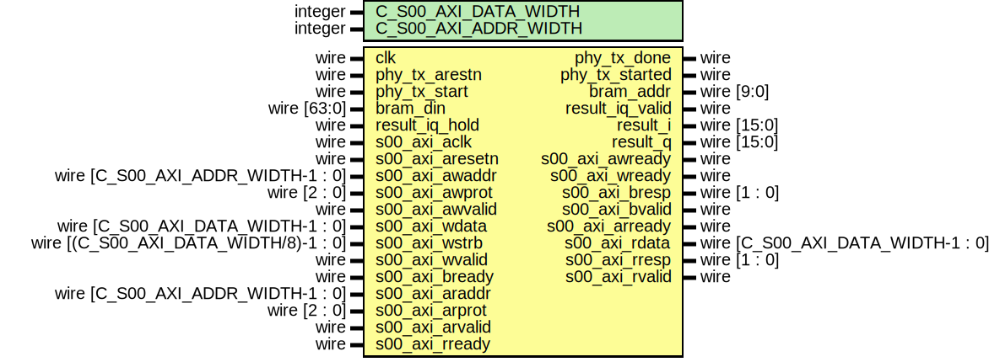

# Entity: openofdm_tx

- **File**: openofdm_tx.v
## Diagram

## Description

## Generics

| Generic name         | Type    | Value | Description |
| -------------------- | ------- | ----- | ----------- |
| C_S00_AXI_DATA_WIDTH | integer | 32    |             |
| C_S00_AXI_ADDR_WIDTH | integer | 7     |             |
## Ports

| Port name       | Direction | Type                                  | Description |
| --------------- | --------- | ------------------------------------- | ----------- |
| clk             | input     | wire                                  |             |
| phy_tx_arestn   | input     | wire                                  |             |
| phy_tx_start    | input     | wire                                  |             |
| phy_tx_done     | output    | wire                                  |             |
| phy_tx_started  | output    | wire                                  |             |
| bram_din        | input     | wire [63:0]                           |             |
| bram_addr       | output    | wire [9:0]                            |             |
| result_iq_hold  | input     | wire                                  |             |
| result_iq_valid | output    | wire                                  |             |
| result_i        | output    | wire [15:0]                           |             |
| result_q        | output    | wire [15:0]                           |             |
| s00_axi_aclk    | input     | wire                                  |             |
| s00_axi_aresetn | input     | wire                                  |             |
| s00_axi_awaddr  | input     | wire [C_S00_AXI_ADDR_WIDTH-1 : 0]     |             |
| s00_axi_awprot  | input     | wire [2 : 0]                          |             |
| s00_axi_awvalid | input     | wire                                  |             |
| s00_axi_awready | output    | wire                                  |             |
| s00_axi_wdata   | input     | wire [C_S00_AXI_DATA_WIDTH-1 : 0]     |             |
| s00_axi_wstrb   | input     | wire [(C_S00_AXI_DATA_WIDTH/8)-1 : 0] |             |
| s00_axi_wvalid  | input     | wire                                  |             |
| s00_axi_wready  | output    | wire                                  |             |
| s00_axi_bresp   | output    | wire [1 : 0]                          |             |
| s00_axi_bvalid  | output    | wire                                  |             |
| s00_axi_bready  | input     | wire                                  |             |
| s00_axi_araddr  | input     | wire [C_S00_AXI_ADDR_WIDTH-1 : 0]     |             |
| s00_axi_arprot  | input     | wire [2 : 0]                          |             |
| s00_axi_arvalid | input     | wire                                  |             |
| s00_axi_arready | output    | wire                                  |             |
| s00_axi_rdata   | output    | wire [C_S00_AXI_DATA_WIDTH-1 : 0]     |             |
| s00_axi_rresp   | output    | wire [1 : 0]                          |             |
| s00_axi_rvalid  | output    | wire                                  |             |
| s00_axi_rready  | input     | wire                                  |             |
## Signals

| Name      | Type                              | Description                                               |
| --------- | --------------------------------- | --------------------------------------------------------- |
| slv_reg0  | wire [(C_S00_AXI_DATA_WIDTH-1):0] |  reg0~19 for config write; from reg20 for reading status  |
| slv_reg1  | wire [(C_S00_AXI_DATA_WIDTH-1):0] |                                                           |
| slv_reg2  | wire [(C_S00_AXI_DATA_WIDTH-1):0] |                                                           |
| slv_reg20 | wire [(C_S00_AXI_DATA_WIDTH-1):0] | read openofdm rx core internal state                      |
## Instantiations

- dot11_tx: dot11_tx
 **Description**

    wire [(C_S00_AXI_DATA_WIDTH-1):0] slv_reg21;
    wire [(C_S00_AXI_DATA_WIDTH-1):0] slv_reg22;
    wire [(C_S00_AXI_DATA_WIDTH-1):0] slv_reg23;
    wire [(C_S00_AXI_DATA_WIDTH-1):0] slv_reg24;
    wire [(C_S00_AXI_DATA_WIDTH-1):0] slv_reg25;
    wire [(C_S00_AXI_DATA_WIDTH-1):0] slv_reg26;
    wire [(C_S00_AXI_DATA_WIDTH-1):0] slv_reg27;
    wire [(C_S00_AXI_DATA_WIDTH-1):0] slv_reg28;
    wire [(C_S00_AXI_DATA_WIDTH-1):0] slv_reg29;
    wire [(C_S00_AXI_DATA_WIDTH-1):0] slv_reg30;
    wire [(C_S00_AXI_DATA_WIDTH-1):0] slv_reg31;
    */

- openofdm_tx_s_axi_i: openofdm_tx_s_axi
 **Description**
assign bram_wen = 0;

