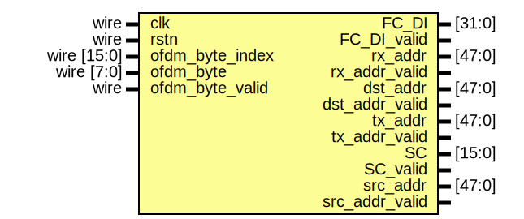

# Entity: phy_rx_parse

- **File**: phy_rx_parse.v
## Diagram

## Description

Xianjun jiao. putaoshu@msn.com; xianjun.jiao@imec.be;
 
## Ports

| Port name       | Direction | Type        | Description |
| --------------- | --------- | ----------- | ----------- |
| clk             | input     | wire        |             |
| rstn            | input     | wire        |             |
| ofdm_byte_index | input     | wire [15:0] |             |
| ofdm_byte       | input     | wire [7:0]  |             |
| ofdm_byte_valid | input     | wire        |             |
| FC_DI           | output    | [31:0]      |             |
| FC_DI_valid     | output    |             |             |
| rx_addr         | output    | [47:0]      |             |
| rx_addr_valid   | output    |             |             |
| dst_addr        | output    | [47:0]      |             |
| dst_addr_valid  | output    |             |             |
| tx_addr         | output    | [47:0]      |             |
| tx_addr_valid   | output    |             |             |
| SC              | output    | [15:0]      |             |
| SC_valid        | output    |             |             |
| src_addr        | output    | [47:0]      |             |
| src_addr_valid  | output    |             |             |
## Processes
- unnamed: ( @( posedge clk ) )
