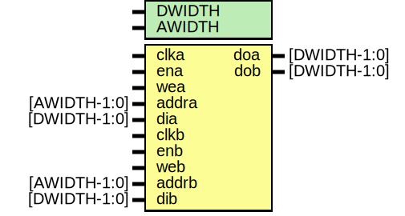

# Entity: ram_2port

- **File**: ram_2port.v
## Diagram

## Description

 Copyright 2011 Ettus Research LLC

 This program is free software: you can redistribute it and/or modify
 it under the terms of the GNU General Public License as published by
 the Free Software Foundation, either version 3 of the License, or
 (at your option) any later version.

 This program is distributed in the hope that it will be useful,
 but WITHOUT ANY WARRANTY; without even the implied warranty of
 MERCHANTABILITY or FITNESS FOR A PARTICULAR PURPOSE.  See the
 GNU General Public License for more details.

 You should have received a copy of the GNU General Public License
 along with this program.  If not, see <http://www.gnu.org/licenses/>.

## Generics

| Generic name | Type | Value | Description |
| ------------ | ---- | ----- | ----------- |
| DWIDTH       |      | 32    |             |
| AWIDTH       |      | 9     |             |
## Ports

| Port name | Direction | Type         | Description |
| --------- | --------- | ------------ | ----------- |
| clka      | input     |              |             |
| ena       | input     |              |             |
| wea       | input     |              |             |
| addra     | input     | [AWIDTH-1:0] |             |
| dia       | input     | [DWIDTH-1:0] |             |
| doa       | output    | [DWIDTH-1:0] |             |
| clkb      | input     |              |             |
| enb       | input     |              |             |
| web       | input     |              |             |
| addrb     | input     | [AWIDTH-1:0] |             |
| dib       | input     | [DWIDTH-1:0] |             |
| dob       | output    | [DWIDTH-1:0] |             |
## Signals

| Name | Type             | Description |
| ---- | ---------------- | ----------- |
| ram  | reg [DWIDTH-1:0] |             |
| i    | integer          |             |
## Processes
- unnamed: ( @(posedge clka) )
  - **Type:** always
- unnamed: ( @(posedge clkb) )
  - **Type:** always
