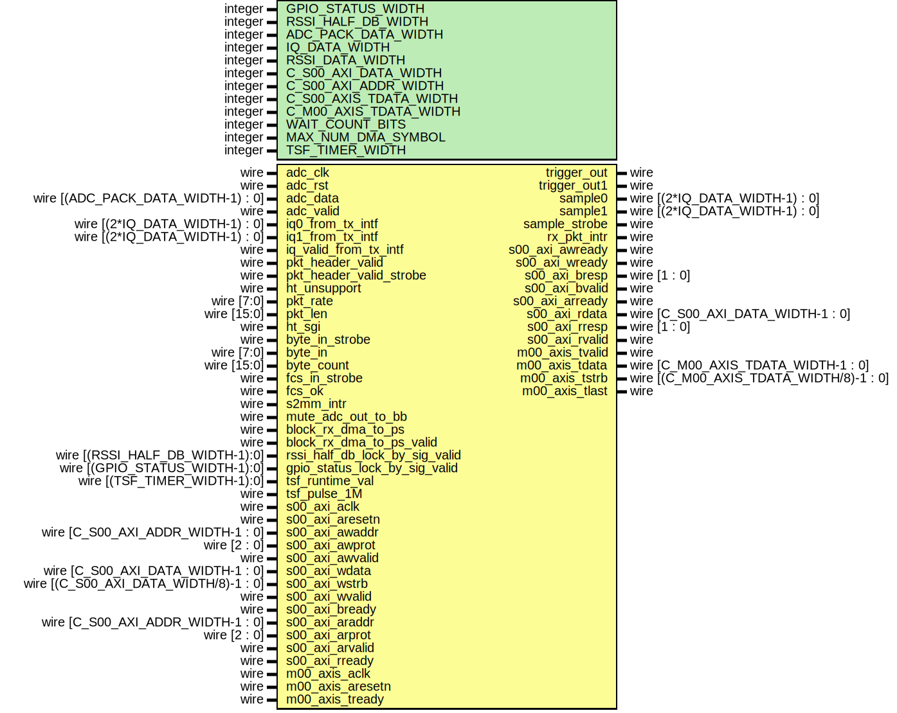

# Entity: rx_intf

- **File**: rx_intf.v
## Diagram

## Description

 Xianjun jiao. putaoshu@msn.com; xianjun.jiao@imec.be;

## Generics

| Generic name           | Type    | Value | Description                    |
| ---------------------- | ------- | ----- | ------------------------------ |
| GPIO_STATUS_WIDTH      | integer | 8     |                                |
| RSSI_HALF_DB_WIDTH     | integer | 11    |                                |
| ADC_PACK_DATA_WIDTH    | integer | 64    |                                |
| IQ_DATA_WIDTH          | integer | 16    |                                |
| RSSI_DATA_WIDTH        | integer | 10    |                                |
| C_S00_AXI_DATA_WIDTH   | integer | 32    |                                |
| C_S00_AXI_ADDR_WIDTH   | integer | 7     |                                |
| C_S00_AXIS_TDATA_WIDTH | integer | 64    |                                |
| C_M00_AXIS_TDATA_WIDTH | integer | 64    |                                |
| WAIT_COUNT_BITS        | integer | 5     |                                |
| MAX_NUM_DMA_SYMBOL     | integer | 8192  |                                |
| TSF_TIMER_WIDTH        | integer | 64    |  according to 802.11 standard  |
## Ports

| Port name                      | Direction | Type                                    | Description                                                       |
| ------------------------------ | --------- | --------------------------------------- | ----------------------------------------------------------------- |
| trigger_out                    | output    | wire                                    |  -------------debug purpose----------------                       |
| trigger_out1                   | output    | wire                                    |                                                                   |
| adc_clk                        | input     | wire                                    |  -------------debug purpose---------------- from ad9361_adc_pack  |
| adc_rst                        | input     | wire                                    |                                                                   |
| adc_data                       | input     | wire [(ADC_PACK_DATA_WIDTH-1) : 0]      |                                                                   |
| adc_valid                      | input     | wire                                    | (* mark_debug = "true" *) input wire adc_sync,                    |
| iq0_from_tx_intf               | input     | wire [(2*IQ_DATA_WIDTH-1) : 0]          |  I/Q ports from tx_intf for loop back                             |
| iq1_from_tx_intf               | input     | wire [(2*IQ_DATA_WIDTH-1) : 0]          |                                                                   |
| iq_valid_from_tx_intf          | input     | wire                                    |                                                                   |
| sample0                        | output    | wire [(2*IQ_DATA_WIDTH-1) : 0]          |  Ports to openofdm rx                                             |
| sample1                        | output    | wire [(2*IQ_DATA_WIDTH-1) : 0]          |                                                                   |
| sample_strobe                  | output    | wire                                    |                                                                   |
| pkt_header_valid               | input     | wire                                    |                                                                   |
| pkt_header_valid_strobe        | input     | wire                                    |                                                                   |
| ht_unsupport                   | input     | wire                                    |                                                                   |
| pkt_rate                       | input     | wire [7:0]                              |                                                                   |
| pkt_len                        | input     | wire [15:0]                             |                                                                   |
| ht_sgi                         | input     | wire                                    |                                                                   |
| byte_in_strobe                 | input     | wire                                    |                                                                   |
| byte_in                        | input     | wire [7:0]                              |                                                                   |
| byte_count                     | input     | wire [15:0]                             |                                                                   |
| fcs_in_strobe                  | input     | wire                                    |                                                                   |
| fcs_ok                         | input     | wire                                    |                                                                   |
| rx_pkt_intr                    | output    | wire                                    |  interrupt to PS                                                  |
| s2mm_intr                      | input     | wire                                    |  interrupt from xilixn axi dma                                    |
| mute_adc_out_to_bb             | input     | wire                                    | in acc clock domain                                               |
| block_rx_dma_to_ps             | input     | wire                                    | if addr filter is on in xpu                                       |
| block_rx_dma_to_ps_valid       | input     | wire                                    | if addr filter is on in xpu                                       |
| rssi_half_db_lock_by_sig_valid | input     | wire [(RSSI_HALF_DB_WIDTH-1):0]         |                                                                   |
| gpio_status_lock_by_sig_valid  | input     | wire [(GPIO_STATUS_WIDTH-1):0]          |                                                                   |
| tsf_runtime_val                | input     | wire [(TSF_TIMER_WIDTH-1):0]            |                                                                   |
| tsf_pulse_1M                   | input     | wire                                    |                                                                   |
| s00_axi_aclk                   | input     | wire                                    |  Ports of Axi Slave Bus Interface S00_AXI                         |
| s00_axi_aresetn                | input     | wire                                    |                                                                   |
| s00_axi_awaddr                 | input     | wire [C_S00_AXI_ADDR_WIDTH-1 : 0]       |                                                                   |
| s00_axi_awprot                 | input     | wire [2 : 0]                            |                                                                   |
| s00_axi_awvalid                | input     | wire                                    |                                                                   |
| s00_axi_awready                | output    | wire                                    |                                                                   |
| s00_axi_wdata                  | input     | wire [C_S00_AXI_DATA_WIDTH-1 : 0]       |                                                                   |
| s00_axi_wstrb                  | input     | wire [(C_S00_AXI_DATA_WIDTH/8)-1 : 0]   |                                                                   |
| s00_axi_wvalid                 | input     | wire                                    |                                                                   |
| s00_axi_wready                 | output    | wire                                    |                                                                   |
| s00_axi_bresp                  | output    | wire [1 : 0]                            |                                                                   |
| s00_axi_bvalid                 | output    | wire                                    |                                                                   |
| s00_axi_bready                 | input     | wire                                    |                                                                   |
| s00_axi_araddr                 | input     | wire [C_S00_AXI_ADDR_WIDTH-1 : 0]       |                                                                   |
| s00_axi_arprot                 | input     | wire [2 : 0]                            |                                                                   |
| s00_axi_arvalid                | input     | wire                                    |                                                                   |
| s00_axi_arready                | output    | wire                                    |                                                                   |
| s00_axi_rdata                  | output    | wire [C_S00_AXI_DATA_WIDTH-1 : 0]       |                                                                   |
| s00_axi_rresp                  | output    | wire [1 : 0]                            |                                                                   |
| s00_axi_rvalid                 | output    | wire                                    |                                                                   |
| s00_axi_rready                 | input     | wire                                    |                                                                   |
| m00_axis_aclk                  | input     | wire                                    |  Ports of Axi Master Bus Interface M00_AXIS to PS                 |
| m00_axis_aresetn               | input     | wire                                    |                                                                   |
| m00_axis_tvalid                | output    | wire                                    |                                                                   |
| m00_axis_tdata                 | output    | wire [C_M00_AXIS_TDATA_WIDTH-1 : 0]     |                                                                   |
| m00_axis_tstrb                 | output    | wire [(C_M00_AXIS_TDATA_WIDTH/8)-1 : 0] |                                                                   |
| m00_axis_tlast                 | output    | wire                                    |                                                                   |
| m00_axis_tready                | input     | wire                                    |                                                                   |
## Signals

| Name                            | Type                                    | Description                                                                                                                                                                                                                                                                                                                                                                                                                                                                                                                                                                                                                                                                                                                                                                                |
| ------------------------------- | --------------------------------------- | ------------------------------------------------------------------------------------------------------------------------------------------------------------------------------------------------------------------------------------------------------------------------------------------------------------------------------------------------------------------------------------------------------------------------------------------------------------------------------------------------------------------------------------------------------------------------------------------------------------------------------------------------------------------------------------------------------------------------------------------------------------------------------------------ |
| slv_reg0                        | wire [(C_S00_AXI_DATA_WIDTH-1):0]       |                                                                                                                                                                                                                                                                                                                                                                                                                                                                                                                                                                                                                                                                                                                                                                                            |
| slv_reg1                        | wire [(C_S00_AXI_DATA_WIDTH-1):0]       |                                                                                                                                                                                                                                                                                                                                                                                                                                                                                                                                                                                                                                                                                                                                                                                            |
| slv_reg2                        | wire [(C_S00_AXI_DATA_WIDTH-1):0]       |                                                                                                                                                                                                                                                                                                                                                                                                                                                                                                                                                                                                                                                                                                                                                                                            |
| slv_reg3                        | wire [(C_S00_AXI_DATA_WIDTH-1):0]       |                                                                                                                                                                                                                                                                                                                                                                                                                                                                                                                                                                                                                                                                                                                                                                                            |
| slv_reg4                        | wire [(C_S00_AXI_DATA_WIDTH-1):0]       |                                                                                                                                                                                                                                                                                                                                                                                                                                                                                                                                                                                                                                                                                                                                                                                            |
| slv_reg5                        | wire [(C_S00_AXI_DATA_WIDTH-1):0]       |                                                                                                                                                                                                                                                                                                                                                                                                                                                                                                                                                                                                                                                                                                                                                                                            |
| slv_reg6                        | wire [(C_S00_AXI_DATA_WIDTH-1):0]       |                                                                                                                                                                                                                                                                                                                                                                                                                                                                                                                                                                                                                                                                                                                                                                                            |
| slv_reg7                        | wire [(C_S00_AXI_DATA_WIDTH-1):0]       |                                                                                                                                                                                                                                                                                                                                                                                                                                                                                                                                                                                                                                                                                                                                                                                            |
| slv_reg8                        | wire [(C_S00_AXI_DATA_WIDTH-1):0]       |                                                                                                                                                                                                                                                                                                                                                                                                                                                                                                                                                                                                                                                                                                                                                                                            |
| slv_reg9                        | wire [(C_S00_AXI_DATA_WIDTH-1):0]       |                                                                                                                                                                                                                                                                                                                                                                                                                                                                                                                                                                                                                                                                                                                                                                                            |
| slv_reg10                       | wire [(C_S00_AXI_DATA_WIDTH-1):0]       |                                                                                                                                                                                                                                                                                                                                                                                                                                                                                                                                                                                                                                                                                                                                                                                            |
| slv_reg11                       | wire [(C_S00_AXI_DATA_WIDTH-1):0]       |                                                                                                                                                                                                                                                                                                                                                                                                                                                                                                                                                                                                                                                                                                                                                                                            |
| slv_reg12                       | wire [(C_S00_AXI_DATA_WIDTH-1):0]       |                                                                                                                                                                                                                                                                                                                                                                                                                                                                                                                                                                                                                                                                                                                                                                                            |
| slv_reg13                       | wire [(C_S00_AXI_DATA_WIDTH-1):0]       |                                                                                                                                                                                                                                                                                                                                                                                                                                                                                                                                                                                                                                                                                                                                                                                            |
| slv_reg16                       | wire [(C_S00_AXI_DATA_WIDTH-1):0]       |  wire [(C_S00_AXI_DATA_WIDTH-1):0] slv_reg14; //   wire [(C_S00_AXI_DATA_WIDTH-1):0] slv_reg15; //                                                                                                                                                                                                                                                                                                                                                                                                                                                                                                                                                                                                                                                                                         |
| m00_axis_tvalid_inner           | wire                                    |  wire [(C_S00_AXI_DATA_WIDTH-1):0] slv_reg17; //   wire [(C_S00_AXI_DATA_WIDTH-1):0] slv_reg18;   wire [(C_S00_AXI_DATA_WIDTH-1):0] slv_reg19; //   wire [(C_S00_AXI_DATA_WIDTH-1):0] slv_reg20; //   wire [(C_S00_AXI_DATA_WIDTH-1):0] slv_reg21; //   wire [(C_S00_AXI_DATA_WIDTH-1):0] slv_reg22; //   wire [(C_S00_AXI_DATA_WIDTH-1):0] slv_reg23; //   wire [(C_S00_AXI_DATA_WIDTH-1):0] slv_reg24;   wire [(C_S00_AXI_DATA_WIDTH-1):0] slv_reg25; //   wire [(C_S00_AXI_DATA_WIDTH-1):0] slv_reg26;   wire [(C_S00_AXI_DATA_WIDTH-1):0] slv_reg27; //   wire [(C_S00_AXI_DATA_WIDTH-1):0] slv_reg28; //   wire [(C_S00_AXI_DATA_WIDTH-1):0] slv_reg29; //   wire [(C_S00_AXI_DATA_WIDTH-1):0] slv_reg30; //   wire [(C_S00_AXI_DATA_WIDTH-1):0] slv_reg31; //  for direct loop back  |
| m00_axis_tdata_inner            | wire [C_M00_AXIS_TDATA_WIDTH-1 : 0]     |                                                                                                                                                                                                                                                                                                                                                                                                                                                                                                                                                                                                                                                                                                                                                                                            |
| m00_axis_tstrb_inner            | wire [(C_M00_AXIS_TDATA_WIDTH/8)-1 : 0] |                                                                                                                                                                                                                                                                                                                                                                                                                                                                                                                                                                                                                                                                                                                                                                                            |
| m00_axis_tlast_inner            | wire                                    |                                                                                                                                                                                                                                                                                                                                                                                                                                                                                                                                                                                                                                                                                                                                                                                            |
| m00_axis_tlast_auto_recover     | wire                                    |                                                                                                                                                                                                                                                                                                                                                                                                                                                                                                                                                                                                                                                                                                                                                                                            |
| emptyn_to_bb                    | wire                                    |                                                                                                                                                                                                                                                                                                                                                                                                                                                                                                                                                                                                                                                                                                                                                                                            |
| ant_data_after_sel              | wire [(ADC_PACK_DATA_WIDTH-1) : 0]      |                                                                                                                                                                                                                                                                                                                                                                                                                                                                                                                                                                                                                                                                                                                                                                                            |
| rf_i0_to_acc                    | wire [(IQ_DATA_WIDTH-1) : 0]            |                                                                                                                                                                                                                                                                                                                                                                                                                                                                                                                                                                                                                                                                                                                                                                                            |
| rf_q0_to_acc                    | wire [(IQ_DATA_WIDTH-1) : 0]            |                                                                                                                                                                                                                                                                                                                                                                                                                                                                                                                                                                                                                                                                                                                                                                                            |
| rf_i1_to_acc                    | wire [(IQ_DATA_WIDTH-1) : 0]            |                                                                                                                                                                                                                                                                                                                                                                                                                                                                                                                                                                                                                                                                                                                                                                                            |
| rf_q1_to_acc                    | wire [(IQ_DATA_WIDTH-1) : 0]            |                                                                                                                                                                                                                                                                                                                                                                                                                                                                                                                                                                                                                                                                                                                                                                                            |
| bw20_i0                         | wire [(IQ_DATA_WIDTH-1):0]              |                                                                                                                                                                                                                                                                                                                                                                                                                                                                                                                                                                                                                                                                                                                                                                                            |
| bw20_q0                         | wire [(IQ_DATA_WIDTH-1):0]              |                                                                                                                                                                                                                                                                                                                                                                                                                                                                                                                                                                                                                                                                                                                                                                                            |
| bw20_i1                         | wire [(IQ_DATA_WIDTH-1):0]              |                                                                                                                                                                                                                                                                                                                                                                                                                                                                                                                                                                                                                                                                                                                                                                                            |
| bw20_q1                         | wire [(IQ_DATA_WIDTH-1):0]              |                                                                                                                                                                                                                                                                                                                                                                                                                                                                                                                                                                                                                                                                                                                                                                                            |
| bw20_iq_valid                   | wire                                    |                                                                                                                                                                                                                                                                                                                                                                                                                                                                                                                                                                                                                                                                                                                                                                                            |
| rf_iq_loopback                  | wire [(4*IQ_DATA_WIDTH-1) : 0]          |                                                                                                                                                                                                                                                                                                                                                                                                                                                                                                                                                                                                                                                                                                                                                                                            |
| start_1trans_from_acc_to_m_axis | wire                                    |                                                                                                                                                                                                                                                                                                                                                                                                                                                                                                                                                                                                                                                                                                                                                                                            |
| data_from_acc_to_m_axis         | wire [(C_M00_AXIS_TDATA_WIDTH-1):0]     |                                                                                                                                                                                                                                                                                                                                                                                                                                                                                                                                                                                                                                                                                                                                                                                            |
| data_ready_from_acc_to_m_axis   | wire                                    |                                                                                                                                                                                                                                                                                                                                                                                                                                                                                                                                                                                                                                                                                                                                                                                            |
| fulln_from_m_axis_to_acc        | wire                                    |                                                                                                                                                                                                                                                                                                                                                                                                                                                                                                                                                                                                                                                                                                                                                                                            |
| m_axis_fifo_data_count          | wire [MAX_BIT_NUM_DMA_SYMBOL-1 : 0]     |                                                                                                                                                                                                                                                                                                                                                                                                                                                                                                                                                                                                                                                                                                                                                                                            |
| fcs_valid_internal              | wire                                    |                                                                                                                                                                                                                                                                                                                                                                                                                                                                                                                                                                                                                                                                                                                                                                                            |
| rx_pkt_intr_internal            | wire                                    |                                                                                                                                                                                                                                                                                                                                                                                                                                                                                                                                                                                                                                                                                                                                                                                            |
| intr_internal                   | wire                                    |                                                                                                                                                                                                                                                                                                                                                                                                                                                                                                                                                                                                                                                                                                                                                                                            |
| wifi_rx_iq_fifo_emptyn          | wire                                    |                                                                                                                                                                                                                                                                                                                                                                                                                                                                                                                                                                                                                                                                                                                                                                                            |
| monitor_num_dma_symbol_to_ps    | wire [(MAX_BIT_NUM_DMA_SYMBOL-1) : 0]   | wire [(MAX_BIT_NUM_DMA_SYMBOL-1) : 0] monitor_num_dma_symbol_to_pl;                                                                                                                                                                                                                                                                                                                                                                                                                                                                                                                                                                                                                                                                                                                        |
| num_dma_symbol_to_ps            | wire [(MAX_BIT_NUM_DMA_SYMBOL-1) : 0]   |                                                                                                                                                                                                                                                                                                                                                                                                                                                                                                                                                                                                                                                                                                                                                                                            |
| m_axis_auto_rst                 | wire                                    | wire fcs_invalid_from_acc_delay;                                                                                                                                                                                                                                                                                                                                                                                                                                                                                                                                                                                                                                                                                                                                                           |
| m_axis_rst                      | wire                                    |                                                                                                                                                                                                                                                                                                                                                                                                                                                                                                                                                                                                                                                                                                                                                                                            |
| enable_m_axis_auto_rst          | wire                                    |                                                                                                                                                                                                                                                                                                                                                                                                                                                                                                                                                                                                                                                                                                                                                                                            |
| ant_flag_in_rf_domain           | wire                                    |                                                                                                                                                                                                                                                                                                                                                                                                                                                                                                                                                                                                                                                                                                                                                                                            |
| mute_adc_out_to_bb_in_rf_domain | wire                                    |                                                                                                                                                                                                                                                                                                                                                                                                                                                                                                                                                                                                                                                                                                                                                                                            |
| adc_data_internal               | wire [(ADC_PACK_DATA_WIDTH-1) : 0]      |                                                                                                                                                                                                                                                                                                                                                                                                                                                                                                                                                                                                                                                                                                                                                                                            |
| adc_data_after_sel              | wire [(ADC_PACK_DATA_WIDTH-1) : 0]      |                                                                                                                                                                                                                                                                                                                                                                                                                                                                                                                                                                                                                                                                                                                                                                                            |
| data_from_acc                   | wire [(C_M00_AXIS_TDATA_WIDTH-1) : 0]   |                                                                                                                                                                                                                                                                                                                                                                                                                                                                                                                                                                                                                                                                                                                                                                                            |
| data_ready_from_acc             | wire                                    |                                                                                                                                                                                                                                                                                                                                                                                                                                                                                                                                                                                                                                                                                                                                                                                            |
| fcs_valid                       | wire                                    |                                                                                                                                                                                                                                                                                                                                                                                                                                                                                                                                                                                                                                                                                                                                                                                            |
| fcs_invalid                     | wire                                    |                                                                                                                                                                                                                                                                                                                                                                                                                                                                                                                                                                                                                                                                                                                                                                                            |
| sig_valid                       | wire                                    |                                                                                                                                                                                                                                                                                                                                                                                                                                                                                                                                                                                                                                                                                                                                                                                            |
| sig_invalid                     | wire                                    |                                                                                                                                                                                                                                                                                                                                                                                                                                                                                                                                                                                                                                                                                                                                                                                            |
| rx_pkt_sn_plus_one              | wire                                    |                                                                                                                                                                                                                                                                                                                                                                                                                                                                                                                                                                                                                                                                                                                                                                                            |
| trigger_out_internal            | wire                                    |  -------------debug purpose----------------                                                                                                                                                                                                                                                                                                                                                                                                                                                                                                                                                                                                                                                                                                                                                |
## Constants

| Name                   | Type    | Value                      | Description |
| ---------------------- | ------- | -------------------------- | ----------- |
| MAX_BIT_NUM_DMA_SYMBOL | integer | clogb2(MAX_NUM_DMA_SYMBOL) |             |
## Functions
- clogb2 (input integer bit_depth) return (integer)
## Instantiations

- xpm_cdc_array_single_inst_mute_adc: xpm_cdc_array_single
 **Description**
 ---------------------------fro mute_adc_out_to_bb control from acc domain to adc domain-------------------------------------

- xpm_cdc_array_single_inst_ant_flag: xpm_cdc_array_single
 **Description**
 ---------------------------fro antenna selection from acc domain to adc domain-------------------------------------

- adc_intf_i: adc_intf
- rx_intf_s_axi_i: rx_intf_s_axi
 **Description**
 Instantiation of Axi Bus Interface S00_AXI

- rx_iq_intf_i: rx_iq_intf
- byte_to_word_fcs_sn_insert_inst: byte_to_word_fcs_sn_insert
- rx_intf_pl_to_m_axis_i: rx_intf_pl_to_m_axis
- rx_intf_m_axis_i: rx_intf_m_axis
