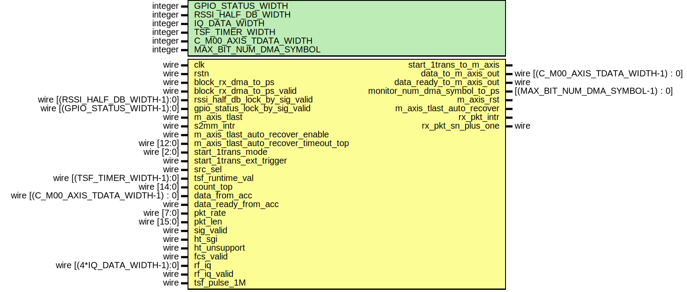
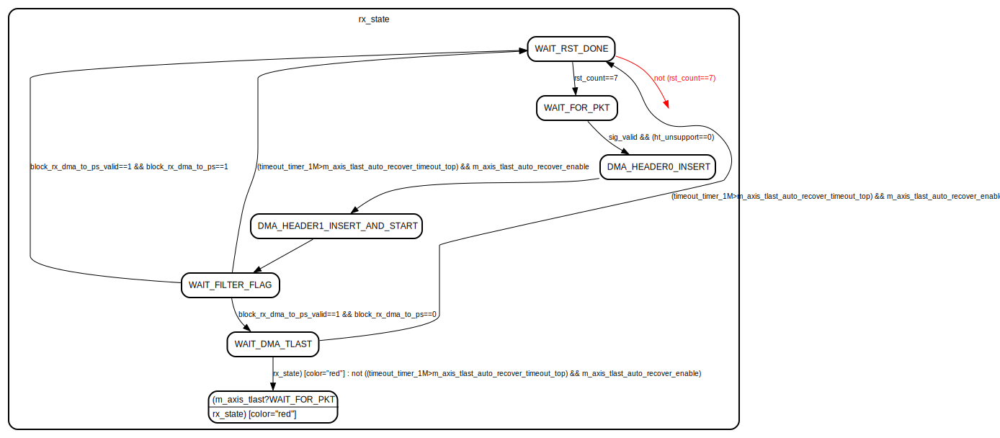

# Entity: rx_intf_pl_to_m_axis

- **File**: rx_intf_pl_to_m_axis.v
## Diagram

## Description

Xianjun jiao. putaoshu@msn.com; xianjun.jiao@imec.be;
 
## Generics

| Generic name           | Type    | Value | Description |
| ---------------------- | ------- | ----- | ----------- |
| GPIO_STATUS_WIDTH      | integer | 8     |             |
| RSSI_HALF_DB_WIDTH     | integer | 11    |             |
| IQ_DATA_WIDTH          | integer | 16    |             |
| TSF_TIMER_WIDTH        | integer | 64    |             |
| C_M00_AXIS_TDATA_WIDTH | integer | 64    |             |
| MAX_BIT_NUM_DMA_SYMBOL | integer | 14    |             |
## Ports

| Port name                             | Direction | Type                                  | Description                    |
| ------------------------------------- | --------- | ------------------------------------- | ------------------------------ |
| clk                                   | input     | wire                                  |                                |
| rstn                                  | input     | wire                                  |                                |
| block_rx_dma_to_ps                    | input     | wire                                  | port to xpu                    |
| block_rx_dma_to_ps_valid              | input     | wire                                  |                                |
| rssi_half_db_lock_by_sig_valid        | input     | wire [(RSSI_HALF_DB_WIDTH-1):0]       |                                |
| gpio_status_lock_by_sig_valid         | input     | wire [(GPIO_STATUS_WIDTH-1):0]        |                                |
| start_1trans_to_m_axis                | output    |                                       | to m_axis and PS               |
| data_to_m_axis_out                    | output    | wire [(C_M00_AXIS_TDATA_WIDTH-1) : 0] |                                |
| data_ready_to_m_axis_out              | output    | wire                                  |                                |
| monitor_num_dma_symbol_to_ps          | output    | [(MAX_BIT_NUM_DMA_SYMBOL-1) : 0]      |                                |
| m_axis_rst                            | output    |                                       |                                |
| m_axis_tlast                          | input     | wire                                  |                                |
| m_axis_tlast_auto_recover             | output    |                                       |                                |
| s2mm_intr                             | input     | wire                                  | port to xilinx axi dma         |
| rx_pkt_intr                           | output    |                                       |                                |
| rx_pkt_sn_plus_one                    | output    | wire                                  | to byte_to_word_fcs_sn_intert  |
| m_axis_tlast_auto_recover_enable      | input     | wire                                  | start m_axis trans mode        |
| m_axis_tlast_auto_recover_timeout_top | input     | wire [12:0]                           |                                |
| start_1trans_mode                     | input     | wire [2:0]                            |                                |
| start_1trans_ext_trigger              | input     | wire                                  |                                |
| src_sel                               | input     | wire                                  |                                |
| tsf_runtime_val                       | input     | wire [(TSF_TIMER_WIDTH-1):0]          |                                |
| count_top                             | input     | wire [14:0]                           |                                |
| data_from_acc                         | input     | wire [(C_M00_AXIS_TDATA_WIDTH-1) : 0] | from wifi rx                   |
| data_ready_from_acc                   | input     | wire                                  |                                |
| pkt_rate                              | input     | wire [7:0]                            |                                |
| pkt_len                               | input     | wire [15:0]                           |                                |
| sig_valid                             | input     | wire                                  |                                |
| ht_sgi                                | input     | wire                                  |                                |
| ht_unsupport                          | input     | wire                                  |                                |
| fcs_valid                             | input     | wire                                  |                                |
| rf_iq                                 | input     | wire [(4*IQ_DATA_WIDTH-1):0]          | from wifi_rx_iq_intf loop back |
| rf_iq_valid                           | input     | wire                                  |                                |
| tsf_pulse_1M                          | input     | wire                                  |                                |
## Signals

| Name                  | Type                                 | Description |
| --------------------- | ------------------------------------ | ----------- |
| rx_state              | reg [2:0]                            |             |
| old_rx_state          | reg [2:0]                            |             |
| start_m_axis          | reg                                  |             |
| data_to_m_axis        | reg [(C_M00_AXIS_TDATA_WIDTH-1) : 0] |             |
| data_ready_to_m_axis  | reg                                  |             |
| rst_count             | reg [2:0]                            |             |
| tsf_val_lock_by_sig   | reg [(TSF_TIMER_WIDTH-1):0]          |             |
| count                 | reg [14:0]                           |             |
| timeout_timer_1M      | reg [12:0]                           |             |
| s2mm_intr_reg         | reg                                  |             |
| count_top_scale       | reg [14:0]                           |             |
| count_top_scale_plus1 | reg [14:0]                           |             |
## Constants

| Name                         | Type  | Value  | Description |
| ---------------------------- | ----- | ------ | ----------- |
| WAIT_S2MM_INTR               | [0:0] | 1'b0   |             |
| COUNT_TO_TOP                 | [0:0] | 1'b1   |             |
| WAIT_FOR_PKT                 | [2:0] | 3'b000 |             |
| DMA_HEADER0_INSERT           | [2:0] | 3'b001 |             |
| DMA_HEADER1_INSERT_AND_START | [2:0] | 3'b010 |             |
| WAIT_FILTER_FLAG             | [2:0] | 3'b011 |             |
| WAIT_DMA_TLAST               | [2:0] | 3'b100 |             |
| WAIT_RST_DONE                | [2:0] | 3'b101 |             |
## Processes
- unnamed: ( @( start_1trans_mode,sig_valid,fcs_valid,start_1trans_ext_trigger,start_m_axis) )
- unnamed: ( @( posedge clk ) )
- unnamed: ( @(posedge clk) )
- unnamed: ( @(posedge clk) )
**Description**
process to generate delayed interrupt after receive s2mm_intr

## State machines

- state machine to control m_axis to ARM