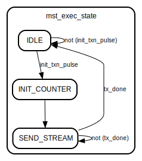

# Entity: side_ch_m_axis

- **File**: side_ch_m_axis.v
## Diagram

## Description

 based on Xilinx module template
 Xianjun jiao. putaoshu@msn.com; xianjun.jiao@imec.be;

## Generics

| Generic name           | Type    | Value | Description                                                                      |
| ---------------------- | ------- | ----- | -------------------------------------------------------------------------------- |
| MAX_NUM_DMA_SYMBOL     | integer | 8192  |  parameter integer START_COUNT_CFG = 0,  parameter integer WAIT_COUNT_BITS = 5,  |
| MAX_BIT_NUM_DMA_SYMBOL | integer | 14    |                                                                                  |
| C_M_AXIS_TDATA_WIDTH   | integer | 64    |                                                                                  |
## Ports

| Port name             | Direction | Type                                  | Description |
| --------------------- | --------- | ------------------------------------- | ----------- |
| m_axis_endless_mode   | input     | wire                                  |             |
| M_AXIS_NUM_DMA_SYMBOL | input     | wire [MAX_BIT_NUM_DMA_SYMBOL-1 : 0]   |             |
| m_axis_start_1trans   | input     | wire                                  |             |
| data_to_ps            | input     | wire [C_M_AXIS_TDATA_WIDTH-1 : 0]     |             |
| data_to_ps_valid      | input     | wire                                  |             |
| m_axis_data_count     | output    | wire [MAX_BIT_NUM_DMA_SYMBOL-1 : 0]   |             |
| fulln_to_pl           | output    | wire                                  |             |
| M_AXIS_ACLK           | input     | wire                                  |             |
| M_AXIS_ARESETN        | input     | wire                                  |             |
| M_AXIS_TVALID         | output    | wire                                  |             |
| M_AXIS_TDATA          | output    | wire [C_M_AXIS_TDATA_WIDTH-1 : 0]     |             |
| M_AXIS_TSTRB          | output    | wire [(C_M_AXIS_TDATA_WIDTH/8)-1 : 0] |             |
| M_AXIS_TLAST          | output    | wire                                  |             |
| M_AXIS_TREADY         | input     | wire                                  |             |
## Signals

| Name             | Type              | Description                                   |
| ---------------- | ----------------- | --------------------------------------------- |
| mst_exec_state   | reg [1:0]         |  In this state the                            |
| read_pointer     | reg [bit_num-1:0] |                                               |
| axis_tvalid      | wire              |  reg [WAIT_COUNT_BITS-1 : 0] 	count;          |
| axis_tlast       | wire              |                                               |
| axis_tlast_delay | reg               |                                               |
| tx_en            | wire              |                                               |
| tx_done          | reg               |                                               |
| EMPTY            | wire              |                                               |
| init_txn_ff      | reg               |                                               |
| init_txn_pulse   | wire              |                                               |
| FULL             | wire              |                                               |
## Constants

| Name         | Type    | Value                      | Description                     |
| ------------ | ------- | -------------------------- | ------------------------------- |
| bit_num      | integer | clogb2(MAX_NUM_DMA_SYMBOL) |                                 |
| IDLE         | [1:0]   | 2'b00                      | This is the initial/idle state  |
| INIT_COUNTER | [1:0]   | 2'b01                      | This is the initial/idle state  |
| SEND_STREAM  | [1:0]   | 2'b10                      | This is the initial/idle state  |
## Functions
- clogb2 (input integer bit_depth) return (integer)
## Processes
- unnamed: ( @(posedge M_AXIS_ACLK) )
  - **Type:** always
**Description**
Generate a pulse to initiate AXI transaction. 
- unnamed: ( @(posedge M_AXIS_ACLK) )
  - **Type:** always
**Description**
 Control state machine implementation                              
- unnamed: ( @(posedge M_AXIS_ACLK) )
  - **Type:** always
**Description**
 Delay the axis_tvalid and axis_tlast signal by one clock cycle                                to match the latency of M_AXIS_TDATA                                                         
- unnamed: ( @(posedge M_AXIS_ACLK) )
  - **Type:** always
## Instantiations

- m_axis_xpm_fifo_sync0: xpm_fifo_sync
**Description**
 fifo64_1clk fifo64_1clk_i (
     .CLK(M_AXIS_ACLK),
     .DATAO(M_AXIS_TDATA),
     .DI(data_to_ps),
     .EMPTY(EMPTY),
     .FULL(FULL),
     .RDEN(tx_en),
     .RST(!M_AXIS_ARESETN),
     .WREN(data_to_ps_valid),
     .data_count(m_axis_data_count)
 );

## State machines

- Control state machine implementation