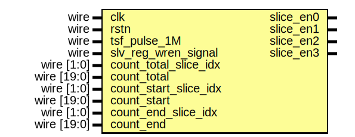

# Entity: time_slice_gen

## Diagram

## Description

Xianjun jiao. putaoshu@msn.com; xianjun.jiao@imec.be;
 
## Ports

| Port name             | Direction | Type        | Description                          |
| --------------------- | --------- | ----------- | ------------------------------------ |
| clk                   | input     | wire        | generate time slice for tx_control.v |
| rstn                  | input     | wire        |                                      |
| tsf_pulse_1M          | input     | wire        |                                      |
| slv_reg_wren_signal   | input     | wire        |                                      |
| count_total_slice_idx | input     | wire [1:0]  |                                      |
| count_total           | input     | wire [19:0] |                                      |
| count_start_slice_idx | input     | wire [1:0]  |                                      |
| count_start           | input     | wire [19:0] |                                      |
| count_end_slice_idx   | input     | wire [1:0]  |                                      |
| count_end             | input     | wire [19:0] |                                      |
| slice_en0             | output    |             |                                      |
| slice_en1             | output    |             |                                      |
| slice_en2             | output    |             |                                      |
| slice_en3             | output    |             |                                      |
## Signals

| Name         | Type       | Description |
| ------------ | ---------- | ----------- |
| count_total0 | reg [19:0] |             |
| count_total1 | reg [19:0] |             |
| count_total2 | reg [19:0] |             |
| count_total3 | reg [19:0] |             |
| count_start0 | reg [19:0] |             |
| count_start1 | reg [19:0] |             |
| count_start2 | reg [19:0] |             |
| count_start3 | reg [19:0] |             |
| count_end0   | reg [19:0] |             |
| count_end1   | reg [19:0] |             |
| count_end2   | reg [19:0] |             |
| count_end3   | reg [19:0] |             |
| counter0     | reg [19:0] |             |
| counter1     | reg [19:0] |             |
| counter2     | reg [19:0] |             |
| counter3     | reg [19:0] |             |
## Processes
- unnamed: ( @( posedge clk ) )
