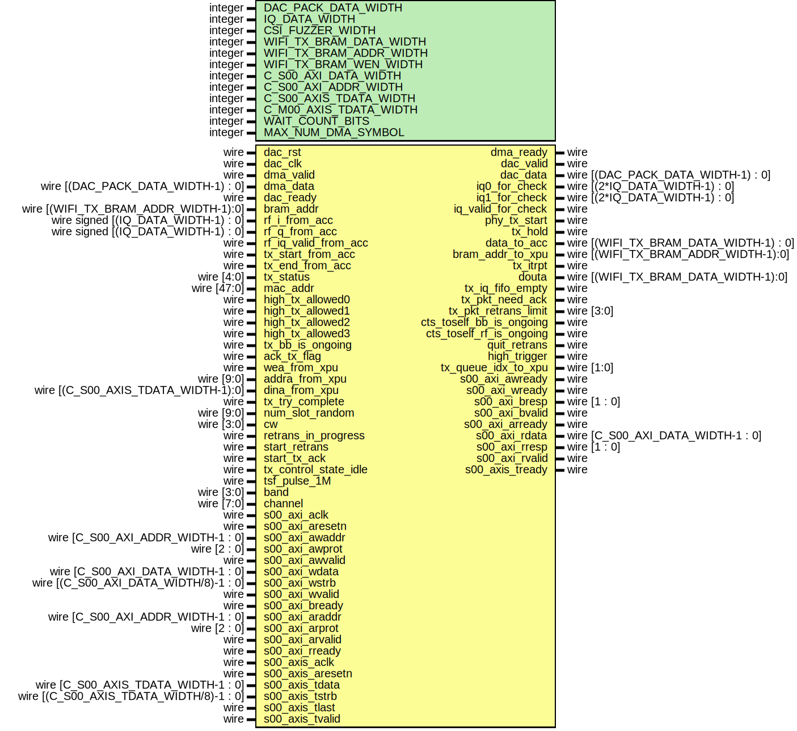

# Entity: tx_intf

## Diagram

## Description

Xianjun jiao. putaoshu@msn.com; xianjun.jiao@imec.be;
 
## Generics

| Generic name            | Type    | Value | Description |
| ----------------------- | ------- | ----- | ----------- |
| DAC_PACK_DATA_WIDTH     | integer | 64    |             |
| IQ_DATA_WIDTH           | integer | 16    |             |
| CSI_FUZZER_WIDTH        | integer | 7     |             |
| WIFI_TX_BRAM_DATA_WIDTH | integer | 64    |             |
| WIFI_TX_BRAM_ADDR_WIDTH | integer | 10    |             |
| WIFI_TX_BRAM_WEN_WIDTH  | integer | 8     |             |
| C_S00_AXI_DATA_WIDTH    | integer | 32    |             |
| C_S00_AXI_ADDR_WIDTH    | integer | 7     |             |
| C_S00_AXIS_TDATA_WIDTH  | integer | 64    |             |
| C_M00_AXIS_TDATA_WIDTH  | integer | 64    |             |
| WAIT_COUNT_BITS         | integer | 5     |             |
| MAX_NUM_DMA_SYMBOL      | integer | 8192  |             |
## Ports

| Port name                | Direction | Type                                    | Description                                                            |
| ------------------------ | --------- | --------------------------------------- | ---------------------------------------------------------------------- |
| dac_rst                  | input     | wire                                    |                                                                        |
| dac_clk                  | input     | wire                                    |                                                                        |
| dma_valid                | input     | wire                                    | connect axi_ad9361_dac_dma                                             |
| dma_data                 | input     | wire [(DAC_PACK_DATA_WIDTH-1) : 0]      |                                                                        |
| dma_ready                | output    | wire                                    |                                                                        |
| dac_valid                | output    | wire                                    | connect util_ad9361_dac_upack                                          |
| dac_data                 | output    | wire [(DAC_PACK_DATA_WIDTH-1) : 0]      |                                                                        |
| dac_ready                | input     | wire                                    |                                                                        |
| iq0_for_check            | output    | wire [(2*IQ_DATA_WIDTH-1) : 0]          | Ports to side_ch for check                                             |
| iq1_for_check            | output    | wire [(2*IQ_DATA_WIDTH-1) : 0]          |                                                                        |
| iq_valid_for_check       | output    | wire                                    |                                                                        |
| phy_tx_start             | output    | wire                                    | Ports to ACC: PHY_TX                                                   |
| tx_hold                  | output    | wire                                    |                                                                        |
| bram_addr                | input     | wire  [(WIFI_TX_BRAM_ADDR_WIDTH-1):0]   |                                                                        |
| rf_i_from_acc            | input     | wire signed [(IQ_DATA_WIDTH-1) : 0]     |                                                                        |
| rf_q_from_acc            | input     | wire signed [(IQ_DATA_WIDTH-1) : 0]     |                                                                        |
| rf_iq_valid_from_acc     | input     | wire                                    |                                                                        |
| data_to_acc              | output    | wire [(WIFI_TX_BRAM_DATA_WIDTH-1) : 0]  |                                                                        |
| bram_addr_to_xpu         | output    | wire  [(WIFI_TX_BRAM_ADDR_WIDTH-1):0]   |                                                                        |
| tx_start_from_acc        | input     | wire                                    |                                                                        |
| tx_end_from_acc          | input     | wire                                    |                                                                        |
| tx_itrpt                 | output    | wire                                    | interrupt to PS                                                        |
| tx_status                | input     | wire [4:0]                              | for xpu                                                                |
| mac_addr                 | input     | wire [47:0]                             |                                                                        |
| douta                    | output    | wire [(WIFI_TX_BRAM_DATA_WIDTH-1):0]    |                                                                        |
| tx_iq_fifo_empty         | output    | wire                                    |                                                                        |
| high_tx_allowed0         | input     | wire                                    | when this is valid, driver takes over tx, other wise xpu takes over tx |
| high_tx_allowed1         | input     | wire                                    | for another queue                                                      |
| high_tx_allowed2         | input     | wire                                    |                                                                        |
| high_tx_allowed3         | input     | wire                                    |                                                                        |
| tx_bb_is_ongoing         | input     | wire                                    |                                                                        |
| ack_tx_flag              | input     | wire                                    |                                                                        |
| wea_from_xpu             | input     | wire                                    |                                                                        |
| addra_from_xpu           | input     | wire [9:0]                              |                                                                        |
| dina_from_xpu            | input     | wire [(C_S00_AXIS_TDATA_WIDTH-1):0]     |                                                                        |
| tx_pkt_need_ack          | output    | wire                                    |                                                                        |
| tx_pkt_retrans_limit     | output    | wire [3:0]                              |                                                                        |
| tx_try_complete          | input     | wire                                    |                                                                        |
| num_slot_random          | input     | wire [9:0]                              |                                                                        |
| cw                       | input     | wire [3:0]                              |                                                                        |
| retrans_in_progress      | input     | wire                                    |                                                                        |
| start_retrans            | input     | wire                                    |                                                                        |
| start_tx_ack             | input     | wire                                    |                                                                        |
| tx_control_state_idle    | input     | wire                                    |                                                                        |
| cts_toself_bb_is_ongoing | output    | wire                                    |                                                                        |
| cts_toself_rf_is_ongoing | output    | wire                                    |                                                                        |
| tsf_pulse_1M             | input     | wire                                    |                                                                        |
| band                     | input     | wire [3:0]                              |                                                                        |
| channel                  | input     | wire [7:0]                              |                                                                        |
| quit_retrans             | output    | wire                                    |                                                                        |
| high_trigger             | output    | wire                                    |                                                                        |
| tx_queue_idx_to_xpu      | output    | wire [1:0]                              |                                                                        |
| s00_axi_aclk             | input     | wire                                    | Ports of Axi Slave Bus Interface S00_AXI                               |
| s00_axi_aresetn          | input     | wire                                    |                                                                        |
| s00_axi_awaddr           | input     | wire [C_S00_AXI_ADDR_WIDTH-1 : 0]       |                                                                        |
| s00_axi_awprot           | input     | wire [2 : 0]                            |                                                                        |
| s00_axi_awvalid          | input     | wire                                    |                                                                        |
| s00_axi_awready          | output    | wire                                    |                                                                        |
| s00_axi_wdata            | input     | wire [C_S00_AXI_DATA_WIDTH-1 : 0]       |                                                                        |
| s00_axi_wstrb            | input     | wire [(C_S00_AXI_DATA_WIDTH/8)-1 : 0]   |                                                                        |
| s00_axi_wvalid           | input     | wire                                    |                                                                        |
| s00_axi_wready           | output    | wire                                    |                                                                        |
| s00_axi_bresp            | output    | wire [1 : 0]                            |                                                                        |
| s00_axi_bvalid           | output    | wire                                    |                                                                        |
| s00_axi_bready           | input     | wire                                    |                                                                        |
| s00_axi_araddr           | input     | wire [C_S00_AXI_ADDR_WIDTH-1 : 0]       |                                                                        |
| s00_axi_arprot           | input     | wire [2 : 0]                            |                                                                        |
| s00_axi_arvalid          | input     | wire                                    |                                                                        |
| s00_axi_arready          | output    | wire                                    |                                                                        |
| s00_axi_rdata            | output    | wire [C_S00_AXI_DATA_WIDTH-1 : 0]       |                                                                        |
| s00_axi_rresp            | output    | wire [1 : 0]                            |                                                                        |
| s00_axi_rvalid           | output    | wire                                    |                                                                        |
| s00_axi_rready           | input     | wire                                    |                                                                        |
| s00_axis_aclk            | input     | wire                                    | Ports of Axi Slave Bus Interface S00_AXIS to PS                        |
| s00_axis_aresetn         | input     | wire                                    |                                                                        |
| s00_axis_tready          | output    | wire                                    |                                                                        |
| s00_axis_tdata           | input     | wire [C_S00_AXIS_TDATA_WIDTH-1 : 0]     |                                                                        |
| s00_axis_tstrb           | input     | wire [(C_S00_AXIS_TDATA_WIDTH/8)-1 : 0] |                                                                        |
| s00_axis_tlast           | input     | wire                                    |                                                                        |
| s00_axis_tvalid          | input     | wire                                    |                                                                        |
## Signals

| Name                                 | Type                                  | Description                                      |
| ------------------------------------ | ------------------------------------- | ------------------------------------------------ |
| slv_reg_rden                         | wire                                  |                                                  |
| axi_araddr_core                      | wire [4:0]                            |                                                  |
| slv_reg0                             | wire [(C_S00_AXI_DATA_WIDTH-1):0]     |                                                  |
| slv_reg1                             | wire [(C_S00_AXI_DATA_WIDTH-1):0]     | duc config                                       |
| slv_reg2                             | wire [(C_S00_AXI_DATA_WIDTH-1):0]     | phy tx auto_start_mode and num_dma_symbol_th     |
| slv_reg3                             | wire [(C_S00_AXI_DATA_WIDTH-1):0]     |                                                  |
| slv_reg4                             | wire [(C_S00_AXI_DATA_WIDTH-1):0]     | CTS duration for CTS-TO-SELF CTS-PROTECT TX      |
| slv_reg5                             | wire [(C_S00_AXI_DATA_WIDTH-1):0]     |                                                  |
| slv_reg6                             | wire [(C_S00_AXI_DATA_WIDTH-1):0]     |                                                  |
| slv_reg7                             | wire [(C_S00_AXI_DATA_WIDTH-1):0]     |                                                  |
| slv_reg8                             | wire [(C_S00_AXI_DATA_WIDTH-1):0]     |                                                  |
| slv_reg9                             | wire [(C_S00_AXI_DATA_WIDTH-1):0]     |                                                  |
| slv_reg10                            | wire [(C_S00_AXI_DATA_WIDTH-1):0]     |                                                  |
| slv_reg11                            | wire [(C_S00_AXI_DATA_WIDTH-1):0]     |                                                  |
| slv_reg12                            | wire [(C_S00_AXI_DATA_WIDTH-1):0]     |                                                  |
| slv_reg13                            | wire [(C_S00_AXI_DATA_WIDTH-1):0]     |                                                  |
| slv_reg14                            | wire [(C_S00_AXI_DATA_WIDTH-1):0]     |                                                  |
| slv_reg16                            | wire [(C_S00_AXI_DATA_WIDTH-1):0]     |                                                  |
| slv_reg21                            | wire [(C_S00_AXI_DATA_WIDTH-1):0]     | wire [(C_S00_AXI_DATA_WIDTH-1):0] slv_reg20; //  |
| slv_reg22                            | wire [(C_S00_AXI_DATA_WIDTH-1):0]     |                                                  |
| slv_reg24                            | wire [(C_S00_AXI_DATA_WIDTH-1):0]     |                                                  |
| ant_data                             | wire [(2*IQ_DATA_WIDTH-1) : 0]        |                                                  |
| ant_data_valid                       | wire                                  |                                                  |
| fulln_from_dac_to_duc                | wire                                  |                                                  |
| wifi_iq_pack                         | wire [(2*IQ_DATA_WIDTH-1) : 0]        |                                                  |
| wifi_iq_valid                        | wire                                  |                                                  |
| wifi_iq_ready                        | wire                                  |                                                  |
| s_axis_data_to_acc                   | wire [(C_S00_AXIS_TDATA_WIDTH-1):0]   |                                                  |
| tx_bit_intf_acc_ask_data_from_s_axis | wire                                  |                                                  |
| acc_ask_data_from_s_axis             | wire                                  |                                                  |
| s_axis_emptyn_to_acc                 | wire                                  |                                                  |
| s_axis_fifo_data_count0              | wire [(MAX_BIT_NUM_DMA_SYMBOL-1) : 0] |                                                  |
| s_axis_fifo_data_count1              | wire [(MAX_BIT_NUM_DMA_SYMBOL-1) : 0] |                                                  |
| s_axis_fifo_data_count2              | wire [(MAX_BIT_NUM_DMA_SYMBOL-1) : 0] |                                                  |
| s_axis_fifo_data_count3              | wire [(MAX_BIT_NUM_DMA_SYMBOL-1) : 0] |                                                  |
| tx_queue_idx                         | wire [1:0]                            |                                                  |
| linux_prio                           | wire [1:0]                            |                                                  |
| tx_pkt_sn                            | wire [9:0]                            |                                                  |
| num_dma_symbol_fifo_data_count0      | wire [6:0]                            | wire [15:0] tx_pkt_num_dma_byte;                 |
| num_dma_symbol_fifo_data_count1      | wire [6:0]                            |                                                  |
| num_dma_symbol_fifo_data_count2      | wire [6:0]                            |                                                  |
| num_dma_symbol_fifo_data_count3      | wire [6:0]                            |                                                  |
| dac_intf_rd_data_count               | wire [5:0]                            |                                                  |
| dac_intf_wr_data_count               | wire [5:0]                            |                                                  |
| dac_intf_counter_1s                  | wire [27:0]                           |                                                  |
| dac_intf_counter_rden_store          | wire [26:0]                           |                                                  |
| dac_intf_counter_dac                 | wire [27:0]                           |                                                  |
| dac_intf_counter_wren_store          | wire [26:0]                           |                                                  |
| phy_tx_auto_start_mode               | wire                                  |                                                  |
| phy_tx_auto_start_num_dma_symbol_th  | wire [9:0]                            |                                                  |
| s_axis_recv_data_from_high           | wire                                  |                                                  |
| tx_itrpt_internal                    | wire                                  |                                                  |
| send_cts_toself_wait_sifs_top        | wire [13:0]                           |                                                  |
## Constants

| Name                   | Type    | Value                      | Description |
| ---------------------- | ------- | -------------------------- | ----------- |
| MAX_BIT_NUM_DMA_SYMBOL | integer | clogb2(MAX_NUM_DMA_SYMBOL) |             |
## Functions
- clogb2 (input integer bit_depth) return (integer)
## Instantiations

- dac_intf_i: dac_intf
- duc_bank_core_i: duc_bank_core
- tx_intf_s_axi_i: tx_intf_s_axi
**Description**
Instantiation of Axi Bus Interface S00_AXI

- tx_status_fifo_i: tx_status_fifo
**Description**
hooked to slv_reg22!
- tx_intf_s_axis_i: tx_intf_s_axis
**Description**
Instantiation of Axi Bus Interface S00_AXIS

- tx_interrupt_selection_i: tx_interrupt_selection
- tx_bit_intf_i: tx_bit_intf
