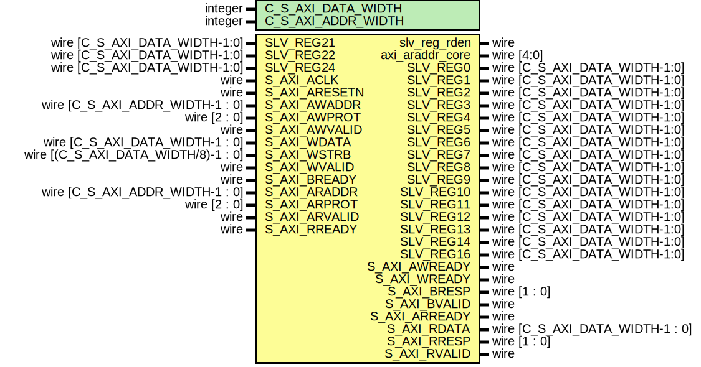

# Entity: tx_intf_s_axi

- **File**: tx_intf_s_axi.v
## Diagram

## Description

 based on Xilinx module template
 Xianjun jiao. putaoshu@msn.com; xianjun.jiao@imec.be;

## Generics

| Generic name       | Type    | Value | Description                                                                                                                  |
| ------------------ | ------- | ----- | ---------------------------------------------------------------------------------------------------------------------------- |
| C_S_AXI_DATA_WIDTH | integer | 32    |  Users to add parameters here  User parameters ends  Do not modify the parameters beyond this line  Width of S_AXI data bus  |
| C_S_AXI_ADDR_WIDTH | integer | 7     |  Width of S_AXI address bus                                                                                                  |
## Ports

| Port name       | Direction | Type                                | Description                                                                                                                                                                                        |
| --------------- | --------- | ----------------------------------- | -------------------------------------------------------------------------------------------------------------------------------------------------------------------------------------------------- |
| slv_reg_rden    | output    | wire                                |                                                                                                                                                                                                    |
| axi_araddr_core | output    | wire [4:0]                          |                                                                                                                                                                                                    |
| SLV_REG0        | output    | wire [C_S_AXI_DATA_WIDTH-1:0]       |  Users to add ports here                                                                                                                                                                           |
| SLV_REG1        | output    | wire [C_S_AXI_DATA_WIDTH-1:0]       |                                                                                                                                                                                                    |
| SLV_REG2        | output    | wire [C_S_AXI_DATA_WIDTH-1:0]       |                                                                                                                                                                                                    |
| SLV_REG3        | output    | wire [C_S_AXI_DATA_WIDTH-1:0]       |                                                                                                                                                                                                    |
| SLV_REG4        | output    | wire [C_S_AXI_DATA_WIDTH-1:0]       |                                                                                                                                                                                                    |
| SLV_REG5        | output    | wire [C_S_AXI_DATA_WIDTH-1:0]       |                                                                                                                                                                                                    |
| SLV_REG6        | output    | wire [C_S_AXI_DATA_WIDTH-1:0]       |                                                                                                                                                                                                    |
| SLV_REG7        | output    | wire [C_S_AXI_DATA_WIDTH-1:0]       |                                                                                                                                                                                                    |
| SLV_REG8        | output    | wire [C_S_AXI_DATA_WIDTH-1:0]       |                                                                                                                                                                                                    |
| SLV_REG9        | output    | wire [C_S_AXI_DATA_WIDTH-1:0]       |                                                                                                                                                                                                    |
| SLV_REG10       | output    | wire [C_S_AXI_DATA_WIDTH-1:0]       |                                                                                                                                                                                                    |
| SLV_REG11       | output    | wire [C_S_AXI_DATA_WIDTH-1:0]       |                                                                                                                                                                                                    |
| SLV_REG12       | output    | wire [C_S_AXI_DATA_WIDTH-1:0]       |                                                                                                                                                                                                    |
| SLV_REG13       | output    | wire [C_S_AXI_DATA_WIDTH-1:0]       |                                                                                                                                                                                                    |
| SLV_REG14       | output    | wire [C_S_AXI_DATA_WIDTH-1:0]       |                                                                                                                                                                                                    |
| SLV_REG16       | output    | wire [C_S_AXI_DATA_WIDTH-1:0]       | output wire [C_S_AXI_DATA_WIDTH-1:0] SLV_REG15,                                                                                                                                                    |
| SLV_REG21       | input     | wire [C_S_AXI_DATA_WIDTH-1:0]       | output wire [C_S_AXI_DATA_WIDTH-1:0] SLV_REG17,output  wire [C_S_AXI_DATA_WIDTH-1:0] SLV_REG18, output  wire [C_S_AXI_DATA_WIDTH-1:0] SLV_REG19,  input  wire [C_S_AXI_DATA_WIDTH-1:0] SLV_REG20,  |
| SLV_REG22       | input     | wire [C_S_AXI_DATA_WIDTH-1:0]       |                                                                                                                                                                                                    |
| SLV_REG24       | input     | wire [C_S_AXI_DATA_WIDTH-1:0]       |                                                                                                                                                                                                    |
| S_AXI_ACLK      | input     | wire                                |  User ports ends Do not modify the ports beyond this line  Global Clock Signal                                                                                                                     |
| S_AXI_ARESETN   | input     | wire                                |  Global Reset Signal. This Signal is Active LOW                                                                                                                                                    |
| S_AXI_AWADDR    | input     | wire [C_S_AXI_ADDR_WIDTH-1 : 0]     |  Write address (issued by master, acceped by Slave)                                                                                                                                                |
| S_AXI_AWPROT    | input     | wire [2 : 0]                        |  Write channel Protection type. This signal indicates the privilege and security level of the transaction, and whether  the transaction is a data access or an instruction access.                 |
| S_AXI_AWVALID   | input     | wire                                |  Write address valid. This signal indicates that the master signaling valid write address and control information.                                                                                 |
| S_AXI_AWREADY   | output    | wire                                |  Write address ready. This signal indicates that the slave is ready to accept an address and associated control signals.                                                                           |
| S_AXI_WDATA     | input     | wire [C_S_AXI_DATA_WIDTH-1 : 0]     |  Write data (issued by master, acceped by Slave)                                                                                                                                                   |
| S_AXI_WSTRB     | input     | wire [(C_S_AXI_DATA_WIDTH/8)-1 : 0] |  Write strobes. This signal indicates which byte lanes hold valid data. There is one write strobe bit for each eight  bits of the write data bus.                                                  |
| S_AXI_WVALID    | input     | wire                                |  Write valid. This signal indicates that valid write data and strobes are available.                                                                                                               |
| S_AXI_WREADY    | output    | wire                                |  Write ready. This signal indicates that the slave can accept the write data.                                                                                                                      |
| S_AXI_BRESP     | output    | wire [1 : 0]                        |  Write response. This signal indicates the status of the write transaction.                                                                                                                        |
| S_AXI_BVALID    | output    | wire                                |  Write response valid. This signal indicates that the channel is signaling a valid write response.                                                                                                 |
| S_AXI_BREADY    | input     | wire                                |  Response ready. This signal indicates that the master can accept a write response.                                                                                                                |
| S_AXI_ARADDR    | input     | wire [C_S_AXI_ADDR_WIDTH-1 : 0]     |  Read address (issued by master, acceped by Slave)                                                                                                                                                 |
| S_AXI_ARPROT    | input     | wire [2 : 0]                        |  Protection type. This signal indicates the privilege and security level of the transaction, and whether the  transaction is a data access or an instruction access.                               |
| S_AXI_ARVALID   | input     | wire                                |  Read address valid. This signal indicates that the channel is signaling valid read address and control information.                                                                               |
| S_AXI_ARREADY   | output    | wire                                |  Read address ready. This signal indicates that the slave is ready to accept an address and associated control signals.                                                                            |
| S_AXI_RDATA     | output    | wire [C_S_AXI_DATA_WIDTH-1 : 0]     |  Read data (issued by slave)                                                                                                                                                                       |
| S_AXI_RRESP     | output    | wire [1 : 0]                        |  Read response. This signal indicates the status of the read transfer.                                                                                                                             |
| S_AXI_RVALID    | output    | wire                                |  Read valid. This signal indicates that the channel is signaling the required read data.                                                                                                           |
| S_AXI_RREADY    | input     | wire                                |  Read ready. This signal indicates that the master can accept the read data and response information.                                                                                              |
## Signals

| Name         | Type                           | Description                                                                                                                                                                       |
| ------------ | ------------------------------ | --------------------------------------------------------------------------------------------------------------------------------------------------------------------------------- |
| axi_awaddr   | reg [C_S_AXI_ADDR_WIDTH-1 : 0] |  AXI4LITE signals                                                                                                                                                                 |
| axi_awready  | reg                            |                                                                                                                                                                                   |
| axi_wready   | reg                            |                                                                                                                                                                                   |
| axi_bresp    | reg [1 : 0]                    |                                                                                                                                                                                   |
| axi_bvalid   | reg                            |                                                                                                                                                                                   |
| axi_araddr   | reg [C_S_AXI_ADDR_WIDTH-1 : 0] |                                                                                                                                                                                   |
| axi_arready  | reg                            |                                                                                                                                                                                   |
| axi_rdata    | reg [C_S_AXI_DATA_WIDTH-1 : 0] |                                                                                                                                                                                   |
| axi_rresp    | reg [1 : 0]                    |                                                                                                                                                                                   |
| axi_rvalid   | reg                            |                                                                                                                                                                                   |
| slv_reg0     | reg [C_S_AXI_DATA_WIDTH-1:0]   | ---------------------------------------------- -- Signals for user logic register space example ------------------------------------------------ -- Number of Slave Registers 32  |
| slv_reg1     | reg [C_S_AXI_DATA_WIDTH-1:0]   |                                                                                                                                                                                   |
| slv_reg2     | reg [C_S_AXI_DATA_WIDTH-1:0]   |                                                                                                                                                                                   |
| slv_reg3     | reg [C_S_AXI_DATA_WIDTH-1:0]   |                                                                                                                                                                                   |
| slv_reg4     | reg [C_S_AXI_DATA_WIDTH-1:0]   |                                                                                                                                                                                   |
| slv_reg5     | reg [C_S_AXI_DATA_WIDTH-1:0]   |                                                                                                                                                                                   |
| slv_reg6     | reg [C_S_AXI_DATA_WIDTH-1:0]   |                                                                                                                                                                                   |
| slv_reg7     | reg [C_S_AXI_DATA_WIDTH-1:0]   |                                                                                                                                                                                   |
| slv_reg8     | reg [C_S_AXI_DATA_WIDTH-1:0]   |                                                                                                                                                                                   |
| slv_reg9     | reg [C_S_AXI_DATA_WIDTH-1:0]   |                                                                                                                                                                                   |
| slv_reg10    | reg [C_S_AXI_DATA_WIDTH-1:0]   |                                                                                                                                                                                   |
| slv_reg11    | reg [C_S_AXI_DATA_WIDTH-1:0]   |                                                                                                                                                                                   |
| slv_reg12    | reg [C_S_AXI_DATA_WIDTH-1:0]   |                                                                                                                                                                                   |
| slv_reg13    | reg [C_S_AXI_DATA_WIDTH-1:0]   |                                                                                                                                                                                   |
| slv_reg14    | reg [C_S_AXI_DATA_WIDTH-1:0]   |                                                                                                                                                                                   |
| slv_reg16    | reg [C_S_AXI_DATA_WIDTH-1:0]   | reg [C_S_AXI_DATA_WIDTH-1:0]	slv_reg15;                                                                                                                                           |
| slv_reg21    | reg [C_S_AXI_DATA_WIDTH-1:0]   | reg [C_S_AXI_DATA_WIDTH-1:0]	slv_reg17; reg [C_S_AXI_DATA_WIDTH-1:0]	slv_reg18; reg [C_S_AXI_DATA_WIDTH-1:0]	slv_reg19;  reg [C_S_AXI_DATA_WIDTH-1:0]	slv_reg20;                  |
| slv_reg22    | reg [C_S_AXI_DATA_WIDTH-1:0]   |                                                                                                                                                                                   |
| slv_reg24    | reg [C_S_AXI_DATA_WIDTH-1:0]   |                                                                                                                                                                                   |
| slv_reg_wren | wire                           | reg [C_S_AXI_DATA_WIDTH-1:0]	slv_reg31;  wire	 slv_reg_rden;                                                                                                                      |
| reg_data_out | reg [C_S_AXI_DATA_WIDTH-1:0]   |                                                                                                                                                                                   |
| byte_index   | integer                        |                                                                                                                                                                                   |
## Constants

| Name              | Type    | Value | Description                                                                                                                                                                                                                                      |
| ----------------- | ------- | ----- | ------------------------------------------------------------------------------------------------------------------------------------------------------------------------------------------------------------------------------------------------ |
| ADDR_LSB          | integer | + 1   |  Example-specific design signals  local parameter for addressing 32 bit / 64 bit C_S_AXI_DATA_WIDTH  ADDR_LSB is used for addressing 32/64 bit registers/memories  ADDR_LSB = 2 for 32 bits (n downto 2)  ADDR_LSB = 3 for 64 bits (n downto 3)  |
| OPT_MEM_ADDR_BITS | integer | 4     |                                                                                                                                                                                                                                                  |
## Processes
- unnamed: ( @( posedge S_AXI_ACLK ) )
  - **Type:** always
 **Description**
assign SLV_REG17 = slv_reg17; assign SLV_REG18 = slv_reg18; assign SLV_REG19 = slv_reg19;  Implement axi_awready generation  axi_awready is asserted for one S_AXI_ACLK clock cycle when both  S_AXI_AWVALID and S_AXI_WVALID are asserted. axi_awready is  de-asserted when reset is low. 
- unnamed: ( @( posedge S_AXI_ACLK ) )
  - **Type:** always
 **Description**
 Implement axi_awaddr latching  This process is used to latch the address when both   S_AXI_AWVALID and S_AXI_WVALID are valid.  
- unnamed: ( @( posedge S_AXI_ACLK ) )
  - **Type:** always
 **Description**
 Implement axi_wready generation  axi_wready is asserted for one S_AXI_ACLK clock cycle when both  S_AXI_AWVALID and S_AXI_WVALID are asserted. axi_wready is   de-asserted when reset is low.  
- unnamed: ( @( posedge S_AXI_ACLK ) )
  - **Type:** always
- unnamed: ( @( posedge S_AXI_ACLK ) )
  - **Type:** always
 **Description**
 Implement write response logic generation  The write response and response valid signals are asserted by the slave   when axi_wready, S_AXI_WVALID, axi_wready and S_AXI_WVALID are asserted.    This marks the acceptance of address and indicates the status of   write transaction. 
- unnamed: ( @( posedge S_AXI_ACLK ) )
  - **Type:** always
 **Description**
 Implement axi_arready generation  axi_arready is asserted for one S_AXI_ACLK clock cycle when  S_AXI_ARVALID is asserted. axi_awready is   de-asserted when reset (active low) is asserted.   The read address is also latched when S_AXI_ARVALID is   asserted. axi_araddr is reset to zero on reset assertion. 
- unnamed: ( @( posedge S_AXI_ACLK ) )
  - **Type:** always
 **Description**
 Implement axi_arvalid generation  axi_rvalid is asserted for one S_AXI_ACLK clock cycle when both   S_AXI_ARVALID and axi_arready are asserted. The slave registers   data are available on the axi_rdata bus at this instance. The   assertion of axi_rvalid marks the validity of read data on the   bus and axi_rresp indicates the status of read transaction.axi_rvalid   is deasserted on reset (active low). axi_rresp and axi_rdata are   cleared to zero on reset (active low).   
- unnamed: ( @(*) )
  - **Type:** always
- unnamed: ( @( posedge S_AXI_ACLK ) )
  - **Type:** always
 **Description**
 Output register or memory read data 
- unnamed: ( @( posedge S_AXI_ACLK ) )
  - **Type:** always
 **Description**
 Add user logic here 
