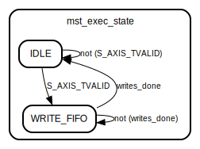

# Entity: tx_intf_s_axis

- **File**: tx_intf_s_axis.v
## Diagram

## Description

based on Xilinx module template
 Xianjun jiao. putaoshu@msn.com; xianjun.jiao@imec.be;
 
## Generics

| Generic name           | Type    | Value | Description |
| ---------------------- | ------- | ----- | ----------- |
| MAX_NUM_DMA_SYMBOL     | integer | 8192  |             |
| MAX_BIT_NUM_DMA_SYMBOL | integer | 14    |             |
| C_S_AXIS_TDATA_WIDTH   | integer | 64    |             |
## Ports

| Port name                       | Direction | Type                                  | Description |
| ------------------------------- | --------- | ------------------------------------- | ----------- |
| tx_queue_idx_indication_from_ps | input     | wire [1:0]                            |             |
| tx_queue_idx                    | input     | wire [1:0]                            |             |
| endless_mode                    | input     | wire                                  |             |
| DATA_TO_ACC                     | output    | wire [C_S_AXIS_TDATA_WIDTH-1 : 0]     |             |
| EMPTYN_TO_ACC                   | output    | wire                                  |             |
| ACC_ASK_DATA                    | input     | wire                                  |             |
| data_count0                     | output    | wire [MAX_BIT_NUM_DMA_SYMBOL-1 : 0]   |             |
| data_count1                     | output    | wire [MAX_BIT_NUM_DMA_SYMBOL-1 : 0]   |             |
| data_count2                     | output    | wire [MAX_BIT_NUM_DMA_SYMBOL-1 : 0]   |             |
| data_count3                     | output    | wire [MAX_BIT_NUM_DMA_SYMBOL-1 : 0]   |             |
| S_AXIS_NUM_DMA_SYMBOL_raw       | input     | wire [MAX_BIT_NUM_DMA_SYMBOL-1 : 0]   |             |
| s_axis_recv_data_from_high      | output    | wire                                  |             |
| S_AXIS_ACLK                     | input     | wire                                  |             |
| S_AXIS_ARESETN                  | input     | wire                                  |             |
| S_AXIS_TREADY                   | output    | wire                                  |             |
| S_AXIS_TDATA                    | input     | wire [C_S_AXIS_TDATA_WIDTH-1 : 0]     |             |
| S_AXIS_TSTRB                    | input     | wire [(C_S_AXIS_TDATA_WIDTH/8)-1 : 0] |             |
| S_AXIS_TLAST                    | input     | wire                                  |             |
| S_AXIS_TVALID                   | input     | wire                                  |             |
## Signals

| Name                  | Type                              | Description                             |
| --------------------- | --------------------------------- | --------------------------------------- |
| mst_exec_state        | reg                               | In this state FIFO is written with the  |
| S_AXIS_NUM_DMA_SYMBOL | reg [bit_num-1 : 0]               |                                         |
| axis_tready0          | wire                              |                                         |
| axis_tready1          | wire                              |                                         |
| axis_tready2          | wire                              |                                         |
| axis_tready3          | wire                              |                                         |
| fifo_wren0            | wire                              |                                         |
| fifo_wren1            | wire                              |                                         |
| fifo_wren2            | wire                              |                                         |
| fifo_wren3            | wire                              |                                         |
| write_pointer         | reg  [bit_num-1:0]                |                                         |
| writes_done           | reg                               |                                         |
| EMPTY0                | wire                              |                                         |
| EMPTY1                | wire                              |                                         |
| EMPTY2                | wire                              |                                         |
| EMPTY3                | wire                              |                                         |
| FULL0                 | wire                              |                                         |
| FULL1                 | wire                              |                                         |
| FULL2                 | wire                              |                                         |
| FULL3                 | wire                              |                                         |
| DATA_TO_ACC0          | wire [C_S_AXIS_TDATA_WIDTH-1 : 0] |                                         |
| DATA_TO_ACC1          | wire [C_S_AXIS_TDATA_WIDTH-1 : 0] |                                         |
| DATA_TO_ACC2          | wire [C_S_AXIS_TDATA_WIDTH-1 : 0] |                                         |
| DATA_TO_ACC3          | wire [C_S_AXIS_TDATA_WIDTH-1 : 0] |                                         |
| ACC_ASK_DATA0         | wire                              |                                         |
| ACC_ASK_DATA1         | wire                              |                                         |
| ACC_ASK_DATA2         | wire                              |                                         |
| ACC_ASK_DATA3         | wire                              |                                         |
## Constants

| Name       | Type    | Value                      | Description                    |
| ---------- | ------- | -------------------------- | ------------------------------ |
| bit_num    | integer | clogb2(MAX_NUM_DMA_SYMBOL) |                                |
| IDLE       | [1:0]   | 1'b0                       | This is the initial/idle state |
| WRITE_FIFO | [1:0]   | 1'b1                       | This is the initial/idle state |
## Functions
- clogb2 (input integer bit_depth) return (integer)
## Processes
- unnamed: ( @(posedge S_AXIS_ACLK) )
- unnamed: ( @(posedge S_AXIS_ACLK) )
## Instantiations

- fifo64_i0: xpm_fifo_sync
**Description**
fifo64_1clk_dep4k fifo64_1clk_dep4k_i0 ( //queue0
.CLK(S_AXIS_ACLK),
.DATAO(DATA_TO_ACC0),
.DI(S_AXIS_TDATA),
.EMPTY(EMPTY0),
.FULL(FULL0),
.RDEN(ACC_ASK_DATA0),
.RST(!S_AXIS_ARESETN),
.WREN(fifo_wren0),
.data_count(data_count0)
);

- fifo64_i1: xpm_fifo_sync
**Description**
fifo64_1clk_dep4k fifo64_1clk_dep4k_i1 ( //queue1
.CLK(S_AXIS_ACLK),
.DATAO(DATA_TO_ACC1),
.DI(S_AXIS_TDATA),
.EMPTY(EMPTY1),
.FULL(FULL1),
.RDEN(ACC_ASK_DATA1),
.RST(!S_AXIS_ARESETN),
.WREN(fifo_wren1),
.data_count(data_count1)
);

- fifo64_i2: xpm_fifo_sync
**Description**
fifo64_1clk fifo64_1clk_dep4k_i2 ( //queue2
.CLK(S_AXIS_ACLK),
.DATAO(DATA_TO_ACC2),
.DI(S_AXIS_TDATA),
.EMPTY(EMPTY2),
.FULL(FULL2),
.RDEN(ACC_ASK_DATA2),
.RST(!S_AXIS_ARESETN),
.WREN(fifo_wren2),
.data_count(data_count2)
);

- fifo64_i3: xpm_fifo_sync
**Description**
fifo64_1clk fifo64_1clk_dep4k_i3 ( //queue3
.CLK(S_AXIS_ACLK),
.DATAO(DATA_TO_ACC3),
.DI(S_AXIS_TDATA),
.EMPTY(EMPTY3),
.FULL(FULL3),
.RDEN(ACC_ASK_DATA3),
.RST(!S_AXIS_ARESETN),
.WREN(fifo_wren3),
.data_count(data_count3)
);

## State machines

