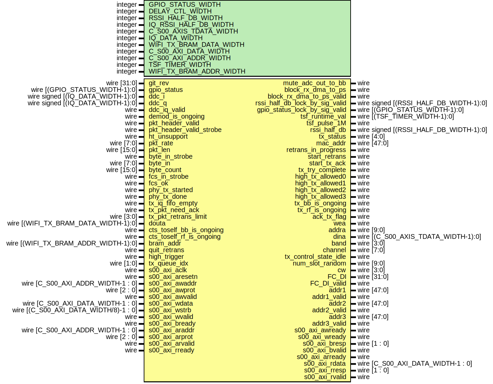

# Entity: xpu

- **File**: xpu.v
## Diagram

## Description

 Xianjun jiao. putaoshu@msn.com; xianjun.jiao@imec.be;
 `define DEBUG_PREFIX (*mark_debug="true",DONT_TOUCH="TRUE"*)

## Generics

| Generic name            | Type    | Value | Description                    |
| ----------------------- | ------- | ----- | ------------------------------ |
| GPIO_STATUS_WIDTH       | integer | 8     |                                |
| DELAY_CTL_WIDTH         | integer | 7     |                                |
| RSSI_HALF_DB_WIDTH      | integer | 11    |                                |
| IQ_RSSI_HALF_DB_WIDTH   | integer | 9     |                                |
| C_S00_AXIS_TDATA_WIDTH  | integer | 64    |                                |
| IQ_DATA_WIDTH           | integer | 16    |                                |
| WIFI_TX_BRAM_DATA_WIDTH | integer | 64    |                                |
| C_S00_AXI_DATA_WIDTH    | integer | 32    |                                |
| C_S00_AXI_ADDR_WIDTH    | integer | 8     |                                |
| TSF_TIMER_WIDTH         | integer | 64    |  according to 802.11 standard  |
| WIFI_TX_BRAM_ADDR_WIDTH | integer | 10    |                                |
## Ports

| Port name                      | Direction | Type                                   | Description                                                                                                 |
| ------------------------------ | --------- | -------------------------------------- | ----------------------------------------------------------------------------------------------------------- |
| git_rev                        | input     | wire [31:0]                            |                                                                                                             |
| gpio_status                    | input     | wire [(GPIO_STATUS_WIDTH-1):0]         |  ad9361 status and ctrl                                                                                     |
| ddc_i                          | input     | wire signed [(IQ_DATA_WIDTH-1):0]      |  Ports to rx_intf                                                                                           |
| ddc_q                          | input     | wire signed [(IQ_DATA_WIDTH-1):0]      |                                                                                                             |
| ddc_iq_valid                   | input     | wire                                   |                                                                                                             |
| mute_adc_out_to_bb             | output    | wire                                   | when tx, mute self rx                                                                                       |
| block_rx_dma_to_ps             | output    | wire                                   | should valid from filter on to fcs valid                                                                    |
| block_rx_dma_to_ps_valid       | output    | wire                                   | should valid from filter on to fcs valid                                                                    |
| rssi_half_db_lock_by_sig_valid | output    | wire signed [(RSSI_HALF_DB_WIDTH-1):0] |                                                                                                             |
| gpio_status_lock_by_sig_valid  | output    | wire [(GPIO_STATUS_WIDTH-1):0]         |                                                                                                             |
| tsf_runtime_val                | output    | wire [(TSF_TIMER_WIDTH-1):0]           |                                                                                                             |
| tsf_pulse_1M                   | output    | wire                                   |                                                                                                             |
| rssi_half_db                   | output    | wire signed [(RSSI_HALF_DB_WIDTH-1):0] |  Ports to openofdm rx                                                                                       |
| demod_is_ongoing               | input     | wire                                   |                                                                                                             |
| pkt_header_valid               | input     | wire                                   | input  wire pkt_begin,input  wire pkt_ht,                                                                   |
| pkt_header_valid_strobe        | input     | wire                                   |                                                                                                             |
| ht_unsupport                   | input     | wire                                   |                                                                                                             |
| pkt_rate                       | input     | wire [7:0]                             |                                                                                                             |
| pkt_len                        | input     | wire [15:0]                            |                                                                                                             |
| byte_in_strobe                 | input     | wire                                   | input  wire [15:0] pkt_len_total, // for interface to byte_to_word.v in rx_intf.v                           |
| byte_in                        | input     | wire [7:0]                             |                                                                                                             |
| byte_count                     | input     | wire [15:0]                            | input  wire [15:0] byte_count_total, // for interface to byte_to_word.v in rx_intf.v                        |
| fcs_in_strobe                  | input     | wire                                   |                                                                                                             |
| fcs_ok                         | input     | wire                                   |                                                                                                             |
| phy_tx_started                 | input     | wire                                   |  Ports to phy_tx                                                                                            |
| phy_tx_done                    | input     | wire                                   |                                                                                                             |
| tx_status                      | output    | wire [4:0]                             |  Ports to tx_intf                                                                                           |
| mac_addr                       | output    | wire [47:0]                            |                                                                                                             |
| retrans_in_progress            | output    | wire                                   |                                                                                                             |
| start_retrans                  | output    | wire                                   |                                                                                                             |
| start_tx_ack                   | output    | wire                                   |                                                                                                             |
| tx_try_complete                | output    | wire                                   |                                                                                                             |
| tx_iq_fifo_empty               | input     | wire                                   |                                                                                                             |
| high_tx_allowed0               | output    | wire                                   |                                                                                                             |
| high_tx_allowed1               | output    | wire                                   |                                                                                                             |
| high_tx_allowed2               | output    | wire                                   |                                                                                                             |
| high_tx_allowed3               | output    | wire                                   |                                                                                                             |
| tx_bb_is_ongoing               | output    | wire                                   |                                                                                                             |
| tx_rf_is_ongoing               | output    | wire                                   |                                                                                                             |
| ack_tx_flag                    | output    | wire                                   |                                                                                                             |
| wea                            | output    | wire                                   |                                                                                                             |
| addra                          | output    | wire [9:0]                             |                                                                                                             |
| dina                           | output    | wire [(C_S00_AXIS_TDATA_WIDTH-1):0]    |                                                                                                             |
| tx_pkt_need_ack                | input     | wire                                   |                                                                                                             |
| tx_pkt_retrans_limit           | input     | wire [3:0]                             |                                                                                                             |
| douta                          | input     | wire [(WIFI_TX_BRAM_DATA_WIDTH-1):0]   | from dpram of tx_intf, for tx_control changing some bits to indicate it is the 1st pkt or retransmitted pkt |
| cts_toself_bb_is_ongoing       | input     | wire                                   | this should rise before the phy tx end valid of phy tx IP core to avoid tx_control waiting ack for this tx  |
| cts_toself_rf_is_ongoing       | input     | wire                                   | just need to cover the SIFS gap between cts tx and following packet tx                                      |
| bram_addr                      | input     | wire  [(WIFI_TX_BRAM_ADDR_WIDTH-1):0]  |                                                                                                             |
| band                           | output    | wire [3:0]                             |                                                                                                             |
| channel                        | output    | wire [7:0]                             |                                                                                                             |
| quit_retrans                   | input     | wire                                   |                                                                                                             |
| tx_control_state_idle          | output    | wire                                   |                                                                                                             |
| num_slot_random                | output    | wire [9:0]                             |                                                                                                             |
| cw                             | output    | wire [3:0]                             |                                                                                                             |
| high_trigger                   | input     | wire                                   |                                                                                                             |
| tx_queue_idx                   | input     | wire [1:0]                             |                                                                                                             |
| FC_DI                          | output    | wire [31:0]                            |  to side channel                                                                                            |
| FC_DI_valid                    | output    | wire                                   |                                                                                                             |
| addr1                          | output    | wire [47:0]                            |                                                                                                             |
| addr1_valid                    | output    | wire                                   |                                                                                                             |
| addr2                          | output    | wire [47:0]                            |                                                                                                             |
| addr2_valid                    | output    | wire                                   |                                                                                                             |
| addr3                          | output    | wire [47:0]                            |                                                                                                             |
| addr3_valid                    | output    | wire                                   |                                                                                                             |
| s00_axi_aclk                   | input     | wire                                   |  Ports of Axi Slave Bus Interface S00_AXI                                                                   |
| s00_axi_aresetn                | input     | wire                                   |                                                                                                             |
| s00_axi_awaddr                 | input     | wire [C_S00_AXI_ADDR_WIDTH-1 : 0]      |                                                                                                             |
| s00_axi_awprot                 | input     | wire [2 : 0]                           |                                                                                                             |
| s00_axi_awvalid                | input     | wire                                   |                                                                                                             |
| s00_axi_awready                | output    | wire                                   |                                                                                                             |
| s00_axi_wdata                  | input     | wire [C_S00_AXI_DATA_WIDTH-1 : 0]      |                                                                                                             |
| s00_axi_wstrb                  | input     | wire [(C_S00_AXI_DATA_WIDTH/8)-1 : 0]  |                                                                                                             |
| s00_axi_wvalid                 | input     | wire                                   |                                                                                                             |
| s00_axi_wready                 | output    | wire                                   |                                                                                                             |
| s00_axi_bresp                  | output    | wire [1 : 0]                           |                                                                                                             |
| s00_axi_bvalid                 | output    | wire                                   |                                                                                                             |
| s00_axi_bready                 | input     | wire                                   |                                                                                                             |
| s00_axi_araddr                 | input     | wire [C_S00_AXI_ADDR_WIDTH-1 : 0]      |                                                                                                             |
| s00_axi_arprot                 | input     | wire [2 : 0]                           |                                                                                                             |
| s00_axi_arvalid                | input     | wire                                   |                                                                                                             |
| s00_axi_arready                | output    | wire                                   |                                                                                                             |
| s00_axi_rdata                  | output    | wire [C_S00_AXI_DATA_WIDTH-1 : 0]      |                                                                                                             |
| s00_axi_rresp                  | output    | wire [1 : 0]                           |                                                                                                             |
| s00_axi_rvalid                 | output    | wire                                   |                                                                                                             |
| s00_axi_rready                 | input     | wire                                   |                                                                                                             |
## Signals

| Name                           | Type                               | Description                                                                                                                             |
| ------------------------------ | ---------------------------------- | --------------------------------------------------------------------------------------------------------------------------------------- |
| slv_reg_wren_signal            | wire                               |                                                                                                                                         |
| slv_reg0                       | wire [(C_S00_AXI_DATA_WIDTH-1):0]  | rst                                                                                                                                     |
| slv_reg1                       | wire [(C_S00_AXI_DATA_WIDTH-1):0]  | some source selection                                                                                                                   |
| slv_reg2                       | wire [(C_S00_AXI_DATA_WIDTH-1):0]  | tsf load value low                                                                                                                      |
| slv_reg3                       | wire [(C_S00_AXI_DATA_WIDTH-1):0]  | tsf load value high (the rising edge of msb will trigger loading)                                                                       |
| slv_reg4                       | wire [(C_S00_AXI_DATA_WIDTH-1):0]  | 19:16 band; 15:0 channel                                                                                                                |
| slv_reg5                       | wire [(C_S00_AXI_DATA_WIDTH-1):0]  |                                                                                                                                         |
| slv_reg6                       | wire [(C_S00_AXI_DATA_WIDTH-1):0]  | some static config: duration after fcs_strobe to force ch idle                                                                          |
| slv_reg7                       | wire [(C_S00_AXI_DATA_WIDTH-1):0]  | rssi report offset, and gpio delay ctrl for rssi calculation, and reset the fifo delay                                                  |
| slv_reg8                       | wire [(C_S00_AXI_DATA_WIDTH-1):0]  | lbt rssi threshold [11:0]                                                                                                               |
| slv_reg9                       | wire [(C_S00_AXI_DATA_WIDTH-1):0]  | xIFS and slot time override for debug                                                                                                   |
| slv_reg10                      | wire [(C_S00_AXI_DATA_WIDTH-1):0]  | tx bb RF delay in number of clock                                                                                                       |
| slv_reg11                      | wire [(C_S00_AXI_DATA_WIDTH-1):0]  | max number of tx re-transmission                                                                                                        |
| slv_reg16                      | wire [(C_S00_AXI_DATA_WIDTH-1):0]  | receive ack time count top -- 2.4GHz                                                                                                    |
| slv_reg17                      | wire [(C_S00_AXI_DATA_WIDTH-1):0]  | receive ack time count top -- 5GHz                                                                                                      |
| slv_reg18                      | wire [(C_S00_AXI_DATA_WIDTH-1):0]  | before actual ack sending, wait until counter reach this value -- related to SIFS in different band. low 16bit 2.4GHz, high 16bit 5GHz  |
| slv_reg19                      | wire [(C_S00_AXI_DATA_WIDTH-1):0]  |                                                                                                                                         |
| slv_reg20                      | wire [(C_S00_AXI_DATA_WIDTH-1):0]  | slice count_total in bit [19:0]; slice selection in bit [21:20]                                                                         |
| slv_reg21                      | wire [(C_S00_AXI_DATA_WIDTH-1):0]  | slice count_start in bit [19:0]; slice selection in bit [21:20]                                                                         |
| slv_reg22                      | wire [(C_S00_AXI_DATA_WIDTH-1):0]  | slice count_end   in bit [19:0]; slice selection in bit [21:20]                                                                         |
| slv_reg26                      | wire [(C_S00_AXI_DATA_WIDTH-1):0]  | extra duration in CTS frame (response to RTS)                                                                                           |
| slv_reg27                      | wire [(C_S00_AXI_DATA_WIDTH-1):0]  | filter flags                                                                                                                            |
| slv_reg28                      | wire [(C_S00_AXI_DATA_WIDTH-1):0]  | self bssid and filter enable                                                                                                            |
| slv_reg29                      | wire [(C_S00_AXI_DATA_WIDTH-1):0]  | self bssid and filter enable                                                                                                            |
| slv_reg30                      | wire [(C_S00_AXI_DATA_WIDTH-1):0]  | mac addr and filter enable                                                                                                              |
| slv_reg31                      | wire [(C_S00_AXI_DATA_WIDTH-1):0]  | mac addr and filter enable                                                                                                              |
| slv_reg58                      | wire [C_S00_AXI_DATA_WIDTH-1:0]    | tsf timer low                                                                                                                           |
| slv_reg59                      | wire [C_S00_AXI_DATA_WIDTH-1:0]    | tsf timer high                                                                                                                          |
| slv_reg63                      | wire [C_S00_AXI_DATA_WIDTH-1:0]    | FPGA version info                                                                                                                       |
| block_rx_dma_to_ps_internal    | wire                               |                                                                                                                                         |
| high_tx_allowed_internal0      | wire                               |                                                                                                                                         |
| high_tx_allowed_internal1      | wire                               |                                                                                                                                         |
| high_tx_allowed_internal2      | wire                               |                                                                                                                                         |
| high_tx_allowed_internal3      | wire                               |                                                                                                                                         |
| ch_idle                        | wire                               |                                                                                                                                         |
| retrans_trigger                | wire                               |                                                                                                                                         |
| FC_version                     | wire [1:0]                         |  wire [31:0] FC_DI;  wire FC_DI_valid;                                                                                                  |
| FC_type                        | wire [1:0]                         |                                                                                                                                         |
| FC_subtype                     | wire [3:0]                         |                                                                                                                                         |
| FC_to_ds                       | wire                               |                                                                                                                                         |
| FC_from_ds                     | wire                               |                                                                                                                                         |
| FC_more_frag                   | wire                               |                                                                                                                                         |
| FC_retry                       | wire                               |                                                                                                                                         |
| FC_power_manage                | wire                               |                                                                                                                                         |
| FC_more_data                   | wire                               |                                                                                                                                         |
| FC_protected_frame             | wire                               |                                                                                                                                         |
| FC_order                       | wire                               |                                                                                                                                         |
| duration                       | wire [15:0]                        |                                                                                                                                         |
| SC                             | wire [15:0]                        |  wire [47:0] addr1;  wire addr1_valid;  wire [47:0] addr2;  wire addr2_valid;  wire [47:0] addr3;  wire addr3_valid;                    |
| SC_valid                       | wire                               |                                                                                                                                         |
| SC_fragment_number             | wire [3:0]                         |                                                                                                                                         |
| SC_sequence_number             | wire [11:0]                        |                                                                                                                                         |
| addr4                          | wire [47:0]                        |                                                                                                                                         |
| addr4_valid                    | wire                               |                                                                                                                                         |
| pulse_tx_bb_end                | wire                               |                                                                                                                                         |
| iq_rssi_half_db                | wire [(IQ_RSSI_HALF_DB_WIDTH-1):0] |                                                                                                                                         |
| iq_rssi_half_db_valid          | wire                               |                                                                                                                                         |
| rssi_half_db_valid             | wire                               |                                                                                                                                         |
| slice_en0                      | wire                               |  wire [4:0] tx_status;                                                                                                                  |
| slice_en1                      | wire                               |                                                                                                                                         |
| slice_en2                      | wire                               |                                                                                                                                         |
| slice_en3                      | wire                               |                                                                                                                                         |
| fcs_valid                      | wire                               |                                                                                                                                         |
| sig_valid                      | wire                               |                                                                                                                                         |
| ack_cts_is_ongoing             | wire                               |                                                                                                                                         |
| send_ack_wait_top              | wire [14:0]                        |                                                                                                                                         |
| recv_ack_timeout_top_adj       | wire [14:0]                        |                                                                                                                                         |
| recv_ack_sig_valid_timeout_top | wire [14:0]                        |                                                                                                                                         |
| recv_ack_fcs_valid_disable     | wire                               |                                                                                                                                         |
| erp_short_slot                 | wire                               |                                                                                                                                         |
| preamble_sig_time              | wire [6:0]                         |                                                                                                                                         |
| ofdm_symbol_time               | wire [4:0]                         |                                                                                                                                         |
| slot_time                      | wire [4:0]                         |                                                                                                                                         |
| sifs_time                      | wire [6:0]                         |                                                                                                                                         |
| phy_rx_start_delay_time        | wire [6:0]                         |                                                                                                                                         |
| cw_exp_used                    | wire [3:0]                         |                                                                                                                                         |
| cw_exp_dynamic                 | wire [3:0]                         |                                                                                                                                         |
| tx_try_complete_int            | wire                               |                                                                                                                                         |
| backoff_done                   | wire                               |                                                                                                                                         |
| increase_cw                    | wire                               |                                                                                                                                         |
| cw_used                        | wire                               |                                                                                                                                         |
## Instantiations

- tx_on_detection_i: tx_on_detection
**Description**
 assign slv_reg60 = rssi_half_db;
 assign slv_reg61 = iq_rssi_half_db;

- csma_ca_i: csma_ca
- cw_exp_i: cw_exp
- tx_control_i: tx_control
- pkt_filter_ctl_i: pkt_filter_ctl
- phy_rx_parse_i: phy_rx_parse
- time_slice_gen_i: time_slice_gen
- xpu_s_axi_i: xpu_s_axi
**Description**
 Instantiation of Axi Bus Interface S00_AXI

