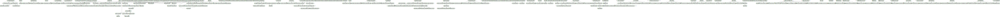

# Documentation for: 

Generated by **TerosHDL** © 2020-2021 License GPLv3 Carlos Alberto Ruiz Naranjo (carlosruiznaranjo@gmail.com) Ismael Perez Rojo (ismaelprojo@gmail.com)  Project revision 2021-07-14 20:45:53

## Designs

- Module: [ad9767 ](./doc_internal/ad9767.md)
- Module: [add_constComplex ](./doc_internal/add_constComplex.md)
- Module: [add_constComplex_handComm ](./doc_internal/add_constComplex_handComm.md)
- Package: [add_constComplex_logic ](./doc_internal/add_constComplex_logic.md)
- Module: [add_constComplex_rst ](./doc_internal/add_constComplex_rst.md)
- Module: [add_constComplex_synchronizer_vector ](./doc_internal/add_constComplex_synchronizer_vector.md)
- Package: [wb_add_constComplex ](./doc_internal/wb_add_constComplex.md)
- Module: [add_constReal ](./doc_internal/add_constReal.md)
- Module: [add_constReal_handComm ](./doc_internal/add_constReal_handComm.md)
- Package: [add_constReal_logic ](./doc_internal/add_constReal_logic.md)
- Module: [add_constReal_rst ](./doc_internal/add_constReal_rst.md)
- Module: [add_constReal_synchronizer_vector ](./doc_internal/add_constReal_synchronizer_vector.md)
- Package: [wb_add_constReal ](./doc_internal/wb_add_constReal.md)
- Package: [adder_substracter_complex ](./doc_internal/adder_substracter_complex.md)
- Package: [adder_substracter_real ](./doc_internal/adder_substracter_real.md)
- Package: [axiStreamToComplex ](./doc_internal/axiStreamToComplex.md)
- Package: [axiStreamToReal ](./doc_internal/axiStreamToReal.md)
- Module: [axi_ctrlif ](./doc_internal/axi_ctrlif.md)
- Module: [axi_deltaSigma ](./doc_internal/axi_deltaSigma.md)
- Module: [deltaSigma ](./doc_internal/deltaSigma.md)
- Module: [deltaSigma_clkgen ](./doc_internal/deltaSigma_clkgen.md)
- Module: [deltaSigma_controller ](./doc_internal/deltaSigma_controller.md)
- Module: [deltaSigma_tx ](./doc_internal/deltaSigma_tx.md)
- Module: [dma_fifo ](./doc_internal/dma_fifo.md)
- Module: [pl330_dma_fifo ](./doc_internal/pl330_dma_fifo.md)
- Module: [axi_to_dac ](./doc_internal/axi_to_dac.md)
- Module: [axi_to_dac_handcomm ](./doc_internal/axi_to_dac_handcomm.md)
- Module: [axi_to_dac_sync_vect ](./doc_internal/axi_to_dac_sync_vect.md)
- Package: [wb_axi_to_dac ](./doc_internal/wb_axi_to_dac.md)
- Module: [cacode ](./doc_internal/cacode.md)
- Module: [cacode_g1_gen ](./doc_internal/cacode_g1_gen.md)
- Module: [cacode_g2_gen ](./doc_internal/cacode_g2_gen.md)
- Module: [check_valid_burst ](./doc_internal/check_valid_burst.md)
- Module: [cvb_check_mean ](./doc_internal/cvb_check_mean.md)
- Module: [cvb_cpt_en ](./doc_internal/cvb_cpt_en.md)
- Module: [cvb_dual_ram ](./doc_internal/cvb_dual_ram.md)
- Package: [cvb_gen_new_flow ](./doc_internal/cvb_gen_new_flow.md)
- Module: [cvb_handComm ](./doc_internal/cvb_handComm.md)
- Module: [cvb_logic ](./doc_internal/cvb_logic.md)
- Module: [cvb_ram ](./doc_internal/cvb_ram.md)
- Package: [wb_cvb ](./doc_internal/wb_cvb.md)
- Module: [readComplexFromFile ](./doc_internal/readComplexFromFile.md)
- Module: [readFromFile ](./doc_internal/readFromFile.md)
- Module: [clkChangeComplex ](./doc_internal/clkChangeComplex.md)
- Package: [complexToAxiStream ](./doc_internal/complexToAxiStream.md)
- Package: [convertComplexToReal ](./doc_internal/convertComplexToReal.md)
- Package: [convertRealToComplex ](./doc_internal/convertRealToComplex.md)
- Package: [cordicAtan ](./doc_internal/cordicAtan.md)
- Package: [cordicAtan_impl ](./doc_internal/cordicAtan_impl.md)
- Module: [cplx_conj ](./doc_internal/cplx_conj.md)
- Module: [top_dut ](./doc_internal/top_dut.md)
- Package: [axi_dataComplex_dma_direct ](./doc_internal/axi_dataComplex_dma_direct.md)
- Module: [dataComplex_dma_direct ](./doc_internal/dataComplex_dma_direct.md)
- Module: [dataComplex_dma_direct_handCom ](./doc_internal/dataComplex_dma_direct_handCom.md)
- Module: [dataComplex_dma_direct_sync ](./doc_internal/dataComplex_dma_direct_sync.md)
- Package: [wb_dataComplex_dma_direct ](./doc_internal/wb_dataComplex_dma_direct.md)
- Module: [top_dut ](./doc_internal/top_dataDma.md)
- Module: [dataComplex_to_ram_handCom ](./doc_internal/dataComplex_handCom.md)
- Module: [dataComplex_to_ram_subtop ](./doc_internal/dataComplex_logic.md)
- Module: [dataComplex_resizer ](./doc_internal/dataComplex_resizer.md)
- Module: [dataComplex_to_ram_storage ](./doc_internal/dataComplex_storage.md)
- Module: [dataComplex_sync ](./doc_internal/dataComplex_sync.md)
- Module: [dataComplex_to_ram ](./doc_internal/dataComplex_to_ram.md)
- Module: [dataComplex_to_ram_top ](./doc_internal/dataComplex_top.md)
- Package: [wb_dataComplex_to_ram ](./doc_internal/wb_dataComplex.md)
- Package: [axi_dataReal_dma_direct ](./doc_internal/axi_dataReal_dma_direct.md)
- Module: [dataReal_dma_direct ](./doc_internal/dataReal_dma_direct.md)
- Module: [dataReal_dma_direct_handCom ](./doc_internal/dataReal_dma_direct_handCom.md)
- Module: [dataReal_dma_direct_sync ](./doc_internal/dataReal_dma_direct_sync.md)
- Package: [wb_dataReal_dma_direct ](./doc_internal/wb_dataReal_dma_direct.md)
- Module: [top_dut ](./doc_internal/top_dataDma.md)
- Module: [dataReal_to_ram_handCom ](./doc_internal/dataReal_handCom.md)
- Module: [dataReal_to_ram_subtop ](./doc_internal/dataReal_logic.md)
- Module: [dataReal_resizer ](./doc_internal/dataReal_resizer.md)
- Module: [dataReal_to_ram_storage ](./doc_internal/dataReal_storage.md)
- Module: [dataReal_sync ](./doc_internal/dataReal_sync.md)
- Module: [dataReal_to_ram ](./doc_internal/dataReal_to_ram.md)
- Module: [dataReal_to_ram_top ](./doc_internal/dataReal_top.md)
- Package: [wb_dataReal_to_ram ](./doc_internal/wb_dataReal.md)
- Module: [delayTempoReal_axi ](./doc_internal/delayTempoReal_axi.md)
- Module: [delayTempoReal_axi_comm ](./doc_internal/delayTempoReal_axi_comm.md)
- Module: [delayTempoReal_axi_handCom ](./doc_internal/delayTempoReal_axi_handCom.md)
- Module: [delayTempoReal_axi_logic ](./doc_internal/delayTempoReal_axi_logic.md)
- Module: [delayTempoReal_axi_sync_slv ](./doc_internal/delayTempoReal_axi_sync_slv.md)
- Module: [dupplComplex ](./doc_internal/dupplComplex.md)
- Module: [dupplComplex_1_to_2 ](./doc_internal/dupplComplex_1_to_2.md)
- Module: [dupplReal ](./doc_internal/dupplReal.md)
- Module: [dupplReal_1_to_2 ](./doc_internal/dupplReal_1_to_2.md)
- Package: [expanderComplex ](./doc_internal/expanderComplex.md)
- Package: [expanderReal ](./doc_internal/expanderReal.md)
- Module: [edfb_handComm ](./doc_internal/edfb_handComm.md)
- Module: [extract_data_from_burst ](./doc_internal/extract_data_from_burst.md)
- Package: [wb_edfb ](./doc_internal/wb_edfb.md)
- Module: [fft ](./doc_internal/fft.md)
- Module: [fft_axi ](./doc_internal/fft_axi.md)
- Package: [fft_coeff_handler ](./doc_internal/fft_coeff_handler.md)
- Package: [fft_comp_butterfly ](./doc_internal/fft_comp_butterfly.md)
- Package: [fft_comp_complex ](./doc_internal/fft_comp_complex.md)
- Package: [fft_data_handler ](./doc_internal/fft_data_handler.md)
- Module: [fft_handCom ](./doc_internal/fft_handCom.md)
- Package: [fft_loop_radix ](./doc_internal/fft_loop_radix.md)
- Package: [fft_loop_stage ](./doc_internal/fft_loop_stage.md)
- Module: [fft_ram ](./doc_internal/fft_ram.md)
- Module: [fft_ram_coeff ](./doc_internal/fft_ram_coeff.md)
- Package: [fft_top_logic ](./doc_internal/fft_top_logic.md)
- Package: [fft_transfert ](./doc_internal/fft_transfert.md)
- Module: [ram_storage16 ](./doc_internal/ram_storage16.md)
- Module: [readComplexFromFile ](./doc_internal/readComplexFromFile.md)
- Module: [readFromFile ](./doc_internal/readFromFile.md)
- Module: [firComplex ](./doc_internal/firComplex.md)
- Module: [firComplex_axi ](./doc_internal/firComplex_axi.md)
- Module: [firComplex_handCom ](./doc_internal/firComplex_handCom.md)
- Package: [firComplex_proc ](./doc_internal/firComplex_proc.md)
- Module: [firComplex_ram ](./doc_internal/firComplex_ram.md)
- Package: [firComplex_top ](./doc_internal/firComplex_top.md)
- Module: [ram_storage16 ](./doc_internal/ram_storage16.md)
- Module: [readFromFile ](./doc_internal/readFromFile.md)
- Module: [firReal ](./doc_internal/firReal.md)
- Module: [firReal_axi ](./doc_internal/firReal_axi.md)
- Module: [firReal_handCom ](./doc_internal/firReal_handCom.md)
- Package: [firReal_proc ](./doc_internal/firReal_proc.md)
- Module: [firReal_ram ](./doc_internal/firReal_ram.md)
- Package: [firReal_top ](./doc_internal/firReal_top.md)
- Module: [ram_storage16 ](./doc_internal/ram_storage16.md)
- Module: [readFromFile ](./doc_internal/readFromFile.md)
- Module: [gen_radar_prog ](./doc_internal/gen_radar_prog.md)
- Module: [gen_radar_prog_handComm ](./doc_internal/gen_radar_prog_handComm.md)
- Module: [gen_radar_prog_logic ](./doc_internal/gen_radar_prog_logic.md)
- Package: [wb_gen_radar_prog ](./doc_internal/wb_gen_radar_prog.md)
- Module: [ltc2145 ](./doc_internal/ltc2145.md)
- Module: [ltc2145_cmos_capture ](./doc_internal/ltc2145_cmos_capture.md)
- Module: [magnitude ](./doc_internal/magnitude.md)
- Module: [top_dut ](./doc_internal/top_dut.md)
- Package: [meanComplex ](./doc_internal/meanComplex.md)
- Package: [meanReal ](./doc_internal/meanReal.md)
- Module: [mean_vector_axi ](./doc_internal/mean_vector_axi.md)
- Module: [mean_vector_axi_handcomm ](./doc_internal/mean_vector_axi_handcomm.md)
- Module: [mean_vector_axi_logic ](./doc_internal/mean_vector_axi_logic.md)
- Module: [mean_vector_axi_ram ](./doc_internal/mean_vector_axi_ram.md)
- Module: [mean_vector_axi_shift ](./doc_internal/mean_vector_axi_shift.md)
- Module: [mva_synchronizer_vector ](./doc_internal/mva_synchronizer_vector.md)
- Package: [wb_mean_vector_axi ](./doc_internal/wb_mean_vector_axi.md)
- Module: [mixerComplex_redim ](./doc_internal/mixerComplex_redim.md)
- Module: [mixerComplex_sin ](./doc_internal/mixerComplex_sin.md)
- Module: [top_shiftercomplex ](./doc_internal/top_mixerComplex_sin.md)
- Module: [mixer_redim ](./doc_internal/mixer_redim.md)
- Module: [mixer_sin ](./doc_internal/mixer_sin.md)
- Module: [top_shiftercomplex ](./doc_internal/top_mixer_sin.md)
- Module: [multiplierReal ](./doc_internal/multiplierReal.md)
- Module: [multiplierReal_redim ](./doc_internal/multiplierReal_redim.md)
- Module: [top_multiplierreal ](./doc_internal/top_multiplierReal.md)
- Module: [nco_counter ](./doc_internal/nco_counter.md)
- Module: [nco_counter_cos_rom ](./doc_internal/nco_counter_cos_rom.md)
- Module: [nco_counter_cos_rom_a12_d16 ](./doc_internal/nco_counter_cos_rom_a12_d16.md)
- Module: [nco_counter_handcomm ](./doc_internal/nco_counter_handcomm.md)
- Module: [nco_counter_logic ](./doc_internal/nco_counter_logic.md)
- Module: [nco_counter_synchronizer_bit ](./doc_internal/nco_counter_synchronizer_bit.md)
- Module: [nco_counter_synchronizer_vector ](./doc_internal/nco_counter_synchronizer_vector.md)
- Package: [wb_nco_counter ](./doc_internal/wb_nco_counter.md)
- Package: [pidv3_axi ](./doc_internal/pidv3_axi.md)
- Package: [pidv3_axi_comm ](./doc_internal/pidv3_axi_comm.md)
- Module: [pidv3_axi_handComm ](./doc_internal/pidv3_axi_handComm.md)
- Package: [pidv3_axi_logic ](./doc_internal/pidv3_axi_logic.md)
- Module: [pidv3_axi_sync_bit ](./doc_internal/pidv3_axi_sync_bit.md)
- Module: [pidv3_axi_sync_vector ](./doc_internal/pidv3_axi_sync_vector.md)
- Module: [prn20b ](./doc_internal/prn20b.md)
- Module: [prn20b_bitSync ](./doc_internal/prn20b_bitSync.md)
- Module: [prn20b_handCom ](./doc_internal/prn20b_handCom.md)
- Module: [prn20b_logic ](./doc_internal/prn20b_logic.md)
- Module: [prn20b_presc ](./doc_internal/prn20b_presc.md)
- Module: [prn20b_vectSync ](./doc_internal/prn20b_vectSync.md)
- Module: [wb_prn20b ](./doc_internal/wb_prn20b.md)
- Module: [prnGenerator ](./doc_internal/prnGenerator.md)
- Package: [pwm_axi ](./doc_internal/pwm_axi.md)
- Package: [pwm_comm ](./doc_internal/pwm_comm.md)
- Package: [pwm_cpt ](./doc_internal/pwm_cpt.md)
- Module: [pwm_handCom ](./doc_internal/pwm_handCom.md)
- Package: [pwm_logic ](./doc_internal/pwm_logic.md)
- Module: [pwm_sync_bit ](./doc_internal/pwm_sync_bit.md)
- Module: [pwm_sync_vector ](./doc_internal/pwm_sync_vector.md)
- Module: [top_pwmaxi ](./doc_internal/top_pwmAxi.md)
- Package: [realToAxiStream ](./doc_internal/realToAxiStream.md)
- Module: [redpitaya_adc_dac_clk ](./doc_internal/redpitaya_adc_dac_clk.md)
- Module: [ad9767 ](./doc_internal/ad9767.md)
- Module: [redpitaya_adc_cmos_capture ](./doc_internal/redpitaya_adc_cmos_capture.md)
- Module: [redpitaya_adc_dac_clk ](./doc_internal/redpitaya_adc_dac_clk.md)
- Module: [redpitaya_converters ](./doc_internal/redpitaya_converters.md)
- Module: [Si571_pll ](./doc_internal/Si571_pll.md)
- Module: [ad9613 ](./doc_internal/ad9613.md)
- Module: [ad9746 ](./doc_internal/ad9746.md)
- Module: [adc_dac_spi_control ](./doc_internal/adc_dac_spi_control.md)
- Module: [redpitaya_adc_dac_clk ](./doc_internal/redpitaya_adc_dac_clk.md)
- Module: [redpitaya_converters_12 ](./doc_internal/redpitaya_converters_12.md)
- Package: [redpitaya_converters_12_comm ](./doc_internal/redpitaya_converters_12_comm.md)
- Module: [redpitaya_converters_12_handComm ](./doc_internal/redpitaya_converters_12_handComm.md)
- Module: [redpitaya_converters_12_sync_bit ](./doc_internal/redpitaya_converters_12_sync_bit.md)
- Module: [redpitaya_converters_12_sync_vector ](./doc_internal/redpitaya_converters_12_sync_vector.md)
- Module: [spi_master ](./doc_internal/spi_master.md)
- Package: [shifterComplex ](./doc_internal/shifterComplex.md)
- Module: [shifterComplex_dyn ](./doc_internal/shifterComplex_dyn.md)
- Package: [shifterComplex_dyn_comm ](./doc_internal/shifterComplex_dyn_comm.md)
- Module: [shifterComplex_dyn_handcomm ](./doc_internal/shifterComplex_dyn_handcomm.md)
- Package: [shifterComplex_dyn_logic ](./doc_internal/shifterComplex_dyn_logic.md)
- Module: [shifterComplex_dyn_synchronizer_vector ](./doc_internal/shifterComplex_dyn_synchronizer_vector.md)
- Package: [shifterReal ](./doc_internal/shifterReal.md)
- Module: [shifterReal_dyn ](./doc_internal/shifterReal_dyn.md)
- Package: [shifterReal_dyn_comm ](./doc_internal/shifterReal_dyn_comm.md)
- Module: [shifterReal_dyn_handcomm ](./doc_internal/shifterReal_dyn_handcomm.md)
- Package: [shifterReal_dyn_logic ](./doc_internal/shifterReal_dyn_logic.md)
- Module: [shifterReal_dyn_synchronizer_vector ](./doc_internal/shifterReal_dyn_synchronizer_vector.md)
- Module: [slv_to_sl_axi ](./doc_internal/slv_to_sl_axi.md)
- Module: [slv_to_sl_axi_comm ](./doc_internal/slv_to_sl_axi_comm.md)
- Module: [slv_to_sl_axi_handCom ](./doc_internal/slv_to_sl_axi_handCom.md)
- Module: [slv_to_sl_axi_sync_slv ](./doc_internal/slv_to_sl_axi_sync_slv.md)
- Module: [switchComplex ](./doc_internal/switchComplex.md)
- Module: [switchComplex_handComm ](./doc_internal/switchComplex_handComm.md)
- Module: [switchComplex_synch ](./doc_internal/switchComplex_synch.md)
- Package: [switchComplex_wb ](./doc_internal/switchComplex_wb.md)
- Module: [switchReal ](./doc_internal/switchReal.md)
- Module: [switchReal_handComm ](./doc_internal/switchReal_handComm.md)
- Module: [switchReal_synch ](./doc_internal/switchReal_synch.md)
- Package: [switchReal_wb ](./doc_internal/switchReal_wb.md)
- Module: [syncTrigStream ](./doc_internal/syncTrigStream.md)
- Package: [syncTrigStream_comm ](./doc_internal/syncTrigStream_comm.md)
- Module: [syncTrigStream_handComm ](./doc_internal/syncTrigStream_handComm.md)
- Module: [syncTrigStream_logic ](./doc_internal/syncTrigStream_logic.md)
- Module: [syncTrigStream_sync_bit ](./doc_internal/syncTrigStream_sync_bit.md)
- Module: [syncTrigStream_sync_vector ](./doc_internal/syncTrigStream_sync_vector.md)
- Module: [top_genpulsetwowaycplx ](./doc_internal/top_syncTrigStream.md)
- Package: [wb_windowReal ](./doc_internal/wb_windowReal.md)
- Module: [windowReal ](./doc_internal/windowReal.md)
- Module: [windowReal_handComm ](./doc_internal/windowReal_handComm.md)
- Module: [windowReal_logic ](./doc_internal/windowReal_logic.md)
- Module: [windowReal_ram ](./doc_internal/windowReal_ram.md)
- Module: [ram_storage16 ](./doc_internal/ram_storage16.md)
- Module: [readFromFile ](./doc_internal/readFromFile.md)
- Module: [xcorr_prn_slow_complex ](./doc_internal/xcorr_prn_slow_complex.md)
- Module: [xcorr_prn_slow_complex_correl ](./doc_internal/xcorr_prn_slow_complex_correl.md)
- Module: [xcorr_prn_slow_complex_mux ](./doc_internal/xcorr_prn_slow_complex_mux.md)
- Module: [xcorr_prn_slow_complex_ram ](./doc_internal/xcorr_prn_slow_complex_ram.md)

