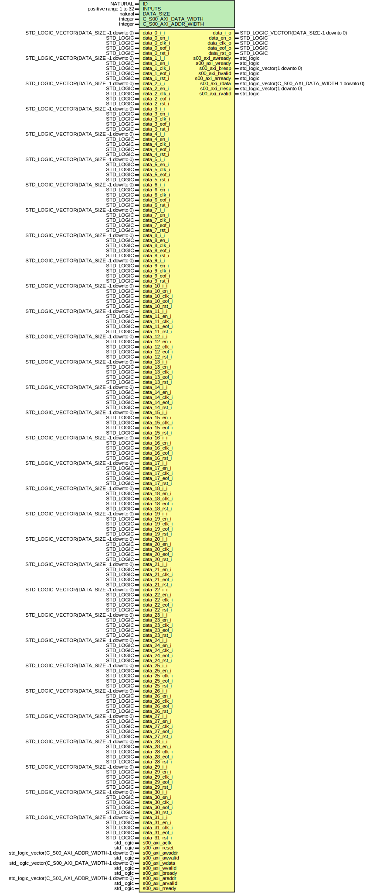

# Entity: MUXrealNto1

- **File**: MUXrealNto1top.vhd
## Diagram

## Description

-------------------------------------------------------------------------
 (c) Copyright: OscillatorIMP Digital
 Author : Gwenhael Goavec-Merou<gwenhael.goavec-merou@trabucayre.com>
 modified: Ivan Ryger <om1air@gmail.com>
 Creation date : 2015/04/08
 last modified : 2021/07/19 IR extended the switch interface to 32 inputs
 to work as a multiplexor N -> 1.
 added AXI interface attribute X_INTERFACE_PARAMETER
 to the reset signal to be regarded as active-high. See:
 https://forums.xilinx.com/t5/Design-Entry/RTL-block-designs/td-p/1159
-------------------------------------------------------------------------
library xil_defaultlib;
use xil_defaultlib.mylib.all; 
## Generics

| Generic name         | Type                   | Value | Description                     |
| -------------------- | ---------------------- | ----- | ------------------------------- |
| ID                   | NATURAL                | 1     |                                 |
| INPUTS               | positive range 1 to 32 | 4     |                                 |
| DATA_SIZE            | natural                | 16    | DEFAULT_INPUT : natural := 0;
  |
| C_S00_AXI_DATA_WIDTH | integer                | 32    |                                 |
| C_S00_AXI_ADDR_WIDTH | integer                | 4     |                                 |
## Ports

| Port name       | Direction | Type                                              | Description                                                                   |
| --------------- | --------- | ------------------------------------------------- | ----------------------------------------------------------------------------- |
| data_0_i_i      | in        | STD_LOGIC_VECTOR(DATA_SIZE -1 downto 0)           | rocessing                                                                     |
| data_0_en_i     | in        | STD_LOGIC                                         |                                                                               |
| data_0_clk_i    | in        | STD_LOGIC                                         |                                                                               |
| data_0_eof_i    | in        | STD_LOGIC                                         |                                                                               |
| data_0_rst_i    | in        | STD_LOGIC                                         |                                                                               |
| data_1_i_i      | in        | STD_LOGIC_VECTOR(DATA_SIZE -1 downto 0)           |                                                                               |
| data_1_en_i     | in        | STD_LOGIC                                         |                                                                               |
| data_1_clk_i    | in        | STD_LOGIC                                         |                                                                               |
| data_1_eof_i    | in        | STD_LOGIC                                         |                                                                               |
| data_1_rst_i    | in        | STD_LOGIC                                         |                                                                               |
| data_2_i_i      | in        | STD_LOGIC_VECTOR(DATA_SIZE -1 downto 0)           |                                                                               |
| data_2_en_i     | in        | STD_LOGIC                                         |                                                                               |
| data_2_clk_i    | in        | STD_LOGIC                                         |                                                                               |
| data_2_eof_i    | in        | STD_LOGIC                                         |                                                                               |
| data_2_rst_i    | in        | STD_LOGIC                                         |                                                                               |
| data_3_i_i      | in        | STD_LOGIC_VECTOR(DATA_SIZE -1 downto 0)           |                                                                               |
| data_3_en_i     | in        | STD_LOGIC                                         |                                                                               |
| data_3_clk_i    | in        | STD_LOGIC                                         |                                                                               |
| data_3_eof_i    | in        | STD_LOGIC                                         |                                                                               |
| data_3_rst_i    | in        | STD_LOGIC                                         |                                                                               |
| data_4_i_i      | in        | STD_LOGIC_VECTOR(DATA_SIZE -1 downto 0)           |                                                                               |
| data_4_en_i     | in        | STD_LOGIC                                         |                                                                               |
| data_4_clk_i    | in        | STD_LOGIC                                         |                                                                               |
| data_4_eof_i    | in        | STD_LOGIC                                         |                                                                               |
| data_4_rst_i    | in        | STD_LOGIC                                         |                                                                               |
| data_5_i_i      | in        | STD_LOGIC_VECTOR(DATA_SIZE -1 downto 0)           |                                                                               |
| data_5_en_i     | in        | STD_LOGIC                                         |                                                                               |
| data_5_clk_i    | in        | STD_LOGIC                                         |                                                                               |
| data_5_eof_i    | in        | STD_LOGIC                                         |                                                                               |
| data_5_rst_i    | in        | STD_LOGIC                                         |                                                                               |
| data_6_i_i      | in        | STD_LOGIC_VECTOR(DATA_SIZE -1 downto 0)           |                                                                               |
| data_6_en_i     | in        | STD_LOGIC                                         |                                                                               |
| data_6_clk_i    | in        | STD_LOGIC                                         |                                                                               |
| data_6_eof_i    | in        | STD_LOGIC                                         |                                                                               |
| data_6_rst_i    | in        | STD_LOGIC                                         |                                                                               |
| data_7_i_i      | in        | STD_LOGIC_VECTOR(DATA_SIZE -1 downto 0)           |                                                                               |
| data_7_en_i     | in        | STD_LOGIC                                         |                                                                               |
| data_7_clk_i    | in        | STD_LOGIC                                         |                                                                               |
| data_7_eof_i    | in        | STD_LOGIC                                         |                                                                               |
| data_7_rst_i    | in        | STD_LOGIC                                         |                                                                               |
| data_8_i_i      | in        | STD_LOGIC_VECTOR(DATA_SIZE -1 downto 0)           |                                                                               |
| data_8_en_i     | in        | STD_LOGIC                                         |                                                                               |
| data_8_clk_i    | in        | STD_LOGIC                                         |                                                                               |
| data_8_eof_i    | in        | STD_LOGIC                                         |                                                                               |
| data_8_rst_i    | in        | STD_LOGIC                                         |                                                                               |
| data_9_i_i      | in        | STD_LOGIC_VECTOR(DATA_SIZE -1 downto 0)           |                                                                               |
| data_9_en_i     | in        | STD_LOGIC                                         |                                                                               |
| data_9_clk_i    | in        | STD_LOGIC                                         |                                                                               |
| data_9_eof_i    | in        | STD_LOGIC                                         |                                                                               |
| data_9_rst_i    | in        | STD_LOGIC                                         |                                                                               |
| data_10_i_i     | in        | STD_LOGIC_VECTOR(DATA_SIZE -1 downto 0)           |                                                                               |
| data_10_en_i    | in        | STD_LOGIC                                         |                                                                               |
| data_10_clk_i   | in        | STD_LOGIC                                         |                                                                               |
| data_10_eof_i   | in        | STD_LOGIC                                         |                                                                               |
| data_10_rst_i   | in        | STD_LOGIC                                         |                                                                               |
| data_11_i_i     | in        | STD_LOGIC_VECTOR(DATA_SIZE -1 downto 0)           |                                                                               |
| data_11_en_i    | in        | STD_LOGIC                                         |                                                                               |
| data_11_clk_i   | in        | STD_LOGIC                                         |                                                                               |
| data_11_eof_i   | in        | STD_LOGIC                                         |                                                                               |
| data_11_rst_i   | in        | STD_LOGIC                                         |                                                                               |
| data_12_i_i     | in        | STD_LOGIC_VECTOR(DATA_SIZE -1 downto 0)           |                                                                               |
| data_12_en_i    | in        | STD_LOGIC                                         |                                                                               |
| data_12_clk_i   | in        | STD_LOGIC                                         |                                                                               |
| data_12_eof_i   | in        | STD_LOGIC                                         |                                                                               |
| data_12_rst_i   | in        | STD_LOGIC                                         |                                                                               |
| data_13_i_i     | in        | STD_LOGIC_VECTOR(DATA_SIZE -1 downto 0)           |                                                                               |
| data_13_en_i    | in        | STD_LOGIC                                         |                                                                               |
| data_13_clk_i   | in        | STD_LOGIC                                         |                                                                               |
| data_13_eof_i   | in        | STD_LOGIC                                         |                                                                               |
| data_13_rst_i   | in        | STD_LOGIC                                         |                                                                               |
| data_14_i_i     | in        | STD_LOGIC_VECTOR(DATA_SIZE -1 downto 0)           |                                                                               |
| data_14_en_i    | in        | STD_LOGIC                                         |                                                                               |
| data_14_clk_i   | in        | STD_LOGIC                                         |                                                                               |
| data_14_eof_i   | in        | STD_LOGIC                                         |                                                                               |
| data_14_rst_i   | in        | STD_LOGIC                                         |                                                                               |
| data_15_i_i     | in        | STD_LOGIC_VECTOR(DATA_SIZE -1 downto 0)           |                                                                               |
| data_15_en_i    | in        | STD_LOGIC                                         |                                                                               |
| data_15_clk_i   | in        | STD_LOGIC                                         |                                                                               |
| data_15_eof_i   | in        | STD_LOGIC                                         |                                                                               |
| data_15_rst_i   | in        | STD_LOGIC                                         |                                                                               |
| data_16_i_i     | in        | STD_LOGIC_VECTOR(DATA_SIZE -1 downto 0)           |                                                                               |
| data_16_en_i    | in        | STD_LOGIC                                         |                                                                               |
| data_16_clk_i   | in        | STD_LOGIC                                         |                                                                               |
| data_16_eof_i   | in        | STD_LOGIC                                         |                                                                               |
| data_16_rst_i   | in        | STD_LOGIC                                         |                                                                               |
| data_17_i_i     | in        | STD_LOGIC_VECTOR(DATA_SIZE -1 downto 0)           |                                                                               |
| data_17_en_i    | in        | STD_LOGIC                                         |                                                                               |
| data_17_clk_i   | in        | STD_LOGIC                                         |                                                                               |
| data_17_eof_i   | in        | STD_LOGIC                                         |                                                                               |
| data_17_rst_i   | in        | STD_LOGIC                                         |                                                                               |
| data_18_i_i     | in        | STD_LOGIC_VECTOR(DATA_SIZE -1 downto 0)           |                                                                               |
| data_18_en_i    | in        | STD_LOGIC                                         |                                                                               |
| data_18_clk_i   | in        | STD_LOGIC                                         |                                                                               |
| data_18_eof_i   | in        | STD_LOGIC                                         |                                                                               |
| data_18_rst_i   | in        | STD_LOGIC                                         |                                                                               |
| data_19_i_i     | in        | STD_LOGIC_VECTOR(DATA_SIZE -1 downto 0)           |                                                                               |
| data_19_en_i    | in        | STD_LOGIC                                         |                                                                               |
| data_19_clk_i   | in        | STD_LOGIC                                         |                                                                               |
| data_19_eof_i   | in        | STD_LOGIC                                         |                                                                               |
| data_19_rst_i   | in        | STD_LOGIC                                         |                                                                               |
| data_20_i_i     | in        | STD_LOGIC_VECTOR(DATA_SIZE -1 downto 0)           |                                                                               |
| data_20_en_i    | in        | STD_LOGIC                                         |                                                                               |
| data_20_clk_i   | in        | STD_LOGIC                                         |                                                                               |
| data_20_eof_i   | in        | STD_LOGIC                                         |                                                                               |
| data_20_rst_i   | in        | STD_LOGIC                                         |                                                                               |
| data_21_i_i     | in        | STD_LOGIC_VECTOR(DATA_SIZE -1 downto 0)           |                                                                               |
| data_21_en_i    | in        | STD_LOGIC                                         |                                                                               |
| data_21_clk_i   | in        | STD_LOGIC                                         |                                                                               |
| data_21_eof_i   | in        | STD_LOGIC                                         |                                                                               |
| data_21_rst_i   | in        | STD_LOGIC                                         |                                                                               |
| data_22_i_i     | in        | STD_LOGIC_VECTOR(DATA_SIZE -1 downto 0)           |                                                                               |
| data_22_en_i    | in        | STD_LOGIC                                         |                                                                               |
| data_22_clk_i   | in        | STD_LOGIC                                         |                                                                               |
| data_22_eof_i   | in        | STD_LOGIC                                         |                                                                               |
| data_22_rst_i   | in        | STD_LOGIC                                         |                                                                               |
| data_23_i_i     | in        | STD_LOGIC_VECTOR(DATA_SIZE -1 downto 0)           |                                                                               |
| data_23_en_i    | in        | STD_LOGIC                                         |                                                                               |
| data_23_clk_i   | in        | STD_LOGIC                                         |                                                                               |
| data_23_eof_i   | in        | STD_LOGIC                                         |                                                                               |
| data_23_rst_i   | in        | STD_LOGIC                                         |                                                                               |
| data_24_i_i     | in        | STD_LOGIC_VECTOR(DATA_SIZE -1 downto 0)           |                                                                               |
| data_24_en_i    | in        | STD_LOGIC                                         |                                                                               |
| data_24_clk_i   | in        | STD_LOGIC                                         |                                                                               |
| data_24_eof_i   | in        | STD_LOGIC                                         |                                                                               |
| data_24_rst_i   | in        | STD_LOGIC                                         |                                                                               |
| data_25_i_i     | in        | STD_LOGIC_VECTOR(DATA_SIZE -1 downto 0)           |                                                                               |
| data_25_en_i    | in        | STD_LOGIC                                         |                                                                               |
| data_25_clk_i   | in        | STD_LOGIC                                         |                                                                               |
| data_25_eof_i   | in        | STD_LOGIC                                         |                                                                               |
| data_25_rst_i   | in        | STD_LOGIC                                         |                                                                               |
| data_26_i_i     | in        | STD_LOGIC_VECTOR(DATA_SIZE -1 downto 0)           |                                                                               |
| data_26_en_i    | in        | STD_LOGIC                                         |                                                                               |
| data_26_clk_i   | in        | STD_LOGIC                                         |                                                                               |
| data_26_eof_i   | in        | STD_LOGIC                                         |                                                                               |
| data_26_rst_i   | in        | STD_LOGIC                                         |                                                                               |
| data_27_i_i     | in        | STD_LOGIC_VECTOR(DATA_SIZE -1 downto 0)           |                                                                               |
| data_27_en_i    | in        | STD_LOGIC                                         |                                                                               |
| data_27_clk_i   | in        | STD_LOGIC                                         |                                                                               |
| data_27_eof_i   | in        | STD_LOGIC                                         |                                                                               |
| data_27_rst_i   | in        | STD_LOGIC                                         |                                                                               |
| data_28_i_i     | in        | STD_LOGIC_VECTOR(DATA_SIZE -1 downto 0)           |                                                                               |
| data_28_en_i    | in        | STD_LOGIC                                         |                                                                               |
| data_28_clk_i   | in        | STD_LOGIC                                         |                                                                               |
| data_28_eof_i   | in        | STD_LOGIC                                         |                                                                               |
| data_28_rst_i   | in        | STD_LOGIC                                         |                                                                               |
| data_29_i_i     | in        | STD_LOGIC_VECTOR(DATA_SIZE -1 downto 0)           |                                                                               |
| data_29_en_i    | in        | STD_LOGIC                                         |                                                                               |
| data_29_clk_i   | in        | STD_LOGIC                                         |                                                                               |
| data_29_eof_i   | in        | STD_LOGIC                                         |                                                                               |
| data_29_rst_i   | in        | STD_LOGIC                                         |                                                                               |
| data_30_i_i     | in        | STD_LOGIC_VECTOR(DATA_SIZE -1 downto 0)           |                                                                               |
| data_30_en_i    | in        | STD_LOGIC                                         |                                                                               |
| data_30_clk_i   | in        | STD_LOGIC                                         |                                                                               |
| data_30_eof_i   | in        | STD_LOGIC                                         |                                                                               |
| data_30_rst_i   | in        | STD_LOGIC                                         |                                                                               |
| data_31_i_i     | in        | STD_LOGIC_VECTOR(DATA_SIZE -1 downto 0)           |                                                                               |
| data_31_en_i    | in        | STD_LOGIC                                         |                                                                               |
| data_31_clk_i   | in        | STD_LOGIC                                         |                                                                               |
| data_31_eof_i   | in        | STD_LOGIC                                         |                                                                               |
| data_31_rst_i   | in        | STD_LOGIC                                         |                                                                               |
| data_i_o        | out       | STD_LOGIC_VECTOR(DATA_SIZE-1 downto 0)            |  select_i    : in STD_LOGIC_VECTOR(integer(log2(real(INPUTS))) - 1 downto 0); |
| data_en_o       | out       | STD_LOGIC                                         |                                                                               |
| data_clk_o      | out       | STD_LOGIC                                         |                                                                               |
| data_eof_o      | out       | STD_LOGIC                                         |                                                                               |
| data_rst_o      | out       | STD_LOGIC                                         |                                                                               |
| s00_axi_aclk    | in        | std_logic                                         |                                                                               |
| s00_axi_reset   | in        | std_logic                                         |                                                                               |
| s00_axi_awaddr  | in        | std_logic_vector(C_S00_AXI_ADDR_WIDTH-1 downto 0) |                                                                               |
| s00_axi_awvalid | in        | std_logic                                         | 00_axi_awprot	: in std_logic_vector(2 downto 0);                              |
| s00_axi_awready | out       | std_logic                                         |                                                                               |
| s00_axi_wdata   | in        | std_logic_vector(C_S00_AXI_DATA_WIDTH-1 downto 0) |                                                                               |
| s00_axi_wvalid  | in        | std_logic                                         | 00_axi_wstrb	: in std_logic_vector((C_S00_AXI_DATA_WIDTH/8)-1 downto 0);      |
| s00_axi_wready  | out       | std_logic                                         |                                                                               |
| s00_axi_bresp   | out       | std_logic_vector(1 downto 0)                      |                                                                               |
| s00_axi_bvalid  | out       | std_logic                                         |                                                                               |
| s00_axi_bready  | in        | std_logic                                         |                                                                               |
| s00_axi_araddr  | in        | std_logic_vector(C_S00_AXI_ADDR_WIDTH-1 downto 0) |                                                                               |
| s00_axi_arvalid | in        | std_logic                                         | 00_axi_arprot	: in std_logic_vector(2 downto 0);                              |
| s00_axi_arready | out       | std_logic                                         |                                                                               |
| s00_axi_rdata   | out       | std_logic_vector(C_S00_AXI_DATA_WIDTH-1 downto 0) |                                                                               |
| s00_axi_rresp   | out       | std_logic_vector(1 downto 0)                      |                                                                               |
| s00_axi_rvalid  | out       | std_logic                                         |                                                                               |
| s00_axi_rready  | in        | std_logic                                         |                                                                               |
## Signals

| Name           | Type                                    | Description                   |
| -------------- | --------------------------------------- | ----------------------------- |
| addr_s         | std_logic_vector(1 downto 0)            |                               |
| write_en_s     | std_logic                               |                               |
|  read_en_s     | std_logic                               |                               |
| select_s       | std_logic_vector(SEL_SIZE - 1 downto 0) | signal witchIn : std_logic;
  |
|  select_s_sync | std_logic_vector(SEL_SIZE - 1 downto 0) | signal witchIn : std_logic;
  |
| witchIn_sync   | std_logic                               |                               |
| data_i_s       | STD_LOGIC_VECTOR_ARRAY(0 to INPUTS - 1) |                               |
| data_en_s      | STD_LOGIC_ARRAY(INPUTS - 1 downto 0)    |                               |
| data_clk_s     | STD_LOGIC_ARRAY(INPUTS - 1 downto 0)    |                               |
| data_eof_s     | STD_LOGIC_ARRAY(INPUTS - 1 downto 0)    |                               |
| data_rst_s     | STD_LOGIC_ARRAY(INPUTS - 1 downto 0)    |                               |
## Constants

| Name     | Type    | Value                              | Description |
| -------- | ------- | ---------------------------------- | ----------- |
| SEL_SIZE | integer |  integer(ceil(log2(real(INPUTS)))) |             |
## Types

| Name                   | Type                                                                 | Description |
| ---------------------- | -------------------------------------------------------------------- | ----------- |
| STD_LOGIC_VECTOR_ARRAY | array(natural range <>) of STD_LOGIC_VECTOR(DATA_SIZE - 1 downto 0)  |             |
| STD_LOGIC_ARRAY        | array(natural range <>) of STD_LOGIC                                 |             |
## Instantiations

- MUXrealNto1_synch_inst: work.MUXrealNto1_synch
 **Description**
clock domain synchronizer 

- MUXrealWb_inst: work.MUXrealNto1_wb
 **Description**
inteface between AXI and MUX block

- handle_comm: work.MUXreal_handComm
 **Description**
 Instantiation of Axi Bus Interface S00_AXI

