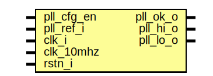

# Entity: Si571_pll

- **File**: Si571_pll.v
## Diagram

## Ports

| Port name  | Direction | Type | Description |
| ---------- | --------- | ---- | ----------- |
| pll_ok_o   | output    |      |  Data input |
| pll_cfg_en | input     |      |             |
| pll_ref_i  | input     |      |             |
| pll_hi_o   | output    |      |             |
| pll_lo_o   | output    |      |             |
| clk_i      | input     |      |             |
| clk_10mhz  | input     |      |             |
| rstn_i     | input     |      |             |
## Signals

| Name        | Type          | Description                                                                                                              |
| ----------- | ------------- | ------------------------------------------------------------------------------------------------------------------------ |
| pll_ref_cnt | reg  [16-1:0] | ---------------------------------------------------------------------------------    Simple FF PLL   detect RF clock  |
| pll_sys_syc | reg  [ 3-1:0] |                                                                                                                          |
| pll_sys_cnt | reg  [21-1:0] |                                                                                                                          |
| pll_sys_val | reg           |                                                                                                                          |
| pll_ff_sys  | reg           |                                                                                                                          |
| pll_ff_ref  | reg           |                                                                                                                          |
| pll_ff_rst  | wire          |                                                                                                                          |
| pll_ff_lck  | wire          |                                                                                                                          |
## Processes
- unnamed: ( @(posedge pll_ref_i) )
  - **Type:** always
- unnamed: ( @(posedge clk_i) )
  - **Type:** always
- unnamed: ( @(posedge clk_10mhz or negedge pll_ff_rst) )
  - **Type:** always
 **Description**
 FF PLL functionality 
- unnamed: ( @(posedge pll_ref_i or negedge pll_ff_rst) )
  - **Type:** always
