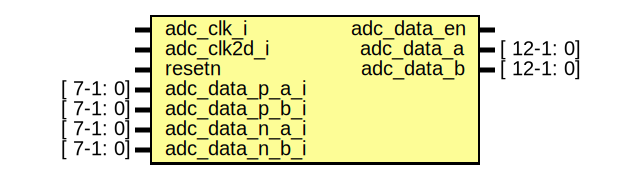

# Entity: ad9613

- **File**: ad9613.v
## Diagram

## Ports

| Port name      | Direction | Type       | Description    |
| -------------- | --------- | ---------- | -------------- |
| adc_clk_i      | input     |            | ADC clks       |
| adc_clk2d_i    | input     |            |                |
| resetn         | input     |            |                |
| adc_data_p_a_i | input     | [ 7-1: 0]  | ADC data cha p |
| adc_data_p_b_i | input     | [ 7-1: 0]  | ADC data chb p |
| adc_data_n_a_i | input     | [ 7-1: 0]  | ADC data cha n |
| adc_data_n_b_i | input     | [ 7-1: 0]  | ADC data chb n |
| adc_data_en    | output    |            |                |
| adc_data_a     | output    | [ 12-1: 0] |                |
| adc_data_b     | output    | [ 12-1: 0] |                |
## Signals

| Name           | Type             | Description |
| -------------- | ---------------- | ----------- |
| adc_dat_a_ibuf | wire [ 7-1: 0]   |             |
| adc_dat_b_ibuf | wire [ 7-1: 0]   |             |
| adc_dat_a_in   | wire [ 14-1: 0]  |             |
| adc_dat_b_in   | wire [ 14-1: 0]  |             |
| adc_dat_a_even | reg   [ 7-1: 0]  |             |
| adc_dat_b_even | reg   [ 7-1: 0]  |             |
| adc_dat_a_odd  | reg   [ 7-1: 0]  |             |
| adc_dat_b_odd  | reg   [ 7-1: 0]  |             |
| adc_data_a     | reg   [ 12-1: 0] |             |
| adc_data_b     | reg   [ 12-1: 0] |             |
| adc_data_en    | reg              |             |
| i              | reg              |             |
## Processes
- unnamed: ( @(negedge adc_clk_i) )
