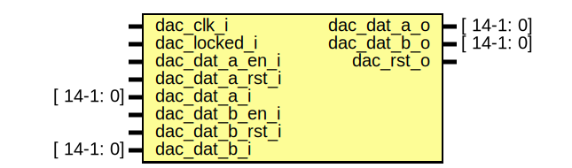

# Entity: ad9746

## Diagram

## Ports

| Port name       | Direction | Type       | Description |
| --------------- | --------- | ---------- | ----------- |
| dac_clk_i       | input     |            | DAC clks    |
| dac_locked_i    | input     |            |             |
| dac_dat_a_o     | output    | [ 14-1: 0] | DAC         |
| dac_dat_b_o     | output    | [ 14-1: 0] |             |
| dac_rst_o       | output    |            |             |
| dac_dat_a_en_i  | input     |            |             |
| dac_dat_a_rst_i | input     |            |             |
| dac_dat_a_i     | input     | [ 14-1: 0] |             |
| dac_dat_b_en_i  | input     |            |             |
| dac_dat_b_rst_i | input     |            |             |
| dac_dat_b_i     | input     | [ 14-1: 0] |             |
## Signals

| Name        | Type           | Description               |
| ----------- | -------------- | ------------------------- |
| dac_dat_a_o | reg  [14-1: 0] | Fast DAC - DDR interface  |
| dac_dat_b_o | reg  [14-1: 0] |                           |
| dac_dat_a_s | reg  [14-1: 0] |                           |
| dac_dat_b_s | reg  [14-1: 0] |                           |
| dac_rst_o   | reg            |                           |
## Processes
- unnamed: ( @(posedge dac_clk_i) )
- unnamed: ( @(posedge dac_clk_i) )
