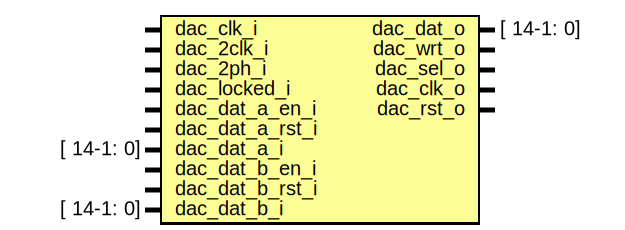

# Entity: ad9767

- **File**: ad9767.v
## Diagram

## Ports

| Port name       | Direction | Type       | Description              |
| --------------- | --------- | ---------- | ------------------------ |
| dac_clk_i       | input     |            |  DAC clks                |
| dac_2clk_i      | input     |            |                          |
| dac_2ph_i       | input     |            |                          |
| dac_locked_i    | input     |            |                          |
| dac_dat_o       | output    | [ 14-1: 0] | !< DAC IC combined data  |
| dac_wrt_o       | output    |            | !< DAC IC write enable   |
| dac_sel_o       | output    |            | !< DAC IC channel select |
| dac_clk_o       | output    |            | !< DAC IC clock          |
| dac_rst_o       | output    |            | !< DAC IC reset          |
| dac_dat_a_en_i  | input     |            |                          |
| dac_dat_a_rst_i | input     |            |                          |
| dac_dat_a_i     | input     | [ 14-1: 0] | !< DAC CHA data          |
| dac_dat_b_en_i  | input     |            |                          |
| dac_dat_b_rst_i | input     |            |                          |
| dac_dat_b_i     | input     | [ 14-1: 0] | !< DAC CHB data          |
## Signals

| Name        | Type           | Description                                                                                                       |
| ----------- | -------------- | ----------------------------------------------------------------------------------------------------------------- |
| dac_rst     | reg            |                                                                                                                   |
| dac_dat_a   | reg  [14-1: 0] | ---------------------------------------------------------------------------------    Fast DAC - DDR interface  |
| dac_dat_b   | reg  [14-1: 0] |                                                                                                                   |
| dac_dat_a_s | reg  [14-1: 0] |                                                                                                                   |
| dac_dat_b_s | reg  [14-1: 0] |                                                                                                                   |
## Processes
- unnamed: ( @(posedge dac_clk_i) )
  - **Type:** always
- unnamed: ( @(posedge dac_clk_i) )
  - **Type:** always
 **Description**
 output registers + signed to unsigned (also to negative slope) 
## Instantiations

- i_dac_clk: ODDR
- i_dac_wrt: ODDR
- i_dac_sel: ODDR
- i_dac_rst: ODDR
- i_dac_0: ODDR
- i_dac_1: ODDR
- i_dac_2: ODDR
- i_dac_3: ODDR
- i_dac_4: ODDR
- i_dac_5: ODDR
- i_dac_6: ODDR
- i_dac_7: ODDR
- i_dac_8: ODDR
- i_dac_9: ODDR
- i_dac_10: ODDR
- i_dac_11: ODDR
- i_dac_12: ODDR
- i_dac_13: ODDR
