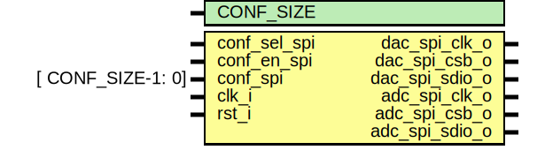

# Entity: adc_dac_spi_control

## Diagram

## Generics

| Generic name | Type | Value | Description |
| ------------ | ---- | ----- | ----------- |
| CONF_SIZE    |      | 21    |             |
## Ports

| Port name      | Direction | Type              | Description |
| -------------- | --------- | ----------------- | ----------- |
| conf_sel_spi   | input     |                   | Data input  |
| conf_en_spi    | input     |                   |             |
| conf_spi       | input     | [ CONF_SIZE-1: 0] |             |
| dac_spi_clk_o  | output    |                   | SPI output  |
| dac_spi_csb_o  | output    |                   |             |
| dac_spi_sdio_o | output    |                   |             |
| adc_spi_clk_o  | output    |                   |             |
| adc_spi_csb_o  | output    |                   |             |
| adc_spi_sdio_o | output    |                   |             |
| clk_i          | input     |                   | Clock       |
| rst_i          | input     |                   |             |
## Signals

| Name           | Type | Description |
| -------------- | ---- | ----------- |
| dac_spi_csb_o  | reg  |             |
| dac_spi_sdio_o | reg  |             |
| dac_spi_clk_o  | reg  |             |
| adc_spi_csb_o  | reg  |             |
| adc_spi_sdio_o | reg  |             |
| adc_spi_clk_o  | reg  |             |
## Processes
- unnamed: ( @(posedge clk_i) )
## Instantiations

- spi_master: spi_master
