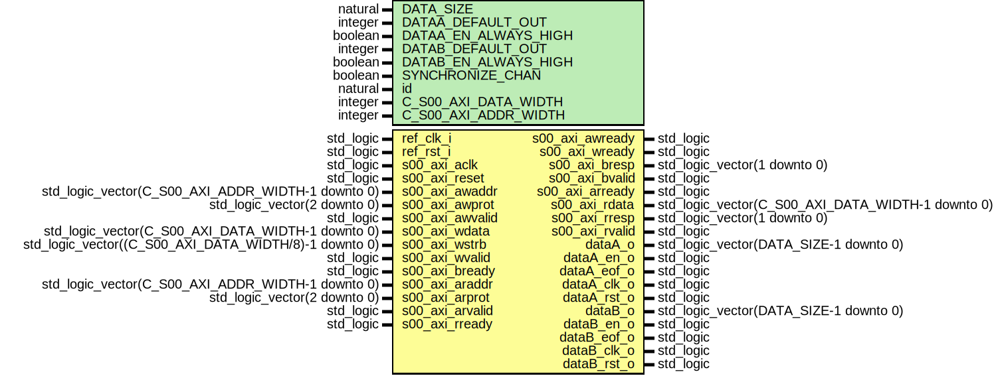

# Entity: axi_to_dac

- **File**: axi_to_dac.vhd
## Diagram

## Generics

| Generic name         | Type    | Value | Description                                    |
| -------------------- | ------- | ----- | ---------------------------------------------- |
| DATA_SIZE            | natural | 14    |                                                |
| DATAA_DEFAULT_OUT    | integer | 0     |                                                |
| DATAA_EN_ALWAYS_HIGH | boolean | false |                                                |
| DATAB_DEFAULT_OUT    | integer | 0     |                                                |
| DATAB_EN_ALWAYS_HIGH | boolean | false |                                                |
| SYNCHRONIZE_CHAN     | boolean | false |                                                |
| id                   | natural | 1     |                                                |
| C_S00_AXI_DATA_WIDTH | integer | 32    | Parameters of Axi Slave Bus Interface S00_AXI  |
| C_S00_AXI_ADDR_WIDTH | integer | 4     |                                                |
## Ports

| Port name       | Direction | Type                                                  | Description      |
| --------------- | --------- | ----------------------------------------------------- | ---------------- |
| ref_clk_i       | in        | std_logic                                             | Syscon signals   |
| ref_rst_i       | in        | std_logic                                             |                  |
| s00_axi_aclk    | in        | std_logic                                             | Wishbone signals |
| s00_axi_reset   | in        | std_logic                                             |                  |
| s00_axi_awaddr  | in        | std_logic_vector(C_S00_AXI_ADDR_WIDTH-1 downto 0)     |                  |
| s00_axi_awprot  | in        | std_logic_vector(2 downto 0)                          |                  |
| s00_axi_awvalid | in        | std_logic                                             |                  |
| s00_axi_awready | out       | std_logic                                             |                  |
| s00_axi_wdata   | in        | std_logic_vector(C_S00_AXI_DATA_WIDTH-1 downto 0)     |                  |
| s00_axi_wstrb   | in        | std_logic_vector((C_S00_AXI_DATA_WIDTH/8)-1 downto 0) |                  |
| s00_axi_wvalid  | in        | std_logic                                             |                  |
| s00_axi_wready  | out       | std_logic                                             |                  |
| s00_axi_bresp   | out       | std_logic_vector(1 downto 0)                          |                  |
| s00_axi_bvalid  | out       | std_logic                                             |                  |
| s00_axi_bready  | in        | std_logic                                             |                  |
| s00_axi_araddr  | in        | std_logic_vector(C_S00_AXI_ADDR_WIDTH-1 downto 0)     |                  |
| s00_axi_arprot  | in        | std_logic_vector(2 downto 0)                          |                  |
| s00_axi_arvalid | in        | std_logic                                             |                  |
| s00_axi_arready | out       | std_logic                                             |                  |
| s00_axi_rdata   | out       | std_logic_vector(C_S00_AXI_DATA_WIDTH-1 downto 0)     |                  |
| s00_axi_rresp   | out       | std_logic_vector(1 downto 0)                          |                  |
| s00_axi_rvalid  | out       | std_logic                                             |                  |
| s00_axi_rready  | in        | std_logic                                             |                  |
| dataA_o         | out       | std_logic_vector(DATA_SIZE-1 downto 0)                | output           |
| dataA_en_o      | out       | std_logic                                             |                  |
| dataA_eof_o     | out       | std_logic                                             |                  |
| dataA_clk_o     | out       | std_logic                                             |                  |
| dataA_rst_o     | out       | std_logic                                             |                  |
| dataB_o         | out       | std_logic_vector(DATA_SIZE-1 downto 0)                |                  |
| dataB_en_o      | out       | std_logic                                             |                  |
| dataB_eof_o     | out       | std_logic                                             |                  |
| dataB_clk_o     | out       | std_logic                                             |                  |
| dataB_rst_o     | out       | std_logic                                             |                  |
## Signals

| Name                         | Type                                   | Description |
| ---------------------------- | -------------------------------------- | ----------- |
| data_a_en_always_high_s      | std_logic                              |             |
| data_a_en_always_high_sync_s | std_logic                              |             |
| data_b_en_always_high_s      | std_logic                              |             |
| data_b_en_always_high_sync_s | std_logic                              |             |
| synchronize_chan_s           | std_logic                              |             |
| synchronize_chan_sync_s      | std_logic                              |             |
| data_a_s                     | std_logic_vector(DATA_SIZE-1 downto 0) |             |
| data_a_sync_s                | std_logic_vector(DATA_SIZE-1 downto 0) |             |
| data_a_out_s                 | std_logic_vector(DATA_SIZE-1 downto 0) |             |
| data_a_en_s                  | std_logic                              |             |
| data_a_en_sync_s             | std_logic                              |             |
| data_a_en_next_s             | std_logic                              |             |
| data_b_s                     | std_logic_vector(DATA_SIZE-1 downto 0) |             |
| data_b_sync_s                | std_logic_vector(DATA_SIZE-1 downto 0) |             |
| data_b_out_s                 | std_logic_vector(DATA_SIZE-1 downto 0) |             |
| data_b_en_s                  | std_logic                              |             |
| data_b_en_sync_s             | std_logic                              |             |
| addr_s                       | std_logic_vector(1 downto 0)           |  comm       |
| write_en_s                   | std_logic                              |             |
|  read_en_s                   | std_logic                              |             |
## Processes
- unnamed: ( ref_clk_i )
## Instantiations

- dataA_sync: work.axi_to_dac_sync_vect
- dataB_sync: work.axi_to_dac_sync_vect
- conf_sync: work.axi_to_dac_sync_vect
- wb_atd_inst: work.wb_axi_to_dac
- handle_comm: work.axi_to_dac_handcomm
 **Description**
 Instantiation of Axi Bus Interface S00_AXI

