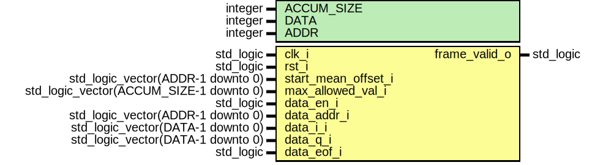

# Entity: cvb_check_mean

## Diagram

## Generics

| Generic name | Type    | Value | Description |
| ------------ | ------- | ----- | ----------- |
| ACCUM_SIZE   | integer | 32    |             |
| DATA         | integer | 72    |             |
| ADDR         | integer | 10    |             |
## Ports

| Port name           | Direction | Type                                    | Description |
| ------------------- | --------- | --------------------------------------- | ----------- |
| clk_i               | in        | std_logic                               |             |
| rst_i               | in        | std_logic                               |             |
| start_mean_offset_i | in        | std_logic_vector(ADDR-1 downto 0)       |             |
| max_allowed_val_i   | in        | std_logic_vector(ACCUM_SIZE-1 downto 0) |             |
| data_en_i           | in        | std_logic                               |             |
| data_addr_i         | in        | std_logic_vector(ADDR-1 downto 0)       |             |
| data_i_i            | in        | std_logic_vector(DATA-1 downto 0)       |             |
| data_q_i            | in        | std_logic_vector(DATA-1 downto 0)       |             |
| data_eof_i          | in        | std_logic                               |             |
| frame_valid_o       | out       | std_logic                               |             |
## Signals

| Name            | Type                                    | Description |
| --------------- | --------------------------------------- | ----------- |
| dat_i_in_s      | std_logic_vector(DATA-1 downto 0)       |             |
| dat_q_in_s      | std_logic_vector(DATA-1 downto 0)       |             |
| in_mean_s       | std_logic                               |             |
| neg_to_pos_i_s  | std_logic_vector(DATA-1 downto 0)       |             |
| neg_to_pos_q_s  | std_logic_vector(DATA-1 downto 0)       |             |
| accum_i_s       | std_logic_vector(ACCUM_SIZE-1 downto 0) | accum       |
|  accum_i_next_s | std_logic_vector(ACCUM_SIZE-1 downto 0) | accum       |
| accum_q_s       | std_logic_vector(ACCUM_SIZE-1 downto 0) |             |
|  accum_q_next_s | std_logic_vector(ACCUM_SIZE-1 downto 0) |             |
| frame_valid_s   | std_logic                               | last --     |
## Processes
- unnamed: ( clk_i )
- unnamed: ( accum_i_s, accum_q_s, max_allowed_val_i )
**Description**
last
check if accum content if allowed --
and output if valid or not when eof is high

- unnamed: ( clk_i )
