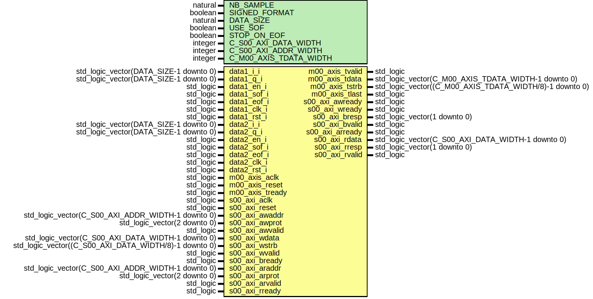

# Entity: dataComplex_dma_direct

- **File**: dataComplex_dma_direct.vhd
## Diagram

## Generics

| Generic name           | Type    | Value | Description                                      |
| ---------------------- | ------- | ----- | ------------------------------------------------ |
| NB_SAMPLE              | natural | 1024  |                                                  |
| SIGNED_FORMAT          | boolean | true  |                                                  |
| DATA_SIZE              | natural | 16    |                                                  |
| USE_SOF                | boolean | false |                                                  |
| STOP_ON_EOF            | boolean | false |                                                  |
| C_S00_AXI_DATA_WIDTH   | integer | 32    | Parameters of Axi Slave Bus Interface S00_AXI    |
| C_S00_AXI_ADDR_WIDTH   | integer | 7     |                                                  |
| C_M00_AXIS_TDATA_WIDTH | integer | 32    | Parameters of Axi Master Bus Interface M00_AXIS  |
## Ports

| Port name       | Direction | Type                                                    | Description                                |
| --------------- | --------- | ------------------------------------------------------- | ------------------------------------------ |
| data1_i_i       | in        | std_logic_vector(DATA_SIZE-1 downto 0)                  | chan1                                      |
| data1_q_i       | in        | std_logic_vector(DATA_SIZE-1 downto 0)                  |                                            |
| data1_en_i      | in        | std_logic                                               |                                            |
| data1_sof_i     | in        | std_logic                                               |                                            |
| data1_eof_i     | in        | std_logic                                               |                                            |
| data1_clk_i     | in        | std_logic                                               |                                            |
| data1_rst_i     | in        | std_logic                                               |                                            |
| data2_i_i       | in        | std_logic_vector(DATA_SIZE-1 downto 0)                  | chan2                                      |
| data2_q_i       | in        | std_logic_vector(DATA_SIZE-1 downto 0)                  |                                            |
| data2_en_i      | in        | std_logic                                               |                                            |
| data2_sof_i     | in        | std_logic                                               |                                            |
| data2_eof_i     | in        | std_logic                                               |                                            |
| data2_clk_i     | in        | std_logic                                               |                                            |
| data2_rst_i     | in        | std_logic                                               |                                            |
| m00_axis_aclk   | in        | std_logic                                               | Ports of Axi Master Bus Interface M00_AXIS |
| m00_axis_reset  | in        | std_logic                                               |                                            |
| m00_axis_tvalid | out       | std_logic                                               |                                            |
| m00_axis_tdata  | out       | std_logic_vector(C_M00_AXIS_TDATA_WIDTH-1 downto 0)     |                                            |
| m00_axis_tstrb  | out       | std_logic_vector((C_M00_AXIS_TDATA_WIDTH/8)-1 downto 0) |                                            |
| m00_axis_tlast  | out       | std_logic                                               |                                            |
| m00_axis_tready | in        | std_logic                                               |                                            |
| s00_axi_aclk    | in        | std_logic                                               | Ports of Axi Slave Bus Interface S00_AXI   |
| s00_axi_reset   | in        | std_logic                                               |                                            |
| s00_axi_awaddr  | in        | std_logic_vector(C_S00_AXI_ADDR_WIDTH-1 downto 0)       |                                            |
| s00_axi_awprot  | in        | std_logic_vector(2 downto 0)                            |                                            |
| s00_axi_awvalid | in        | std_logic                                               |                                            |
| s00_axi_awready | out       | std_logic                                               |                                            |
| s00_axi_wdata   | in        | std_logic_vector(C_S00_AXI_DATA_WIDTH-1 downto 0)       |                                            |
| s00_axi_wstrb   | in        | std_logic_vector((C_S00_AXI_DATA_WIDTH/8)-1 downto 0)   |                                            |
| s00_axi_wvalid  | in        | std_logic                                               |                                            |
| s00_axi_wready  | out       | std_logic                                               |                                            |
| s00_axi_bresp   | out       | std_logic_vector(1 downto 0)                            |                                            |
| s00_axi_bvalid  | out       | std_logic                                               |                                            |
| s00_axi_bready  | in        | std_logic                                               |                                            |
| s00_axi_araddr  | in        | std_logic_vector(C_S00_AXI_ADDR_WIDTH-1 downto 0)       |                                            |
| s00_axi_arprot  | in        | std_logic_vector(2 downto 0)                            |                                            |
| s00_axi_arvalid | in        | std_logic                                               |                                            |
| s00_axi_arready | out       | std_logic                                               |                                            |
| s00_axi_rdata   | out       | std_logic_vector(C_S00_AXI_DATA_WIDTH-1 downto 0)       |                                            |
| s00_axi_rresp   | out       | std_logic_vector(1 downto 0)                            |                                            |
| s00_axi_rvalid  | out       | std_logic                                               |                                            |
| s00_axi_rready  | in        | std_logic                                               |                                            |
## Signals

| Name                     | Type                          | Description        |
| ------------------------ | ----------------------------- | ------------------ |
| addr_s                   | std_logic_vector(3 downto 0)  |                    |
| write_en_s               | std_logic                     |                    |
|  read_en_s               | std_logic                     |                    |
| data1_s                  | std_logic_vector(31 downto 0) |  new               |
| data2_s                  | std_logic_vector(31 downto 0) |                    |
| data_sof_s               | std_logic                     |                    |
| data_eof_s               | std_logic                     |                    |
| start_acquisition_s      | std_logic                     |  axi4lite -> axis  |
| start_acquisition_sync_s | std_logic                     |                    |
| busy_s                   | std_logic                     |  axis -> axi4lite  |
|  busy_sync_s             | std_logic                     |  axis -> axi4lite  |
## Instantiations

- dma_flow_slave_axis_inst: work.axi_dataComplex_dma_direct
 **Description**
 Instantiation of Axi Bus Interface M00_AXIS

- busy_sync: work.dataComplex_dma_direct_sync
- start_sync: work.dataComplex_dma_direct_sync
- wb_inst: work.wb_dataComplex_dma_direct
- handle_comm: work.dataComplex_dma_direct_handCom
 **Description**
 Instantiation of Axi Bus Interface S00_AXI

