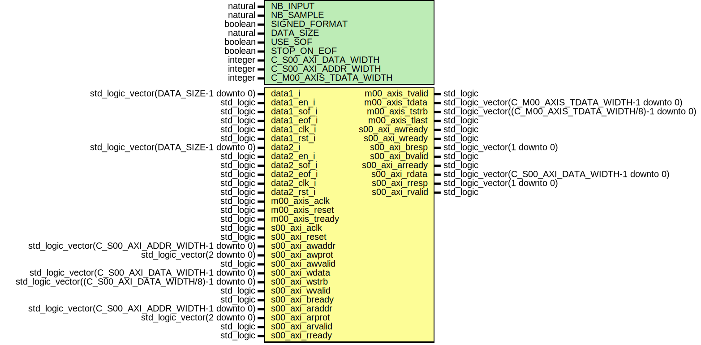

# Entity: dataReal_dma_direct

- **File**: dataReal_dma_direct.vhd
## Diagram

## Description

currently only support up to 16bits per chan
and only one or two input
eof and sof are not supported
two inputs must be synchronize (ie dataX_en_i high at the same time
## Generics

| Generic name           | Type    | Value | Description                                      |
| ---------------------- | ------- | ----- | ------------------------------------------------ |
| NB_INPUT               | natural | 2     |                                                  |
| NB_SAMPLE              | natural | 1024  |                                                  |
| SIGNED_FORMAT          | boolean | true  |                                                  |
| DATA_SIZE              | natural | 16    |                                                  |
| USE_SOF                | boolean | false |                                                  |
| STOP_ON_EOF            | boolean | false |                                                  |
| C_S00_AXI_DATA_WIDTH   | integer | 32    | Parameters of Axi Slave Bus Interface S00_AXI    |
| C_S00_AXI_ADDR_WIDTH   | integer | 4     |                                                  |
| C_M00_AXIS_TDATA_WIDTH | integer | 32    | Parameters of Axi Master Bus Interface M00_AXIS  |
## Ports

| Port name       | Direction | Type                                                    | Description                                |
| --------------- | --------- | ------------------------------------------------------- | ------------------------------------------ |
| data1_i         | in        | std_logic_vector(DATA_SIZE-1 downto 0)                  | chan1                                      |
| data1_en_i      | in        | std_logic                                               |                                            |
| data1_sof_i     | in        | std_logic                                               |                                            |
| data1_eof_i     | in        | std_logic                                               |                                            |
| data1_clk_i     | in        | std_logic                                               |                                            |
| data1_rst_i     | in        | std_logic                                               |                                            |
| data2_i         | in        | std_logic_vector(DATA_SIZE-1 downto 0)                  | chan2                                      |
| data2_en_i      | in        | std_logic                                               |                                            |
| data2_sof_i     | in        | std_logic                                               |                                            |
| data2_eof_i     | in        | std_logic                                               |                                            |
| data2_clk_i     | in        | std_logic                                               |                                            |
| data2_rst_i     | in        | std_logic                                               |                                            |
| m00_axis_aclk   | in        | std_logic                                               | Ports of Axi Master Bus Interface M00_AXIS |
| m00_axis_reset  | in        | std_logic                                               |                                            |
| m00_axis_tvalid | out       | std_logic                                               |                                            |
| m00_axis_tdata  | out       | std_logic_vector(C_M00_AXIS_TDATA_WIDTH-1 downto 0)     |                                            |
| m00_axis_tstrb  | out       | std_logic_vector((C_M00_AXIS_TDATA_WIDTH/8)-1 downto 0) |                                            |
| m00_axis_tlast  | out       | std_logic                                               |                                            |
| m00_axis_tready | in        | std_logic                                               |                                            |
| s00_axi_aclk    | in        | std_logic                                               | Ports of Axi Slave Bus Interface S00_AXI   |
| s00_axi_reset   | in        | std_logic                                               |                                            |
| s00_axi_awaddr  | in        | std_logic_vector(C_S00_AXI_ADDR_WIDTH-1 downto 0)       |                                            |
| s00_axi_awprot  | in        | std_logic_vector(2 downto 0)                            |                                            |
| s00_axi_awvalid | in        | std_logic                                               |                                            |
| s00_axi_awready | out       | std_logic                                               |                                            |
| s00_axi_wdata   | in        | std_logic_vector(C_S00_AXI_DATA_WIDTH-1 downto 0)       |                                            |
| s00_axi_wstrb   | in        | std_logic_vector((C_S00_AXI_DATA_WIDTH/8)-1 downto 0)   |                                            |
| s00_axi_wvalid  | in        | std_logic                                               |                                            |
| s00_axi_wready  | out       | std_logic                                               |                                            |
| s00_axi_bresp   | out       | std_logic_vector(1 downto 0)                            |                                            |
| s00_axi_bvalid  | out       | std_logic                                               |                                            |
| s00_axi_bready  | in        | std_logic                                               |                                            |
| s00_axi_araddr  | in        | std_logic_vector(C_S00_AXI_ADDR_WIDTH-1 downto 0)       |                                            |
| s00_axi_arprot  | in        | std_logic_vector(2 downto 0)                            |                                            |
| s00_axi_arvalid | in        | std_logic                                               |                                            |
| s00_axi_arready | out       | std_logic                                               |                                            |
| s00_axi_rdata   | out       | std_logic_vector(C_S00_AXI_DATA_WIDTH-1 downto 0)       |                                            |
| s00_axi_rresp   | out       | std_logic_vector(1 downto 0)                            |                                            |
| s00_axi_rvalid  | out       | std_logic                                               |                                            |
| s00_axi_rready  | in        | std_logic                                               |                                            |
## Signals

| Name                     | Type                                       | Description      |
| ------------------------ | ------------------------------------------ | ---------------- |
| addr_s                   | std_logic_vector(1 downto 0)               |                  |
| write_en_s               | std_logic                                  |                  |
|  read_en_s               | std_logic                                  |                  |
| data1_s                  | std_logic_vector(INT_DATA_SIZE-1 downto 0) | new              |
| data2_s                  | std_logic_vector(INT_DATA_SIZE-1 downto 0) |                  |
| data1_d1_s               | std_logic_vector(31 downto 0)              |                  |
| data2_d1_s               | std_logic_vector(31 downto 0)              |                  |
| data_en_s                | std_logic                                  |                  |
| seq_pos_s                | std_logic                                  |                  |
| data_sof_s               | std_logic                                  |                  |
| data_eof_s               | std_logic                                  |                  |
| start_acquisition_s      | std_logic                                  | axi4lite -> axis |
| start_acquisition_sync_s | std_logic                                  |                  |
| busy_s                   | std_logic                                  | axis -> axi4lite |
|  busy_sync_s             | std_logic                                  | axis -> axi4lite |
## Constants

| Name          | Type    | Value                                                                                                                   | Description |
| ------------- | ------- | ----------------------------------------------------------------------------------------------------------------------- | ----------- |
| INT_NB_SAMPLE | natural |  getIntNbSample(NB_INPUT,  DATA_SIZE,  NB_SAMPLE) |             |
| INT_NB_INPUT  | natural |  getIntNbInput(NB_INPUT,  DATA_SIZE)                                                 |             |
| INT_DATA_SIZE | natural |  getIntSize(DATA_SIZE)                                                                                                  |             |
## Functions
- getIntNbSample (nb_input,  data_size,  nb_sample: natural)  return natural 
- getIntNbInput (nb_input,  data_size: natural)  return natural 
- getIntSize (data_size: natural)  return natural 
## Instantiations

- dma_flow_slave_axis_inst: work.axi_dataReal_dma_direct
**Description**
Instantiation of Axi Bus Interface M00_AXIS

- busy_sync: work.dataReal_dma_direct_sync
- start_sync: work.dataReal_dma_direct_sync
- wb_inst: work.wb_dataReal_dma_direct
- handle_comm: work.dataReal_dma_direct_handCom
**Description**
Instantiation of Axi Bus Interface S00_AXI

