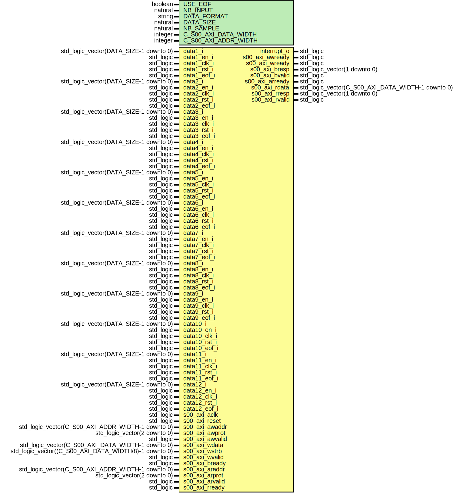

# Entity: dataReal_to_ram

- **File**: dataReal_to_ram.vhd
## Diagram

## Description

-------------------------------------------------------------------------
 (c) Copyright: OscillatorIMP Digital
 Author : Gwenhael Goavec-Merou<gwenhael.goavec-merou@trabucayre.com>
 Creation date : 2018/12/16
-------------------------------------------------------------------------
## Generics

| Generic name         | Type    | Value    | Description                                    |
| -------------------- | ------- | -------- | ---------------------------------------------- |
| USE_EOF              | boolean | false    |                                                |
| NB_INPUT             | natural | 12       |                                                |
| DATA_FORMAT          | string  | "signed" |                                                |
| DATA_SIZE            | natural | 32       |                                                |
| NB_SAMPLE            | natural | 1024     | DDR_SIZE : natural := 12;                      |
| C_S00_AXI_DATA_WIDTH | integer | 32       | Parameters of Axi Slave Bus Interface S00_AXI  |
| C_S00_AXI_ADDR_WIDTH | integer | 4        |                                                |
## Ports

| Port name       | Direction | Type                                                  | Description                              |
| --------------- | --------- | ----------------------------------------------------- | ---------------------------------------- |
| data1_i         | in        | std_logic_vector(DATA_SIZE-1 downto 0)                | nterrupt                                 |
| data1_en_i      | in        | std_logic                                             |                                          |
| data1_clk_i     | in        | std_logic                                             |                                          |
| data1_rst_i     | in        | std_logic                                             |                                          |
| data1_eof_i     | in        | std_logic                                             |                                          |
| data2_i         | in        | std_logic_vector(DATA_SIZE-1 downto 0)                |                                          |
| data2_en_i      | in        | std_logic                                             |                                          |
| data2_clk_i     | in        | std_logic                                             |                                          |
| data2_rst_i     | in        | std_logic                                             |                                          |
| data2_eof_i     | in        | std_logic                                             |                                          |
| data3_i         | in        | std_logic_vector(DATA_SIZE-1 downto 0)                |                                          |
| data3_en_i      | in        | std_logic                                             |                                          |
| data3_clk_i     | in        | std_logic                                             |                                          |
| data3_rst_i     | in        | std_logic                                             |                                          |
| data3_eof_i     | in        | std_logic                                             |                                          |
| data4_i         | in        | std_logic_vector(DATA_SIZE-1 downto 0)                |                                          |
| data4_en_i      | in        | std_logic                                             |                                          |
| data4_clk_i     | in        | std_logic                                             |                                          |
| data4_rst_i     | in        | std_logic                                             |                                          |
| data4_eof_i     | in        | std_logic                                             |                                          |
| data5_i         | in        | std_logic_vector(DATA_SIZE-1 downto 0)                |                                          |
| data5_en_i      | in        | std_logic                                             |                                          |
| data5_clk_i     | in        | std_logic                                             |                                          |
| data5_rst_i     | in        | std_logic                                             |                                          |
| data5_eof_i     | in        | std_logic                                             |                                          |
| data6_i         | in        | std_logic_vector(DATA_SIZE-1 downto 0)                |                                          |
| data6_en_i      | in        | std_logic                                             |                                          |
| data6_clk_i     | in        | std_logic                                             |                                          |
| data6_rst_i     | in        | std_logic                                             |                                          |
| data6_eof_i     | in        | std_logic                                             |                                          |
| data7_i         | in        | std_logic_vector(DATA_SIZE-1 downto 0)                |                                          |
| data7_en_i      | in        | std_logic                                             |                                          |
| data7_clk_i     | in        | std_logic                                             |                                          |
| data7_rst_i     | in        | std_logic                                             |                                          |
| data7_eof_i     | in        | std_logic                                             |                                          |
| data8_i         | in        | std_logic_vector(DATA_SIZE-1 downto 0)                |                                          |
| data8_en_i      | in        | std_logic                                             |                                          |
| data8_clk_i     | in        | std_logic                                             |                                          |
| data8_rst_i     | in        | std_logic                                             |                                          |
| data8_eof_i     | in        | std_logic                                             |                                          |
| data9_i         | in        | std_logic_vector(DATA_SIZE-1 downto 0)                |                                          |
| data9_en_i      | in        | std_logic                                             |                                          |
| data9_clk_i     | in        | std_logic                                             |                                          |
| data9_rst_i     | in        | std_logic                                             |                                          |
| data9_eof_i     | in        | std_logic                                             |                                          |
| data10_i        | in        | std_logic_vector(DATA_SIZE-1 downto 0)                |                                          |
| data10_en_i     | in        | std_logic                                             |                                          |
| data10_clk_i    | in        | std_logic                                             |                                          |
| data10_rst_i    | in        | std_logic                                             |                                          |
| data10_eof_i    | in        | std_logic                                             |                                          |
| data11_i        | in        | std_logic_vector(DATA_SIZE-1 downto 0)                |                                          |
| data11_en_i     | in        | std_logic                                             |                                          |
| data11_clk_i    | in        | std_logic                                             |                                          |
| data11_rst_i    | in        | std_logic                                             |                                          |
| data11_eof_i    | in        | std_logic                                             |                                          |
| data12_i        | in        | std_logic_vector(DATA_SIZE-1 downto 0)                |                                          |
| data12_en_i     | in        | std_logic                                             |                                          |
| data12_clk_i    | in        | std_logic                                             |                                          |
| data12_rst_i    | in        | std_logic                                             |                                          |
| data12_eof_i    | in        | std_logic                                             |                                          |
| interrupt_o     | out       | std_logic                                             | interrupt                                |
| s00_axi_aclk    | in        | std_logic                                             | Ports of Axi Slave Bus Interface S00_AXI |
| s00_axi_reset   | in        | std_logic                                             |                                          |
| s00_axi_awaddr  | in        | std_logic_vector(C_S00_AXI_ADDR_WIDTH-1 downto 0)     |                                          |
| s00_axi_awprot  | in        | std_logic_vector(2 downto 0)                          |                                          |
| s00_axi_awvalid | in        | std_logic                                             |                                          |
| s00_axi_awready | out       | std_logic                                             |                                          |
| s00_axi_wdata   | in        | std_logic_vector(C_S00_AXI_DATA_WIDTH-1 downto 0)     |                                          |
| s00_axi_wstrb   | in        | std_logic_vector((C_S00_AXI_DATA_WIDTH/8)-1 downto 0) |                                          |
| s00_axi_wvalid  | in        | std_logic                                             |                                          |
| s00_axi_wready  | out       | std_logic                                             |                                          |
| s00_axi_bresp   | out       | std_logic_vector(1 downto 0)                          |                                          |
| s00_axi_bvalid  | out       | std_logic                                             |                                          |
| s00_axi_bready  | in        | std_logic                                             |                                          |
| s00_axi_araddr  | in        | std_logic_vector(C_S00_AXI_ADDR_WIDTH-1 downto 0)     |                                          |
| s00_axi_arprot  | in        | std_logic_vector(2 downto 0)                          |                                          |
| s00_axi_arvalid | in        | std_logic                                             |                                          |
| s00_axi_arready | out       | std_logic                                             |                                          |
| s00_axi_rdata   | out       | std_logic_vector(C_S00_AXI_DATA_WIDTH-1 downto 0)     |                                          |
| s00_axi_rresp   | out       | std_logic_vector(1 downto 0)                          |                                          |
| s00_axi_rvalid  | out       | std_logic                                             |                                          |
| s00_axi_rready  | in        | std_logic                                             |                                          |
## Signals

| Name                | Type                                               | Description        |
| ------------------- | -------------------------------------------------- | ------------------ |
| start_acquisition_s | std_logic                                          |  control           |
| busy_s              | std_logic                                          |                    |
|  busy_d_s           | std_logic                                          |                    |
| addr_s              | std_logic_vector(INT_ADDR_WIDTH-1 downto 0)        |                    |
| write_en_s          | std_logic                                          |                    |
|  read_en_s          | std_logic                                          |                    |
| data_s              | std_logic_vector((MAX_WAY * DATA_SIZE)-1 downto 0) |  input data merge  |
| data_rst_s          | std_logic_vector(MAX_WAY-1 downto 0)               |                    |
| data_clk_s          | std_logic_vector(MAX_WAY-1 downto 0)               |                    |
| data_en_s           | std_logic_vector(MAX_WAY-1 downto 0)               |                    |
| data_eof_s          | std_logic_vector(MAX_WAY-1 downto 0)               |                    |
| res_s               | std_logic_vector(AXI_SIZE-1 downto 0)              |                    |
| ram_incr_s          | std_logic                                          |                    |
| ram_reinit_s        | std_logic                                          |                    |
## Constants

| Name            | Type    | Value                                       | Description                                                                                                               |
| --------------- | ------- | ------------------------------------------- | ------------------------------------------------------------------------------------------------------------------------- |
| ADDR_SIZE       | natural |  chan_mux_size(NB_SAMPLE)                   |                                                                                                                           |
| MAX_WAY         | natural |  12                                         | constant ADDR_SIZE			 : natural := natural(ceil(log2(real(NB_SAMPLE))));                                                  |
| INT_DATA_SIZE   | natural |  comp_internal_size(DATA_SIZE)              |                                                                                                                           |
| INT_ADDR_WIDTH  | natural |  2                                          | axi                                                                                                                       |
| AXI_SIZE        | natural |  C_S00_AXI_DATA_WIDTH                       |  read                                                                                                                     |
| CHAN_MUX_SZ     | natural |  chan_mux_size(NB_INPUT)                    |  address adaptation  bit used for chan muxing constant CHAN_MUX_SZ     : natural := natural(ceil(log2(real(NB_INPUT))));  |
| NB_PKT_PER_SAMP | natural |  (INT_DATA_SIZE/AXI_SIZE)                   |  number of pkt (32bits)                                                                                                   |
| PKT_MUX_SZ      | natural |  natural(ceil(log2(real(NB_PKT_PER_SAMP)))) |  bit used for pkt (32bits) muxing                                                                                         |
| RD_ADDR_SZ      | natural |  ADDR_SIZE + CHAN_MUX_SZ + PKT_MUX_SZ       |                                                                                                                           |
## Functions
- chan_mux_size (nb_input_i: natural)  return natural 
- comp_internal_size (in_size : natural)  return natural 
**Description**
 compute upper near 2^n size for data extension

## Processes
- unnamed: ( s00_axi_aclk )
**Description**
 interrupt 
## Instantiations

- data32_top_inst: work.dataReal_to_ram_top
- wb_inst: work.wb_dataReal_to_ram
- handle_comm: work.dataReal_to_ram_handCom
**Description**
 Instantiation of Axi Bus Interface S00_AXI

